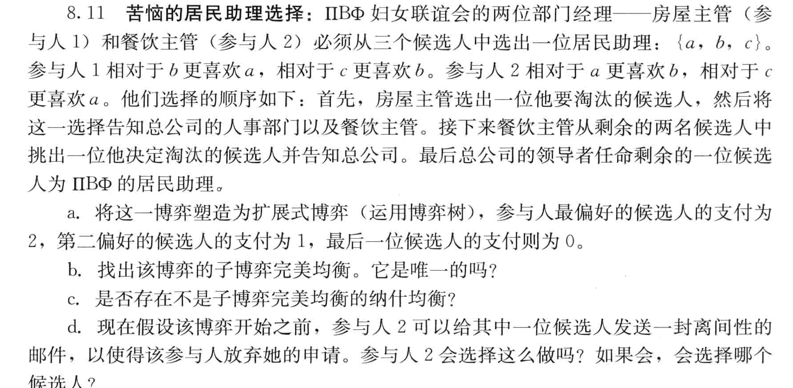

# Game Theory Presentation

## 6.4:

a:我们假设p为雇员选择工作W的概率，q为老板选择监管M的概率。对于雇员来说，考虑其期望支付 $v_1(W,q)=q+1-q=1$ $ v_1(S,q)=0*q+2*(1-q)=2(1-q) $

我们分三种情况来讨论：

要使$v_1(W,q) > v_1(S,q)$ ,$1<2(1-q)$,也就是$q>1/2$

要使$v_1(W,q) = v_1(S,q)$ ,$1=2(1-q)$,也就是$q=1/2$

要使$v_1(W,q) < v_1(S,q)$ $1>2(1-q)$,也就是$q<1/2$

所以对于雇员来说，其最优反应函数为

$BR_1(q) = \begin{cases}  p = 0 & \text{if } q < \frac{1}{2} \\ p \in [0, 1] & \text{if } q = \frac{1}{2} \\ p = 1 & \text{if } q > \frac{1}{2} \end{cases}$

同样地，对于老板来说其期望支付

$v_2(p,M)=p+2*(1-p)=2-p$ $ v_2(p,I)=2*p+1*(1-p)=1+p $

要使$v_2(p,M) > v_2(p,I)$ ,$2-p>1+p$,也就是$p<1/2$

要使$v_2(p,M) = v_2(p,I)$ ,$1=2(1-q)$,也就是$p=1/2$

要使$v_2(p,M) < v_2(p,I)$ $1>2(1-q)$,也就是$p>1/2$

所以对于老板来说，其最优反应函数为

$BR_2(p) = \begin{cases}  q = 1 & \text{if } p < \frac{1}{2} \\ q \in [0, 1] & \text{if } p = \frac{1}{2} \\ q = 0 & \text{if } p > \frac{1}{2} \end{cases}$

从上述最佳响应函数中，我们可以看出：

- 当 $p= \frac{1}{2}$ 时，q 可以是任何值，因此 $(\frac{1}{2},q)$ 是玩家2的最佳响应对任何 q的纳什均衡。
- 同样地，当 $q= \frac{1}{2}$ 时，p可以是任何值，因此 $(p,\frac{1}{2})$ 是玩家1的最佳响应对任何 p 的纳什均衡。

但是，我们通常寻找的是所有玩家都没有激励去单方面偏离的策略组合。在这个例子中，唯一满足这个条件的纳什均衡是$(p,q)=(\frac{1}{2},\frac{1}{2})$，在这一点上，任何玩家改变策略都不会增加自己的期望支付，因为他们都已经在对方策略的最佳响应上了。

纳什均衡点，没有玩家能够通过单方面改变策略来提高自己的支付。

## 8.11

参与人1：$a>b>c$

参与人2：$b>a>c$

a:由于玩家1实际上会淘汰一个候选人，所以玩家1的三种选择（否决）之后都会跟随着玩家2的两种可能的否决选择：

我们能画出这样的一个博弈树，最下方的第一行是参与人1的支付，第二行是参与人2的支付

b:If player 1 vetoes a or b then player 2 will veto c,and if player1 vetoes c then player 2 will veto a.By backward induction,anticipating player 2’s behavior player 1 will veto candidate b.This is the unique subgame perfect equilibrium by backward induction resulting in payoffs of (2,1).

我们可以用反向归纳解决这个问题：我们先预测玩家2的策略：

- 如果玩家1选择否决a，玩家2会否决c，得到支付 (1,2)。
- 如果玩家1选择否决b，玩家2也会否决c，得到支付 (2,1)。
- 如果玩家1选择否决c，玩家2会否决a，得到支付 (0,0)。

接下来，我们考虑玩家1的最优策略。玩家1知道玩家2的反应策略，并会选择使自己收益最大化的策略。

玩家1为了自己的最大收益，会选择否决b，因为这样会导致玩家2否决c，最终结果是 (2,1)，这是玩家1在所有可能结果中可以获得的最高支付。

所以，通过反向归纳，我们可以得出子博弈完美均衡是玩家1否决b，玩家2随后否决c，最终支付为（2,1）。这是在这个博弈中唯一的子博弈完美均衡，因为在这个均衡中，玩家1和玩家2的选择都是在给定对方策略的情况下的最佳反应

c:Yes. Player 2 can threaten to veto candidate a whenever player 1 vetoes either c or b,and veto candidate c when player 1 vetoes a.Player 1’s best reply to this strategy is to veto either a or c.The playerswill both be playing best responses on the equilibrium path but player 2 is not playing a best response following the choice of player 1 to veto candidate b.Hence,this is a Nash equilibrium that is not subgame perfect.

存在。当玩家1否决b或c时，玩家2可以威胁否决候选者a；而当玩家1否决a时，玩家2可以否决候选者c。玩家1对这一策略的最佳回应是否决a或c。在均衡路径上，玩家将都选择最佳响应，但在玩家1选择否决候选者b后，玩家2并没有选择最佳响应（即玩家2应该否决c，但实际上玩家2威胁并可能选择否决a）。因为玩家2在玩家1否决b后的实际行动并非最佳响应，这个策略组合虽然是一个纳什均衡，但不是子博弈完美均衡。子博弈完美均衡要求在每个子博弈中玩家的策略都是最佳响应，而这里玩家2的威胁策略在子博弈中并非如此。因此，这是一个纳什均衡，但不是子博弈完美均衡。

d:Player 2 would like to send the email to candidate a.That way, only candidates b and c will be in the pool and both players will veto c,resultinginthepayoffs (1, 2) which are better for player 2 than the unique subgame perfect equilibrium payoffs derived in part(a)

玩家2会邮件发送给候选人a。这样一来，只有候选者b和c会留在池中，而且两位玩家都将否决c，导致支付为（1, 2），这对于玩家2而言比在(2)部分得出的唯一子博弈完美均衡支付更好。