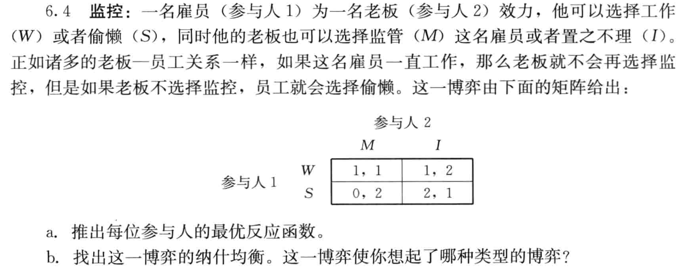
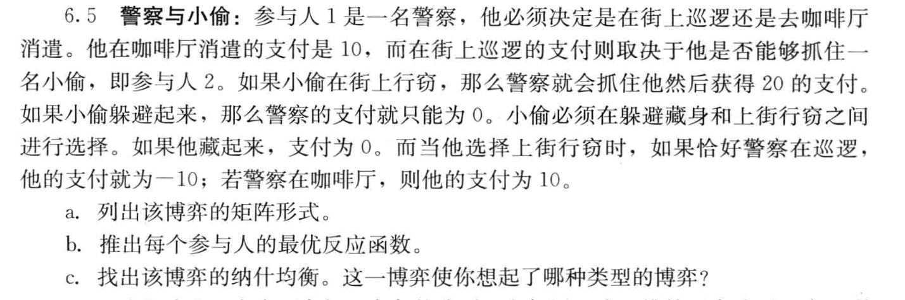

## 5.10协同：

两个部门经理可以花费时间和精力来营造一个更加良好的工作关系。每个人都花费：$e_i$≥0，两个人所花时间越多，则两人的境况就会越好，但是对于每个经理来说，花费时间的代价是很昂贵的。特别地，参与人i从努力程度($e_i$,$e_j$)中得到的支付函数为$v_i(e_i,e_j)=(a+e_j)e_j-e_i^2$
a.每个参与人的最优反应对应是什么？
b.这些最优反应对应在哪一方面和古诺博弈中的不同？为什么？
c.找出这一博弈的纳什均衡，并证明它是唯一的。

### 答：

a:如果玩家i 相信玩家j 选择$e_j$ 那么 i最大化其收益的一阶最优条件是：

 $a+e_j-2e_i=0 $

得出最佳响应函数：

$BR_i(e_j)=\frac{a+e_j}{2}for \ all \ e_j \geq 0$

b:在这个问题中，博弈者i的最佳响应函数随着博弈者j的选择而递增，而在古诺博弈中，它随着博弈者j的选择而递减。这是因为在这个博弈中，两个博弈者的选择是战略互补，而在古诺博弈中，他们的选择是战略替代。

c:我们用两个未知数求解两个方程:

$e_1=\frac{a+e_2}{2}\ and \ e_2=\frac{a+e_1}{2}$

得出解 $e_1=e_2=a$。很容易看出解是唯一的，因为它是这两个最佳响应函数交叉的唯一点。

## 5.11浪费的运输成本：

考虑两个国家A和B,每个国家各有一个拥有该国唯一有
效煤矿运营权的垄断公司。设公司1为位于A国的公司，公司2为位于B国的公司。
设$q^j_i,i\in\{1,2\} $且$j\in \{A,B\}$表示公司i在j国销售的产品数量。因此，设$q^j=q^A_i+q^B_j$为公司i∈{1,2}的总产量，设$q^j=q^j_1+q^j_2$为在j∈{A,B}国销售的产品总量。A国和B国对煤炭的需求分别为：
$p^j=90-q^j,j\in\{1,2\}$
同时每个公司的生产成本为：
$c_i(q_i)=10q_i,i\in\{1,2\}$

### 问题：

a.假设这两个国家之间没有贸易协定，并且事实上，在这两个国家中的任何一个国家进口煤炭都是被禁止的。这表明$q^A_2=q^B_1=0$是一项政策限制。这时两个公司的产量$q^A_1$和$q^B_2$是多少？

现在假设这两个国家签订了一份自由贸易协定，允许外国公司在本国进行销售且不征收任何关税。然而，存在运输成本。如果公司i在国外的销量为$q^j_i$(即公司1在B国的销量或公司2在A国的销量)，则其运输成本为10$q^j_i$。进一步假设每个公司都同时选择一对数值$q^A_1$和$q^B_2$,i∈{1,2}，因此一个行动剖面由四个数值选择组成。

b.用一个标准式博弈来建立模型，并找出该博弈的一个纳什均衡。它是唯一的吗？

现在假设在b中你所描述的那个博弈开始之前，公司1的研究部门发现用现有的船只来运输煤炭会引起污染。如果该公司向世界贸易组织(WTO)披露这份报告，则WTO就会禁止现有船只的使用。取而代之的是，它会提供一项新的运输技术，这会使运输成本增至40$q^j_i$(取代之前给出的10$q^j_i$)。

c.公司1会有意愿将这一信息发布给WTO吗？通过均衡分析来论证你的回答。

### 答：

#### a:

在没有贸易协定的情况下，每个公司只能在自己的国家销售煤炭。因此，公司1的总产量等于其在A国的销量，公司2的总产量等于其在B国的销量。即$q^A_1=q^A$和$a^B_2=q^B$

每个公司的目标是最大化利润，即收入减去成本。公司的收入由需求函数决定，成本由成本函数决定。

对于公司1，在A国的利润为：

$\pi^A_1=p^A*q^A_1-c_1(q^A_1)=(90-q^A)q^A_1-10q^A_1$

对于公司2，在B国的利润为：

$\pi^B_1=p^B*q^B_2-c_2(q^B_2)=(90-q^B)q^B_2-10q^B_2$

为了找到最大利润，我们对利润函数求导并令其等于0。

公司1：

$\frac{d\pi^A_1}{dq^A_1}=90-2q^A_1-10=0$

解得$q^A_1=40$

对于公司2：

$\frac{d\pi^B_2}{dq^B_2}=90-2q^A_1-10=0$

解得$q^B_2=40$

每个公司的收益是1600。

#### b:

这个游戏有两个玩家，$i\in\{1,2\}$，每个人选择由两个非负量组成的策略，$(q^A_i,q^B_i)\in R^2_+$，两个玩家的收益由下式给出，

$v_1(q_1^A, q_1^B, q_2^A, q_2^B) = (90 - q_1^A - q_2^A)q_1^A + (90 - q_1^B - q_2^B)q_1^B - 10(q_1^A + q_1^B) - 10q_1^B,$

$v_2(q_1^A, q_1^B, q_2^A, q_2^B) = (90 - q_1^A - q_2^A)q_2^A + (90 - q_1^B - q_2^B)q_2^B - 10(q_2^A + q_2^B) - 10q_2^A,$

其中第一项是公司在市场A中的收入，第二项是市场B中的收入，第三项是总生产成本，最后一项是运输成本。给定关于企业 2 选择生产什么的假设 $(q^A_2,q^B_2)$，企业 1 的优化需要的两个偏导数 $q^A_1$ 和 $q^B_1$ 如下，

$\frac{\partial v_1(q_1^A, q_1^B, q_2^A, q_2^B)}{\partial q_1^A} = 90 - q_2^A - 2q_1^A - 10 = 0,$

$\frac{\partial v_1(q_1^A, q_1^B, q_2^A, q_2^B)}{\partial q_1^B} = 90 - q_2^B - 2q_1^B - 20 = 0,$

这又导致公司 1 最佳响应函数的两部分

$q_1^A = \frac{80 - q_2^A}{2},$

$q_1^B = \frac{70 - q_2^B}{2}.$

很容易看出，企业 2 的目标与企业 1 的目标是对称的，因此我们可以直接将企业 2 的最佳响应写为：

$q_2^A = \frac{70 - q_1^A}{2},$

$q_2^B = \frac{80 - q_1^B}{2}.$

纳什均衡的求解是通过找到策略分布 $(q^A_1,q^B_1,q^A_2,q^B_2)$，从上述式子我们能得到$q^A_1=30,q^A_2=20,q^B_1=20,q^B_2=30$。每个公司的收益等于 1300。

现在假设在进行（b）中描述的游戏之前，公司1的研究部门发现用现有船舶运输煤炭会导致污染物释放。如果该公司向世界贸易组织 (WTO) 披露这份报告，那么 WTO 将禁止使用现有船舶。取而代之的是一个新的运输技术会将运输成本增加至$40q^j_i$（而不是上述的$10q^j_i$ )。

#### c:

为了回答这个问题，我们需要用更昂贵的运输技术来解决纳什均衡，并将利润与当前更便宜的技术进行比较。我们知道，垄断者（或竞争性公司）永远不会选择更昂贵的技术而不是更便宜的技术，但这里可能会产生有趣的战略效应：更昂贵的运输技术将抑制竞争。新的支付函数是

$v_1(q_1^A, q_1^B, q_2^A, q_2^B) = (90 - q_1^A - q_2^A)q_1^A + (90 - q_1^B - q_2^B)q_1^B - 10(q_1^A + q_1^B) - 40q_1^B,$

$v_2(q_1^A, q_1^B, q_2^A, q_2^B) = (90 - q_1^A - q_2^A)q_2^A + (90 - q_1^B - q_2^B)q_2^B - 10(q_2^A + q_2^B) - 40q_2^A,$

遵循上面 (b) 部分中的相同论点，定义两家公司最佳响应的四个方程是：

$q_1^A = \frac{80 - q_2^A}{2},$

$q_1^B = \frac{40 - q_2^B}{2},$

$q_2^A = \frac{40 - q_1^A}{2},$

$q_2^B = \frac{80 - q_1^B}{2}.$

我们得到 $q^A_1=40 \ and \ q^A_2=0,q^B_1=0,q^B_2=40$。每个公司的收益正如我们在上面(a)部分计算的那样，将等于1600。因此，该公司希望披露该信息并让世贸组织实施禁令，这将有效地扼杀跨境竞争。

## 6.4

答：

a:设$p$为玩家 1 选择 W的概率，q为玩家 2 选择M的概率。它遵循 $v_1(W,q) > v_1(S,q)$ 当且仅当$1>2(1-q)$，或$q> \frac{1}{2}$，且$v_2(p,M)>v_2(p,I)$ 当且仅当$p+2(1-p)>2p+(1-p)$，或 $p<\frac{1}{2}$ 。 

对于玩家 1 来说，

$BR_1(q) = \begin{cases}  p = 0 & \text{if } q < \frac{1}{2} \\ p \in [0, 1] & \text{if } q = \frac{1}{2} \\ p = 1 & \text{if } q > \frac{1}{2} \end{cases}$

对于玩家 2 来说，

$BR_2(p) = \begin{cases}  q = 1 & \text{if } p < \frac{1}{2} \\ q \in [0, 1] & \text{if } p = \frac{1}{2} \\ q = 0 & \text{if } p > \frac{1}{2} \end{cases}$

b:从两个最佳响应对应中，独特的纳什均衡为$(p,q)=(1/2,1/2)$ 

## 6.5

a: 假设P代表巡逻C代表咖啡厅，S代表行窃H代表躲藏

$\begin{equation*} \begin{array}{c|cc}    & \ \text{S} & \text{H} \\ \hline \text{P} & (20 -10) & (0, 0) \\ \text{C} & (10, 10) & (10, 0) \\ \end{array} \end{equation*}$

b:设 p为警察选择P的概率，q为小偷 选择盗窃的概率。它遵循 $v_1(P,q)>v_1(C,q)$ 当且仅当 $20q>10$，也就是$q>1/2$,且$v_2(p,S)>v_2(p,H)$当且仅当 $-10p+10(1-p)>0$,或 $p<1/2$

对警察来说

$BR_1(q) = \begin{cases}  p = 0 & \text{if } q < \frac{1}{2} \\ p \in [0, 1] & \text{if } q = \frac{1}{2} \\ p = 1 & \text{if } q > \frac{1}{2} \end{cases}$

对小偷来说

$BR_2(p) = \begin{cases}  q = 1 & \text{if } p < \frac{1}{2} \\ q \in [0, 1] & \text{if } p = \frac{1}{2} \\ q = 0 & \text{if } p > \frac{1}{2} \end{cases}$

c:从这两个最佳响应对应中，独特的纳什均衡为$ (p,q)=(1/2,1/2)$ 并且游戏的策略力量与匹配便士游戏中的策略力量相同。