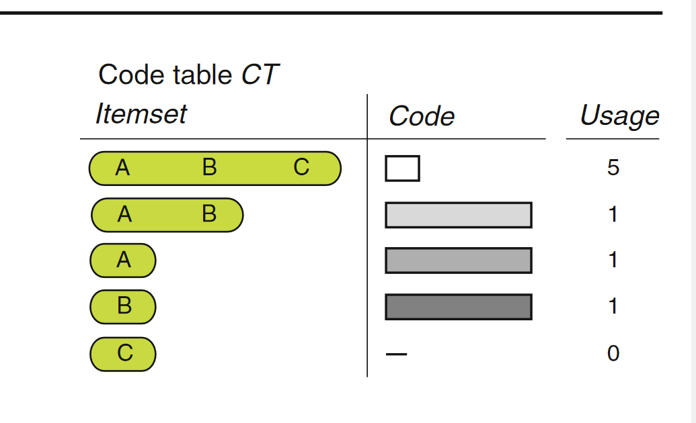

# KRIMP

One of the main reasons for mining a dataset is to gain insight in the  data. Hence, for us, the best set of patterns is the set of patterns  that describes the data best.

Minimal Description Length Principle

One could summarize this approach by the slogan: the best model compresses the data best. By taking this approach we do not try to compress the set of frequent itemsets, rather, we want to find that set of frequent itemsets that yields the best lossless compression of the database.

## Minimal Description Length Principle

Insight: any regularity in the data can be used to compress the data,

### Kolmogorov Complexity and Ideal MDL

a formal language in which to express properties of the data.

This choice leads to the definition of the *Kolmogorov complexity* ：a sequence as the length of the shortest program that prints the sequence and then halts.

This idealized MDL is very general in scope, but not practically applicable, for the following two reasons: 

1. Uncomputability. It can be shown that there exists no computer program that, for every set of data D,when given D as input, returns the shortest program that prints D
2. Arbitrariness/dependence on syntax. In practice we are confronted with small data samples for which the invariance theorem does not say much. Then the hypothesis chosen by idealized MDL may depend on arbitrary details of the syntax of the programming language under consideration.

### Practical MDL

**MDL: The Basic Idea** 

The goal of statistical inference may be cast as trying to find regularity in the data. “Regularity” may be identified with “ability to compress.” MDL combines these two insights by viewing learning as data compression: it tells us that, for a given set of hypotheses H and data set D, we should try to find the hypothesis or combination of hypotheses in H that compresses D most.

## Theory

### MDL (Minimum Description Length)

For MDL, this principle can be roughly described as follows.

model and data are encoded together

### MDL for itemsets

The key idea of our compression based approach is the ***code table***. A code table is a simple two-column translation table that has itemsets on the left-hand side and a code for each itemset on its right-hand side.

A example code table: 

The usage column is not actually part of the code table—it is only shown for illustrative purposes .

To encode a transaction t from database D over I with code table CT , we require a cover function cover(CT , t) that identifies which elements  of CT are used to encode t. The parameters are a code table CT and a transaction t, the result is a disjoint set of elements of CT that cover t. Or, more formally, a cover function is defined as follows.

