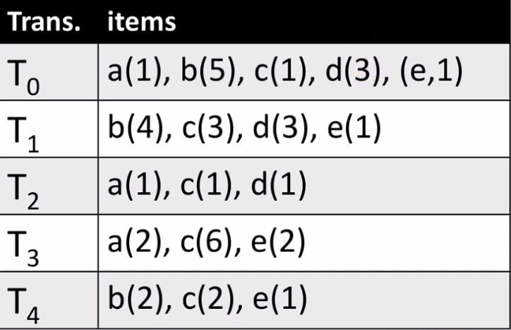
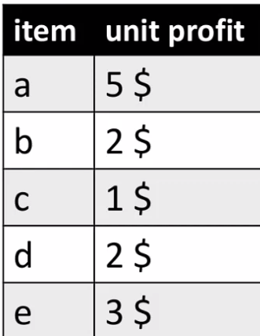
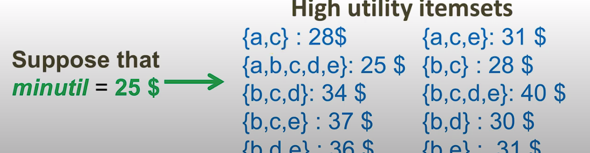
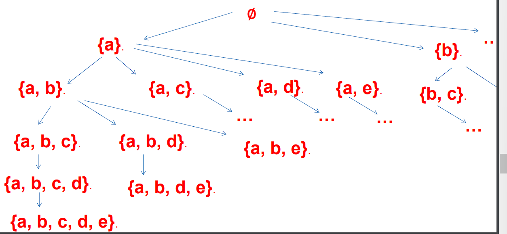
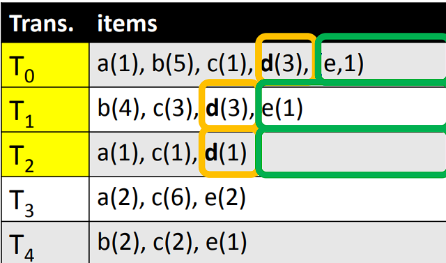
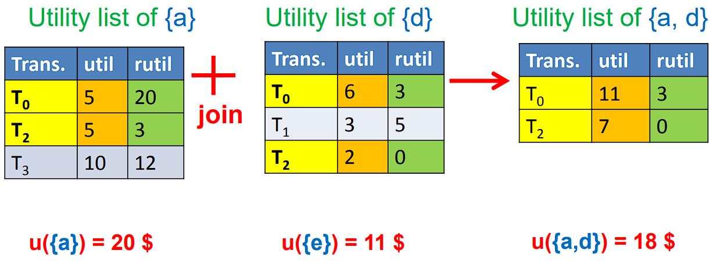
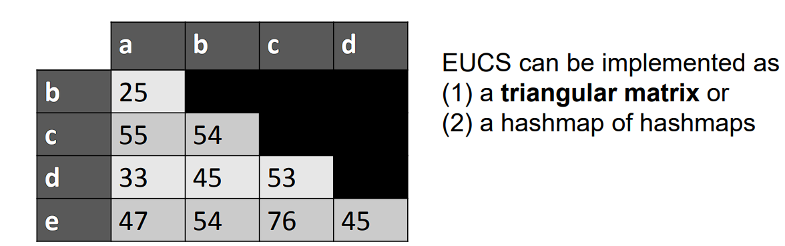

## High Utility Itemset Mining

Problem description: Find what combinations make the most money. 

Transaction database with quantities:

unit profit table:

what we need to find:

### Transaction Utility

**Transaction Utility** of a transaction:

​	the sum of the utility of all items in that transaction.

| Trans.  | items                         |
| ------- | ----------------------------- |
| $T_{0}$ | a(1), b(5), c(1), d(3), (e,1) |
| $T_{1}$ | b(4), c(3), d(3), e(1)        |
| $T_{2}$ | a(1), c(1), d(1)              |
| $T_{3}$ | a(2), c(6), e(2)              |
| $T_{4}$ | b(2),c(2),e(1)                |

| item | unit profit |
| ---- | ----------- |
| a    | 5$          |
| b    | 2$          |
| c    | 1$          |
| d    | 2$          |
| e    | 3$          |

example: $ TU(T_{3})=(2*5)+(6 × 1)+(2 × 3) = 22 $

### The TWU upper bound

 **TWU of an itemset**:

​	the sum of the transaction utility for transactions containing the itemset.

Example:

$TWU(\{a,e\}) = TU(T_{0}) + TU(T_{3}) = 25 $ + 22 $ = 47 $ 

**Property:** The TWU of an itemset is an upper bound on its utility, and all its supersets.

**Example:**

$\text{TWU}(\{a, e\}) = 47 \geq u(\{a, e\}) = 24$ and the utility of any superset of {a,e}

### HUI-Miner

We use the transaction database below to show the process.

| Trans.  | items                         |
| ------- | ----------------------------- |
| $T_{0}$ | a(1), b(5), c(1), d(3), (e,1) |
| $T_{1}$ | b(4), c(3), d(3), e(1)        |
| $T_{2}$ | a(1), c(1), d(1)              |
| $T_{3}$ | a(2), c(6), e(2)              |
| $T_{4}$ | b(2),c(2),e(1)                |

| item | unit profit |
| ---- | ----------- |
| a    | 5$          |
| b    | 2$          |
| c    | 1$          |
| d    | 2$          |
| e    | 3$          |

Steps:

1. It performs a **depth-first search** by appending items to itemsets.

	

2. Creates a vertical structure named *Utility-List* for **each item**

	**Example:** The utility-list of {d}

	| Trans.  | util | rutil |
	| ------- | ---- | ----- |
	| $T_{0}$ | 6    | 3     |
	| $T_{1}$ | 6    | 3     |
	| $T_{2}$ | 2    | 0     |

	1. The first column is the **list of transactions** containing the itemset

	2. The second column is the **utility** of **the itemset** in these transactions

		**Property 1.** The sum of the second column gives the utility of the itemset.

	3. The third column is the **remaining utility**, that is utility of items appearing after the itemset in the transactions.

		The rutil of {d} is the utility of {e}

		

3. Utility-lists can be joined to calculate utility-lists of larger itemsets

	

	for rutil, we take the smaller number.

### FHM- A faster algorithm

**Observation**:

* the main performance bottleneck of HUIMiner is the join operations.

* Join operations are very costly in terms of execution time

**Solutions**:

 * We propose a mechanism named Estimated-Utility Co-occurrence pruning.

 * First, we pre-calculate the TWU of all pairs of items and store it in a structure named EUCS.

	

* Then, during the search, consider that we need to calculate the utility list of an itemset X
* If X contains a pair of items i and j such that TWU({i,j}) < minutil, then X is low utility as well as all its extensions.
* In this case, we can avoid performing the join.

## Sequential Pattern Mining

Definition: **Sequence**

Definition: **Subsequence**

Definition: **Sequence database**

Definition: **Support of a sequence**

Definition: **Sequential pattern mining**

