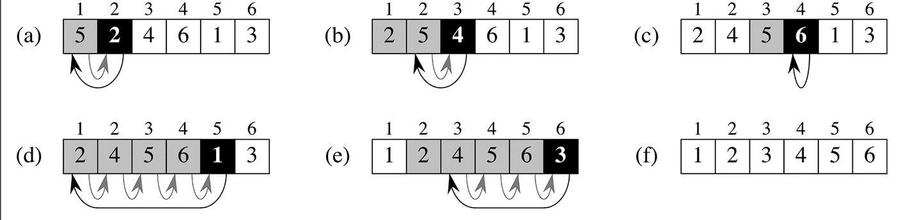
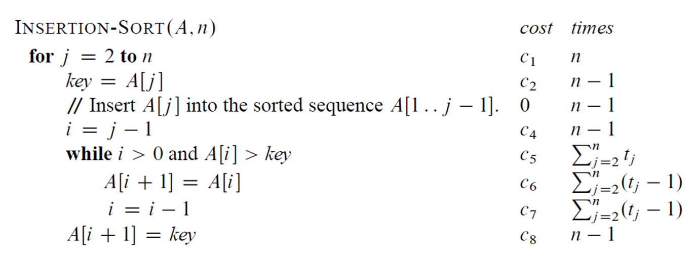
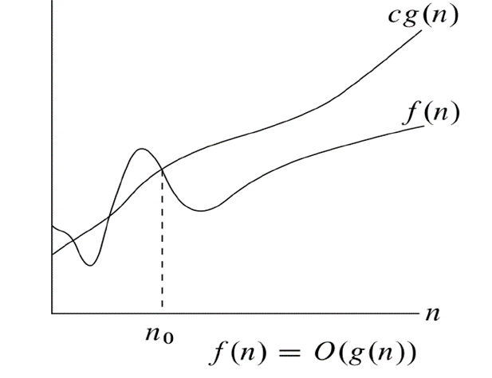
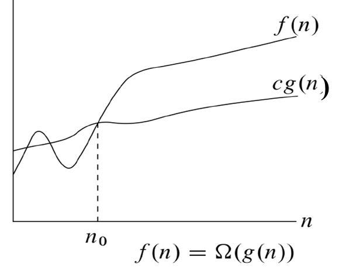
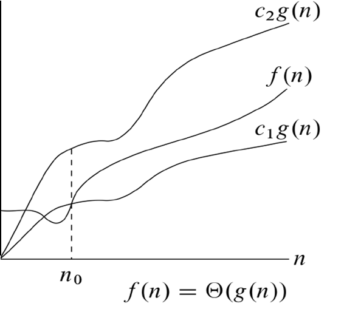
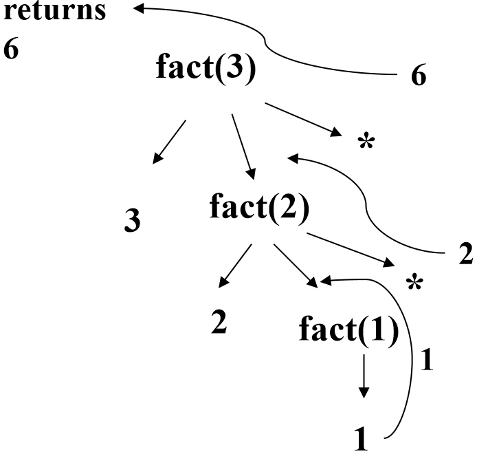

# 算法设计与分析课程

## 第一章：算法复杂度分析

### 1.1算法基本概念

**算法是若干指令的有穷序列，满足性质**

* **输入**：有外部提供的量作为算法的输入。

* **输出**：算法产生至少一个量作为输出。

* **确定性**：组成算法的每条指令是清晰，无歧义的。

* **有限性**：算法中每条指令的执行次数是有限的，执行每条指令的时间也是有限的。

* **可行性**: **算法是能够有效解决问题的**

### 1.2 分析插入排序

伪代码：

* 假定每次执行第i行所花的时间都是常量$c{_i}$
* j=2,,3,…,n,假定$t{_j}$表示对那个值j执行while循环测试的次数。
* 当一个for或while循环按通常的方式（由于循环头中的测试）退出时，执行测试的次数比执行循环体的次数多1。

$T(n)=c{_1}*n+c{_2}*(n-1)+c{_4}*(n-1)+c{_5}*\sum_{j=2}^n t{_j}$

$+c{_6}*\sum_{j=2}^n(t{_j}-1) +c{_7*\sum_{j=2}^n *(t{_j}-1)+c_8*(n-1)}$

最好情况：数组已经排好序

所有$t_j$均为1，$T(n)$可表示为$an+b$,其中常量a和b依赖于语句代价$c_i$

最坏情况：数组已逆序排好

$t_j=j$ , $T(n)=an^2+bn+c$

平均情况：

$E(t_j)=\frac{1}{j}(1+2+...+j)=\frac{j+1}{2} \approx \frac{j}{2}$

平均情况下的运行时间仍是n的二次函数

### 1.3渐近几号–O记号

渐进上界记号O(大O)

渐近地给出了一个函数在常量因子内的上界:

$O(g(n)) = \{ f(n) : \exists c > 0, \exists n_0 > 0, \forall n \geq n_0, 0 \leq f(n) \leq c \cdot g(n) \}$

**渐近下界记号$\Omega$(大$\Omega$)**

渐近地给出了一个函数在常量因子内的下界:

$\Omega(g(n)) = \{ f(n) : \exists c > 0, \exists n_0 > 0, \forall n \geq n_0, 0 \leq c \cdot g(n) \leq f(n) \}$

**渐近紧确界记号$\Theta$**

渐近地给出了一个函数的上界和下界:

$\Theta(g(n)) = \{ f(n) : \exists c_1 > 0, \exists c_2 > 0, \exists n_0 > 0, \forall n \geq n_0, 0 \leq c_1 \cdot g(n) \leq f(n) \leq c_2 \cdot g(n) \}$

## 第二章：分治策略

将一个问题分解为与原问题相似但规模更小的若干子问题，递归地解这些子问题，然后将这些子问题的解结合起来构成原问题的解。这种方法在每层递归上均包括三个步骤

* Divide（分解）：将问题划分为若干个子问题
* Conquer（求解）：递归地解这些子问题；若子问题Size足够小，则直接解决之
* Combine（组合）：将子问题的解结合成原问题的解

### 递归算法

* 一个递归算法通常包含递归的调用该算法本身，传入较小的参数。

* 递归算法的中止条件：

	处理基本情况，这些情况不可以有任何递归调用。

