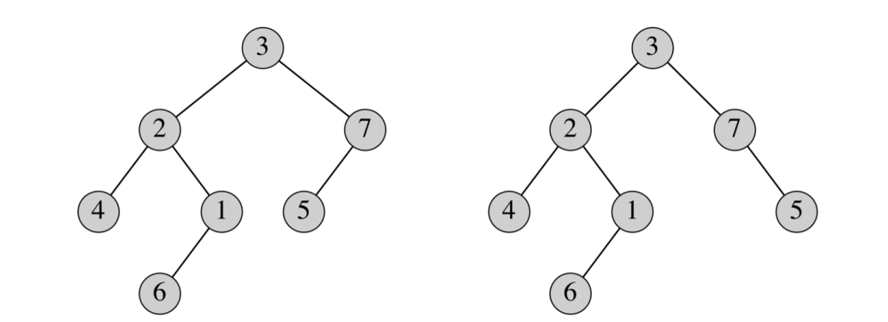

# 算法设计与分析课程

## 第一章：算法复杂度分析

### 1.1算法基本概念

**算法是若干指令的有穷序列，满足性质**

* **输入**：有外部提供的量作为算法的输入。

* **输出**：算法产生至少一个量作为输出。

* **确定性**：组成算法的每条指令是清晰，无歧义的。

* **有限性**：算法中每条指令的执行次数是有限的，执行每条指令的时间也是有限的。

* **可行性**: **算法是能够有效解决问题的**

### 1.2 分析插入排序


伪代码：


* 假定每次执行第i行所花的时间都是常量$c{_i}$
* j=2,,3,…,n,假定$t{_j}$表示对那个值j执行while循环测试的次数。
* 当一个for或while循环按通常的方式（由于循环头中的测试）退出时，执行测试的次数比执行循环体的次数多1。

$T(n)=c{_1}*n+c{_2}*(n-1)+c{_4}*(n-1)+c{_5}*\sum_{j=2}^n t{_j}$

$+c{_6}*\sum_{j=2}^n(t{_j}-1) +c{_7*\sum_{j=2}^n *(t{_j}-1)+c_8*(n-1)}$

最好情况：数组已经排好序

所有$t_j$均为1，$T(n)$可表示为$an+b$,其中常量a和b依赖于语句代价$c_i$

最坏情况：数组已逆序排好

$t_j=j$ , $T(n)=an^2+bn+c$

平均情况：

$E(t_j)=\frac{1}{j}(1+2+...+j)=\frac{j+1}{2} \approx \frac{j}{2}$

平均情况下的运行时间仍是n的二次函数

### 1.3渐近几号–O记号

<span style= color:blue>渐进上界</span>记号<span style="color:red">O</span>(大O)

渐近地给出了一个函数在常量因子内的上界:

$O(g(n)) = \{ f(n) : \exists c > 0, \exists n_0 > 0, \forall n \geq n_0, 0 \leq f(n) \leq c \cdot g(n) \}$


**渐近下界记号$\Omega$(大$\Omega$)**

渐近地给出了一个函数在常量因子内的下界:

$\Omega(g(n)) = \{ f(n) : \exists c > 0, \exists n_0 > 0, \forall n \geq n_0, 0 \leq c \cdot g(n) \leq f(n) \}$


**渐近紧确界记号$\Theta$**

渐近地给出了一个函数的上界和下界:

$\Theta(g(n)) = \{ f(n) : \exists c_1 > 0, \exists c_2 > 0, \exists n_0 > 0, \forall n \geq n_0, 0 \leq c_1 \cdot g(n) \leq f(n) \leq c_2 \cdot g(n) \}$


## 第二章：分治策略

将一个问题分解为与原问题相似但规模更小的若干子问题，递归地解这些子问题，然后将这些子问题的解结合起来构成原问题的解。这种方法在每层递归上均包括三个步骤

* Divide（分解）：将问题划分为若干个子问题
* Conquer（求解）：递归地解这些子问题；若子问题Size足够小，则直接解决之
* Combine（组合）：将子问题的解结合成原问题的解

### 递归算法

* 一个递归算法通常包含递归的调用该算法本身，传入较小的参数。

* 递归算法的中止条件：

	处理基本情况，这些情况不可以有任何递归调用。


### 分治算法的效率分析

* 用递归式分析分治算法的运行时间。
* 一个递归式是一个函数，它由一个或多个基本情况（base case），它自身，以及小参数组成。
* 递归式的解可以用来近似算法的运行时间。

#### 递归式求解方法1-迭代法


对于上图的递归式：

当n>1时T(n) = T(n-1)+1 =T(n-2)+1+1 =…  =T(1)+1+…+1         =T(1)+n-1= n

$\therefore T(n)\in \Theta(n)$

归并排序：

* 输入数组 A[p .. r] 

	

* 递归式:

	


$\therefore T(n) \in \Theta(n\log(n))$

#### 递归式求解方法2-主定理法

该方法可解如下形式的递归式

$T(n)=aT(n/b)+f(n)$

其描述的是这样一种算法的运行时间：它将规模为n的问题分解为啊个子问题，每个子问题规模为n/b，其中a和b都是正数。

其中 $$a\geq 1$$ 和 b > 1 是两个常数, f(n) 是一个渐进非负函数（当n趋于无穷时， f(n) 是非负的）。

如果 n/b 不是整数, 取整 n/b 

主方法可解包含三种类型 f(n) ($O、\Omega、\Theta$)的递归式  T(n) 。 


##### 使用主方法：

使用主方法很简单，我们只需确定主定理的哪种情况成立，即可得到解

**关键是看$f(n)$和$n^{\log_a^b}$谁比较大**

“较大” 指<span style="color:red">多项式意义上的大</span>, 大一个因子$n^{\varepsilon}$, for some $\varepsilon$> 0.

1. 若$n^{\log_a^b} > f(n)$ ，$T(n)=\Theta (n^{\log_a^b})$，属于情况(1)
2. 若$n^{\log_a^b} < f(n)$，$T(n)=\Theta(f(n))$，属于情况(3)
3. 若$n^{\log_a^b} = f(n)$，$T(n)=\Theta(n^{log_a^b})$，属于情况(2)

### 分治算法的设计

用分治算法来解决问题，通常思路为:

1. **划分（Divide）：** 将原问题划分成若干个规模较小且相互独立的子问题。这一步是问题分解的过程。
2. **征服（Conquer）：** 递归地解决这些子问题。对于规模足够小的子问题，直接求解。
3. **合并（Combine）：** 将子问题的解合并成原问题的解。这一步是问题合并的过程。

最经典的分治算法之一是归并排序（Merge Sort），它就是通过分治思想来进行排序的。其他例如快速排序、最近点对问题等问题也可以通过分治算法解决。

#### 1、二维最近点对问题

P1(x1,y1),...,Pn=(xn,yn)是平面上n个点构成的集合S，假设n=$2^k$，最近点对问题要求找出距离最近的两个点


1. 将点集S分为S1和S2，分隔线是S在x轴的中点（如何确定x=c?）
2. 递归求解S1和S2的最近点对，令d=min{d1,d2}，确定C1和C2
3. 将C1和C2的最近点对合并

最终会分为左右两边都只有一个点，并将这两个点的距离返回

property:合并时只考虑处在中轴线左右距离为d的范围内的点，在考虑每一个点时也只考虑点上下两端长度为d的范围之内的点


算法分析：

合并最小问题所花的时间为M(n)=O(n)

该算法的最差递归时间为：T(n)=2T(n/2)+n=O(nlogn)

#### 2、最大子数组问题

问题:

* 输入: 数值数组 A[1 .. n]
	* 假设数组中存在负数
	* 如果数组中全是非负数，该问题很简单。
* 输出: 数组下标 i 和 j 使得子数组 A[i .. j]为A[1 .. n]的和最大的非空连续子数组。


**分治算法：**

* 子问题 : 找出 A[low .. high] 的最大子数组。
	* 参数初始值, low = 1, high = n. 
	* **分解** 将子数组分解成两个大小基本相同的子数组找到子数组的中间位置 mid ，将子数组分成两个更小的子数组 A[low  .. mid] 和 A[mid +1 .. high]。
	* **求解** 找数组 A[low .. mid] 和 A[mid +1 .. high]的最大子数组。
	* 组合 找出跨越中间位置的最大子数组, 三种情况取和最大的子数组 (跨越中间位置的**最大**子数组和求解 步骤中找到的两个最大子数组)。

**找跨越中间位置的最大子数组**：

* 这是一个关键的新问题。

* 它不是原问题的一个小规模实例

	* 附加限制：子数组必须跨越中间位置。

* 这个问题可以用O(n) 时间解决。

	* 任何一个跨越中间位置 A[mid] 的子数组 A[i .. j] 由两个更小的子数组 A[i .. mid] 和 A[mid+1 .. j] 组成, 其中$low \leq \ i \leq mid < j \leq high $因此，只需要找两种形式的最大子数组 A[i .. mid] 和 A[mid+1 .. j], 然后把它们合并。

	从中间位置分别向左和右寻找最大子数组，往左依次累加值，往右依次累加值，并记录最大值的值和所在的位置，最后将左右的从中间开始的最大子数组合并。

	def find_max_crossing_subarray(arr, low, mid, high):
	    left_sum = float('-inf')
	    max_left = 0

	    # 从中间位置向左找到最大子数组
	    for i in range(mid, low - 1, -1):
	        max_left += arr[i]
	        if max_left > left_sum:
	            left_sum = max_left
	            max_left_index = i
	    
	    right_sum = float('-inf')
	    max_right = 0
	    
	    # 从中间位置向右找到最大子数组
	    for j in range(mid + 1, high + 1):
	        max_right += arr[j]
	        if max_right > right_sum:
	            right_sum = max_right
	            max_right_index = j
	    
	    # 计算横跨中间位置的最大子数组的和和索引
	    cross_sum = left_sum + right_sum
	    cross_start_index = max_left_index
	    cross_end_index = max_right_index
	    
	    return cross_sum, cross_start_index, cross_end_index

完整分治算法：


算法分析：

递归情况的递归式    T(n) = $\Theta$(1) + 2T(n/2) + $\Theta$(n) + $\Theta$(1) = 2T(n/2) + $\Theta$(n)

最大子数组分治算法运行时间为 $\Theta$(n lg n)，比蛮力法 $\Omega$(n2) 快。

#### 3、Strassen矩阵乘法

Strassen算法是一种分治算法，用于矩阵乘法。1969年，Volker Strassen发现了这种算法，它比传统的矩阵乘法算法（时间复杂度为O(n^3)）更快。传统的算法将两个n×n的矩阵相乘需要n^3次单独的乘法操作，而Strassen算法减少了乘法的次数，降低了时间复杂度到大约O(n^2.8074)。

Strassen算法的核心思想是将矩阵分割成四个子矩阵，然后对这些子矩阵进行递归操作。算法只需要7次乘法（而不是8次），因为它使用了一些额外的加法和减法来组合这些乘法的结果。

让我们用一个2x2的矩阵乘法例子来说明这个算法：

假设我们有两个矩阵A和B：

```
A = | a  b |    B = | e  f |
    | c  d |        | g  h |
```

普通的矩阵乘法会直接计算A和B的乘积：

```
AB = | ae+bg  af+bh |
     | ce+dg  cf+dh |
```

Strassen算法引入了七个新的乘法操作（P1到P7）来减少乘法的总次数：

```
P1 = a(f - h)       // a乘以(f-h)
P2 = (a + b)h       // (a+b)乘以h
P3 = (c + d)e       // (c+d)乘以e
P4 = d(g - e)       // d乘以(g-e)
P5 = (a + d)(e + h) // (a+d)乘以(e+h)
P6 = (b - d)(g + h) // (b-d)乘以(g+h)
P7 = (a - c)(e + f) // (a-c)乘以(e+f)
```

然后，我们可以用这七个乘法结果来构造最终的乘积矩阵C：

```
C = | P5 + P4 - P2 + P6    P1 + P2           |
    | P3 + P4              P1 + P5 - P3 - P7 |
```

实际上，我们用7次乘法和18次加法或减法取代了8次乘法和4次加法。

请注意，当矩阵大小增加时，Strassen算法的优势会更加明显。对于大型矩阵，我们会继续分割每个子矩阵，直到它们足够小，可以用常规方法或递归使用Strassen算法计算。

下面是一个简单的2x2矩阵乘法的例子，来演示Strassen算法的步骤：

假设我们有以下矩阵A和B：

```
A = | 1  2 |    B = | 3  4 |
    | 3  4 |        | 5  6 |
```

我们可以计算P1到P7：

```
P1 = 1 * (4 - 6) = -2
P2 = (1 + 2) * 6 = 18
P3 = (3 + 4) * 3 = 21
P4 = 4 * (5 - 3) = 8
P5 = (1 + 4) * (3 + 6) = 45
P6 = (2 - 4) * (5 + 6) = -12
P7 = (1 - 3) * (3 + 4) = -7
```

现在用这些值计算C的每个元素：

```
= | 45 + 8 - 18 - 12  -2 + 18     |
  | 21 + 8              -2 + 45 - 21 + 7 |
= | 23                   16        |
  | 29                   29        |
```

因此，矩阵C，即A乘以B的结果是：

```
| 23  16 |
| 29  29 |
```

Strassen算法是理解矩阵乘法和算法优化的一个很好的工具，尤其是在处理大规模数据时。然而，由于它涉及更多的加法和减法，所以它在实践中的效率可能会受到具体实现和计算环境的影响。

#### 4、凸包问题


#### 5、棋盘覆盖问题


## 第三章：堆和堆排序

### 二叉树

二叉树是一个有根结点的有序树，其中每个结点最多有两个孩子结点，并且左孩子结点和右孩子结点可区分 (也就是说他们有不同属性)。

有序树  是一个有根结点的树，其中每个结点的孩子结点都是有序的 (第一个孩子结点，第二个孩子结点，等等)。



* 在一个二叉树中，一个结点的深度 in 是从这个结点到根结点的简单路径的边数。
* 一颗树 T的深度 是树中所有结点最大的深度。
* 一个结点的高度 = 从该结点到一个叶子结点的最长简单路径的边数。
* 一棵树 T 的高度 = 树的根结点的高度= 树的深度


#### 完全二叉树

完全二叉树 是一个所有叶子结点在同样深度，而且每个非叶节点都有两个孩子结点的二叉树。


在完全二叉树中，高度为h的节点数是$2^{(h+1)}-1$

有n个结点的完全二叉树的高度是$lg{(n+1)}-1$

##### 近似完全二叉树

深度为 d 的 近似完全二叉树 满足下面两个条件：

* 只考虑深度为 d – 1 时是完全二叉树
* 深度为 d 的结点都在靠左部分


### 堆

一个 (二叉) 堆 是一个 a 近似完全二叉树 :

* 结点中存储的数值来自一个有序的集合。
* 每个结点存储的数值满足一种 堆的性质. 

两种堆的性质:

* 最大堆性质 : 每个结点存储的数值 ≥ 该结点的孩子节点存储的数值。
	* 最大值存储在根结点
* 最小堆性质 :每个结点存储的数值 ≤该结点的孩子节点存储的数值。
	* 最小值存储在根结点

#### 一个堆可以用一个数组 A来实现。

* 根结点是 A[1].
* A[i] 的左孩子结点 = A[2i].
* A[i] 的右孩子结点 = A[2i + 1].
* A[i] 的父节点 = A[ i/2 ].


#### 堆的基本操作

* Max-Heapify: 维护最大堆性质; 代价 O(lg n) 时间
* Build-Max-Heap: 从一个无序数组建成一个最大堆; 代价 (n) 时间
* Heapsort: in place排序一个数组；代价 O(n lg n)
* Max-Heap-Insert, Heap-Extract-Max, Heap-Increase-Key, and Heap-Maximum: 这些操作可用堆实现 优先队列 。

##### Max-Heapify 维护最大堆的性质。

* 调用 Max-Heapify 之前: A[i], 可能比它的孩子结点小。
* 条件: i 的左和右子树已经是最大堆。
* 调用 Max-Heapify 之后: 以 i 为根的子树是一个最大堆。

主要思想:

* 比较 A[i], A[Left(i)], and A[Right(i)]
* 如果有需要, 把 A[i] 与其较大的一个孩子结点交换
* 在堆中继续向下比较和交换，直到以 i 为根的子树是一个最大堆。 


##### 建堆

自底向上的过程把一个无序的数组 A 建成一个最大堆


为什么从$\lfloor n/2 \rfloor$开始？

* 在heapification的过程中, 只需要考虑非叶节点。
	* 因为叶子节点可以被视为已经是一个满足堆性质的堆（每个节点的值都不大于（或不小于）其子节点的值），而非叶子节点是那些可能破坏堆性质的节点.
* 子数组 A[$\lfloor$n/2$\rfloor$+1 .. n] 中的元素对应的所有结点都是叶子结点，因为 A[$\lfloor$n/2$\rfloor$] 是非叶节点中数组下标最大的。
	* A[$\lfloor$n/2$\rfloor$] 的左孩子是 A[2$\lfloor$n/2$\rfloor$], which is A[n] 如果 n 是偶数 or n – 1 如果 n 是奇数。

##### 堆排序

给定一个数组, **堆排序** 算法如下:

* 在数组上建一个最大堆。
* 从根结点开始 (它的值最大), 算法将最大值放到数组中正确的地方，也就是将它与数组中最后一个元素交换位置。
* “去掉” 数组中最后一个元素 (它已经在正确的位置)， 在新的根结点上调用 Max-Heapify，新的根结点有可能违反堆的性质。
* 重复“去掉” 操作直到只剩一个结点 (也就是最小值), 这是数组已经排序完成。


分析：

* Build-Max-Heap: O(n)
* for loop: n – 1 次
	* 交换值: O(1)
	* Max-Heapify: O(lg n)
* **总时间 : O(n lg n)**
	* 与归并排序一样，而且是in place排序。

举例：


## 第四章：回溯法

### N皇后问题

在n×n格的棋盘上放置彼此不受攻击的n个皇后。按照国际象棋的规则，皇后可以攻击与之处在同一行或同一列或同一斜线上的棋子。n后问题等价于在n×n格的棋盘上放置n个皇后，任何2个皇后不放在同一行或同一列或同一斜线上。

n＝1 显而易见。n＝2、3，问题无解。n>=4 时，以4后为例


**求解过程图示**


### 回溯法思想

向量$x=(x_1,x_2,x_3,x_4)$表示皇后的布局。分量$x_i$表示第i行皇后的列位置。

$x_i$的取值范围$S_i={\{1,2,3,4\}}$，有$4^4$个可能解(2,4,1,3)是一个可行解


完全四叉树的所有叶子节点构成一个解空间，每个叶子节点就是一个可能解，满足要求的叶子节点就是可行解

#### 回溯法简介

将所有的解（问题的解空间）按照一定结构排列，再进行搜索。

* 一般解空间构造成为为树状结构，用深度优先的策略搜索
* 两种方式：
	* 只需要一个解的话，找到解就停止
	* 需要求所有解，则需做“树的遍历”找到所有解。
* 通常用排除法，减少搜索空间

#### 回溯法的基本思想

1. 针对所给问题，定义问题的解空间
2. 确定易于搜索的解空间范围
3. 以深度优先方式搜索解空间，并在搜索过程中用剪枝函数避免无效搜索

常用剪枝函数

1. 用约束函数在扩展结点处剪去不满足约束的子树
2. 用限界函数剪去得不到最优解的子树  

## 第六章：动态规划

### 历史及研究问题

动态规划(dynamic programming)是运筹学的一个分支，20世纪50年代初美国数学家R.E.Bellman等人在研究多阶段决策过程(multistep decision process)的优化问题时，提出了著名的最优化原理(principle of optimality)，把多阶段过程转化为一系列单阶段问题，逐个求解，创立了解决这类过程优化问题的新方法—动态规划。

多阶段决策问题：求解的问题可以划分为一系列相互联系的阶段，在每个阶段都需要作出决策，且一个阶段决策的选择会影响下一个阶段的决策，从而影响整个过程的活动路线，求解的目标是选择各个阶段的决策使整个过程达到最优。

动态规划主要用于求解以时间划分阶段的动态过程的优化问题，但是一些与时间无关的静态规划(如线性规划、非线性规划)，可以人为地引进时间因素，把它视为多阶段决策过程，也可以用动态规划方法方便地求解。

动态规划是考察问题的一种途径，或是求解某类问题的一种方法。

动态规划问世以来，在经济管理、生产调度、工程技术和最优控制等方面得到了广泛的应用。例如最短路线、库存管理、资源分配、设备更新、排序、装载等问题，用动态规划方法比用其它方法求解更为方便。

### 一些术语和概念

阶段：把所给的问题的求解过程恰当地划分为若干个相互联系的阶段。

状态：状态表示每个阶段开始时，问题或系统所处的客观状况。状态既是该阶段的某个起点，又是前一个阶段的某个终点。通常一个阶段有若干个状态。

状态的无后效性：如果某阶段状态给定后，则该阶段以后过程的发展不受该阶段以前各阶段状态的影响，也就是说状态具有马尔科夫性。

 注：适于动态规划法求解的问题具有状态的无后效性

策略：各个阶段决策的确定后，就组成了一个决策序列，该序列称之为一个策略。由某个阶段开始到终止阶段的过程称为子过程，其对应的某个策略称为子策略。

### 最优性原理

* Bellman的原定义如下：

  An optimal policy has the property that whatever the initial state and initial decision are, then remaining decisions must constitute an optimal policy with regard to the state resulting from first decision.

* Bellman最优性原理：

  求解问题的一个最优策略序列的子策略序列总是最优的，则称该问题满足最优性原理。

  注：对具有最优性原理性质的问题而言，如果有一决策序列包含有非最优的决策子序列，则该决策序列一定不是最优的。

### 方法的基本思想

动态规划的思想实质是分治思想和解决冗余。 

与分治法类似的是

将原问题分解成若干个子问题，先求解子问题，然后从这些子问题的解得到原问题的解。

与分治法不同的是：

经分解的子问题往往不是互相独立的。若用分治法来解，有些共同部分（子问题或子子问题）被重复计算了很多次。

如果能够保存已解决的子问题的答案，在需要时再查找，这样就可以避免重复计算、节省时间。动态规划法用一个表来记录所有已解的子问题的答案。这就是动态规划法的基本思路。具体的动态规划算法多种多样，但它们具有相同的填表方式。

### 方法的求解步骤

1. 找出最优解的性质，并刻画其结构特征；
2. 递归地定义最优值（写出动态规划方程）；
3. 以自底向上的方式计算出最优值；
4. 根据计算最优值时记录的信息，构造最优解。

### 适用条件

* 最优子结构

	如果问题的最优解是由其子问题的最优解来构造，则称该问题具有最优子结构性质。 

* 重叠子问题

	 在用递归算法自顶向下解问题时，每次产生的子问题并不总是新问题，有些子问题被反复计算多次。动态规划算法正是利用了这种子问题的重叠性质，对每一个子问题只解一次，而后将其解保存在一个表格中，在以后该子问题的求解时直接查表。

### 0/1背包问题

计算机科学中一个著名的问题。给定*n*个体积为$w_1,...w_n,...$、价值为$v_1,...,v_n,...$的物品和一容量为*W*的背包，求这些物品中一个最有价值的子集。

#### 动态规划求解背包问题

#### 动态规划思路：

1. **定义状态：** 设 `dp[i][j]` 表示前 `i` 个物品放入容量为 `j` 的背包中所能获得的最大价值。

2. **状态转移方程：**

	- 如果第 `i` 个物品的重量大于当前背包容量 `j`，即 `weights[i-1] > j`，那么无法放入，保持上一行的状态：`dp[i][j] = dp[i-1][j]`。

	- 否则，可以选择放入或不放入，取两者中的最大值：

		```dp[i][j] = Math.max(dp[i-1][j], dp[i-1][j-weights[i-1]] + values[i-1]); ```

		- 放入：`dp[i][j] = dp[i-1][j-weights[i-1]] + values[i-1]`，表示放入第 `i` 个物品后的总价值。( 这时我们需要查看前 `i-1` 个物品在剩余容量 `j - weights[i-1]` 下的最优值 `dp[i-1][j-weights[i-1]]`，dp\[i-1][j-weights[i-1]] 表示放入当前物品之后再把剩下的重量按最佳填满的价值)
		- 不放入：`dp[i][j] = dp[i-1][j]`。

3. **初始化条件：** 第一行和第一列需要初始化，表示没有物品或者背包容量为 0 时的情况。

4. **遍历顺序：** 从左上角到右下角，逐行填表。

5. **结果：** `dp[n][W]` 即为问题的解，其中 `n` 是物品的个数，`W` 是背包的容量。

### 钢条切割问题

问题描述

**钢条切割问题**：给定一段长度为n英寸的钢条和一个价格表$p_i$ (*i*=1,2,…,n) ,求切割钢条方案，使得销售收益$r_n$最大。

 切割工序本身没有成本支出。 Serling公司管理层希望知道最佳的切割方案。假定我们知道Serling公司出售一段长度为*i*英寸的钢条的价格为$p_i$(*i*=1,2,…,单位为美元) 。钢条的长度均为整英寸。如下为一个价格表的样例。


1. **初始始化变量**：对于每个长度 $i(从1到n)$，你首先初始化一个临时变量 $q$。这个变量$q$用来存储当前长度为$i$ 的钢条的最大收益。我们将$q$初始化为一个非常小的数（例如 $-\infin$），以确保它小于任何可能的收益。
2. **内部循环(更新最大收益)**
	* 然后，对于每个可能的切割垫$j(从1到i)$，计算如果在这个点切割，能得到的总收益。这个收益由两部分组成：
		* 长度为$j$的钢条的价格$p_j$
		* 剩下长度为$i-j$的钢条的最大收益$r[i-j]$
	* 你会计算这些不同切割点的所有可能收益，并更新q为这些收益中的最大值。这样，$q$就变成了对于长度为$i$的钢条，所有切割方案中的最大收益。
3. **记录最大收益**
	* 一旦内部循环完成，将这个最大收益q存储在$r[i]$中。这意味着对于长度为$i$的钢条，我们已经找到了最大收益，并将其记录下来


### 总结

对于动态规划来说，一般就是创建一个dp数组来记录状态，然后通过循环遍历问题给出的数组，遍历来找出子问题的解然后用子问题来解决问题。根据不同的问题设置不同的记录变量或者是改进dp数组的增值条件。

动态规划是一种算法范式，用于解决具有重叠子问题和最优子结构特性的复杂问题。其基本步骤可以概括如下：

1. **定义状态**：创建一个或多个状态数组（通常称为 DP 数组），用于记录解决问题的中间结果。每个状态通常表示到达某个特定步骤或决策点时的最优解。

2. **初始化状态**：确定基本情况的解，用于构建更复杂解决方案的基础。这通常涉及到初始化 DP 数组的一个或多个元素。

3. **状态转移方程**：定义如何从一个或多个较小的子问题的解中构建出较大问题的解。这通常涉及到编写一个或多个状态转移方程，用于更新 DP 数组的元素。

4. **填充 DP 数组**：通过遍历问题给出的数据结构（例如数组、列表等），按照状态转移方程逐步填充 DP 数组。这通常涉及到一系列循环，根据问题的特性可能是单层或多层嵌套循环。

5. **构造最终解**：在填充完 DP 数组后，最终解通常存储在数组的一个特定位置（如最后一个元素），或者需要通过遍历数组来构造。

6. **优化**：根据问题的特点，可以对基本的动态规划方法进行优化，如使用滚动数组减少空间复杂度，或使用备忘录方法优化递归实现。

	

## 第七章：贪心算法

### 最优化问题

* 贪心贪心算法可用来解决最优化问题。
* 最优化问题：给出一个问题的实例，一组约束条件和目标函数，找到一个可行的解决方案，对于给定的实例为目标函数的最优值。
* 可行的解决方案满足问题的约束条件。
	* 解决方案中要详细说明约束条件中的限制因素。
	* 例：在背包问题中，我们要求背包中所有物件的质量总和不能超过所能承受的最大重量。

### 贪心法：基本原理

* 经典贪心算法基本思想：
	* 遵循某些贪心准则，在当前状态下做出局部最优选择。这被称为贪心选择。
	* 我们希望能够从局部最优解中推导出全局最优解。
	* **贪心选择属性**：局部最优解导出全局最优解。
* 在设计好的贪心算法的过程中，找到一个合适的贪心选择准则是很关键的。
	* 不同的贪心准则会导致不同的结果。

### 贪心法的不足

* 尽管贪心算法能够得出可行的解决方案，但它得出的可能不总是最优解。
* 因此需要证明对于任何有效的输入，贪心算法总能找到最优解。
* 为了反驳贪心算法不能得出最优解这种观点，我们需要反例。

### 0/1背包问题

* 假定
	* 背包能够承受的重量C > 0,
	* N个物件分别有重量为$w_i > 0$ ，价值分别为 $p_i > 0 \ for \ i = 1, …n, $
* 指出一个子集A  { 1, 2, …, n } 满足以下公式:


#### 贪心法解决方案

* 得到局部最优选择有一些可能的贪心选择准则：
	* 最大价值优先——选择可用价值最高的物件放入背包中。
	* 最小重量优先——选择可用重量最小的物件放入背包中。
	* 最大重量优先——选择可用重量最大的物件放入背包中。
	* 最大性价比优先——选择可用的、价值重量比最高的物件放入背包中。
* 不尽人意的是，以上方法没有一种能保证是最优解决方案——我们能够找到每一种方案的反例。

##### 最大价值优先-反例


##### 最小重量优先-反例


##### 最大重量优先——反例


##### 最高性价比优先——反例


## 第八章：摊还分析

在平摊分析中，在一数据结构上执行一个操作序列所需时间是所有操作执行时间的平均。它常用来证明在一个操作序列中，即使某个操作具有较大代价，当通过对所有操作求平均后，一个操作的平摊代价仍很小。 例如：某个地区生活成本800元/月/人

## 第九章：图论算法

### 1. 图的基本概念

- **节点（顶点）**: 图的基本单元，可以代表网络中的一个站点、地图上的一个城市等。

- **边**: 连接两个节点的线。如果边有方向，则称为有向图；如果没有方向，则称为无向图。

- **权重**: 边上的值，代表从一个顶点到另一个顶点的“成本”或“距离”。

- **连通性**：

	- 对于一个无向图，如果任意两个节点之间都存在一条路径连接，则称这个无向图为连通图。
	- 对于一个有向图，如果任意2个节点之间都存在一条有向路径连接，则称之为强连通图。

- **完全图：**对于一个有向或者无向图，如果任意两个节点之间都有边邻接（对于有向图需要两个方向的边），则称之为完全图

	- 如果(u, v) 为G中一条边, 我们称节点u 与节点v邻接

	

### 2. 图的实现

在计算机科学中，图通常用两种主要方式实现：

#### a. 邻接表

- **定义**: 每个节点都有一个列表，列出与之直接相连的所有节点。
- **优点**: 节省空间，特别是对于稀疏图（即边的数量远少于顶点对的数量）。
- **缺点**: 找出两个特定节点是否直接相连较慢。

#### b. 邻接矩阵

- **定义**: 一个二维数组，其中的元素表示节点之间是否存在边。如果数组的第 i 行第 j 列的元素为 1（或权重值），则表示存在从节点 i 到节点 j 的边。
- **优点**: 快速查询任意两个节点是否直接相连。
- **缺点**: 对于稀疏图，会浪费很多空间。

### 3.图的遍历

#### 广度优先搜索(BFS)


##### BFS 算法的步骤

###### 初始化阶段

1. 对图 `G` 中除了起始节点 `s` 外的所有节点 `u` 进行初始化：
	- `u.color = white`：所有这些节点都未被访问，所以它们的颜色初始化为白色。
	- `u.d = ∞`：这是节点 `u` 到起始节点 `s` 的距离，一开始被设为无穷大，表示距离未知。
	- `u.π = NIL`：这是节点 `u` 在 BFS 树中的父节点，初始化为 `NIL` 表示没有父节点。
2. 将起始节点 `s` 的颜色设为灰色，表示它将要被访问：
	- `s.color = gray`：起始节点被标记为灰色。
	- `s.d = 0`：起始节点到自身的距离是 0。
	- `s.π = NIL`：起始节点没有父节点。
3. 创建一个队列 `Q` 并将起始节点 `s` 入队：
	- `Q = ϕ`：初始化一个空队列。
	- `Enqueue(Q, s)`：将起始节点 `s` 加入队列。

###### 处理阶段

1. 当队列不为空时，执行循环：

	- `while (Q ≠ ϕ)`

2. 从队列中移除一个节点 `u`：

	- `u = Dequeue(Q)`

3. 对于节点 `u` 的每一个邻接节点 `v`：

	- `for each v in adj[u]`

4. 如果 `v` 的颜色是白色，即未被访问过，则：

	- ```
		if (v.color == white)
		```

		- `v.color = gray`：将 `v` 标记为灰色，表示 `v` 即将被访问。
		- `v.d = u.d + 1`：更新节点 `v` 的距离，它是 `u` 的距离加上一条边的距离。
		- `v.π = u`：将节点 `u` 设置为 `v` 的父节点。
		- `Enqueue(Q, v)`：将节点 `v` 加入队列。

5. 节点 `u` 的所有邻接节点都被处理后，将 `u` 的颜色改为黑色：

	- `u.color = black`：这表示 `u` 已经被完全探索，它和它的所有邻居都已被访问。

#### 深度优先搜索(DFS)

目标: 遍历图中所有的节点和边

基本思想: 每次搜索时优先往更深的节点搜索


##### DFS-Visit 算法的步骤

1. **时间戳增加**:

	- 算法以一个全局变量 `time` 开始，这个变量在整个搜索过程中持续增加。每当一个节点开始或结束探索时，`time` 将会增加。

2. **发现节点**:

	- `time = time + 1`：增加时间戳。
	- `u.d = time`：记录节点 `u` 的发现时间。
	- `u.color = GRAY`：将节点 `u` 标记为灰色，表示这个节点正在被探索。

3. **探索邻居**:

	- `for each v ∈ G.Adj[u]`：遍历节点 `u` 的所有邻接节点 `v`。

	- 如果邻居 

		```
		v
		```

		 未被访问（即 

		```
		v.color == WHITE
		```

		），则：

		- 递归调用 `DFS-Visit(G, v)`：对节点 `v` 进行深度优先探索。

4. **完成节点探索**:

	- 在探索完节点 

		```
		u
		```

		 的所有邻居后，我们将 

		```
		u
		```

		 标记为已完全探索：

		- `u.color = BLACK`：节点 `u` 变为黑色，表示 `u` 和它的所有邻居都已被探索完毕。
		- `time = time + 1`：再次增加时间戳。
		- `u.f = time`：记录节点 `u` 的完成时间（finish time）。

**算法分析**：

该算法能够发现图中的所有节点，无论该图是否连通，或者是否是有向图

BFS算法可以得到:

* 一个DFS森林：包括了一系列的DFS树
* 对于任意一个节点u有2个时间戳
	* u.d 表示第一次发现节点u的时间（被染成灰色节点的时间）
	* u.f 表示已经完成对u节点进行搜索的时间（被染成黑色节点的时间）
* 如果是邻接表存图，则DFS算法的复杂度为O(|V| + |E|) 
* 如果是邻接矩阵存图，则DFS算法的复杂度为O($|V|^2$)

##### DFS森林


DFS算法会产生一个DFS森林，它包含了一系列的DFS树

每颗DFS树都是由一系列的灰色节点指向白色节点的边组成

**边的分类**：

* 树边： 属于DFS森林的边.
* 反向边 ：从一个节点连向它在DFS树中的==祖先==节点的非树边
	* 上个例子中标记为B的边

* 前向边：从一个节点连向它在DFS树中的==后代==节点的非树边
	* 上个例子中标记为F 的边.

* 交叉边Cross edges – 图中不属于树边、反向边、和前向边的那些边
	* 上个例子中标记为C的边

* 当边(u, v) 第一次被DFS算法访问时，v节点的颜色可以确定边(u,v)的类型:
	* 如果v为白色节点，则(u,v) 为树边
	* 如果v是灰色节点，则(u,v) 为反向边
	* 如果v是黑色节点，则(u,v) 为前向边或者交叉边


##### DFS的应用

* ==无向图==G是否连通? 
	* 调用DFS-Visit(G, v) 一次，然后检查一下看看是否图中还有白色的节点。如果没有，则说明图是连通的，否则不连通    运行时间: O(|V | + | E |)
* 寻找连通分支
	* 调用DFS；每次调用DFS-Visit(G, v) ，其中所有遍历到的节点属于一个连通分支     运行时间: $\Theta$(|V | + | E |)
* 一个==有向图G==中是否包含一个有向环? 
	* 调用DFS；如果存在反向边，则说明存在有向环，否则不包含有向环
	* 运行时间: O(|V | + | E |).
* 一个==无向图G== 是否包含一个环? 
	* 与有向图的情况一样 
	* 如果图G是一个树或者森林，则它最多包含 |V | – 1 条边 
	* 运行时间为 O(|V |) ，因为DFS算法在发现环之前最多只会遍历|V |条边（一个无向图如果有≥ |V | 条边，则一定有环） 
* ==无向图G== 是否是一颗树? 
	* DFS调用 DFS-Visit(G, v)，如果所有的边都遍历了，且没有反向边，则图G是一颗树。如果有|V |条边被访问了，则G不是树. 
	* 运行时间: O(|V |).

### 拓扑排序

一个有向无环图(directed acyclic graph，简称DAG) 的拓扑排序是指对图中节点的一个排序，并且在该排序中，如果图G中存在边(vi, vj)，则节点vi必须排在节点vj之前


```
Topological-Sort2(G)
找到一个没有入边的节点v
删除v和v相连的边
递归调用Topological-Sort2(G  – {v})
```

### 强连通分支算法

* 一个有向图G = (V, E)的强连通分支是一个最大的节点集合，该集合中的任意节点互相连通。
* 如果把一个有向图分解为很多个强连通分支呢? 


#### 有向图的转置

* 令G = (V, E) 为一个有向图，G的转置为 $G^T$ = (V, ET), 其中ET = {(u, v): (v, u) $\in$ E}. 
* 如果用邻接表存图，计算$G^T$ 的时间复杂度为O(|V| + |E|).
* $G和G^T$ 有相同的强连通分支


**强连通分支算法:**

1. 调用DFS(G)，计算被DFS访问的结束时间 u.f

	

2. 计算$G^T$

3. 调用DFS($G^T$)，在DFS的主循环中，以u.f下降的顺序遍历节点

	

4. 对于在第3步中输出的DFS树，每颗DFS树中的节点形成一个强连通分支


### 生成树

对于一个连通的无向图G = (V, E) ，它的生成树是指包含图G中所有节点的树。

#### 最小生成树(MST)

* 图的权值指的是该图中所有边的权值之和
* 对于一个连通无向的加权G, 它的最小生成树指的是权值最小的生成树a 

##### Kruskal算法

* 令G = (V, E) 为一个连通的无向加权图
* 初始化：每个节点为一个连通分支
* 对于两个连通分支，选择连接它们的权值最小的边合并这两个连通分支，不断地重复这一过程。
* 按照权值递增的顺序选择边
* 利用一个==并查集==的数据结构来判断是否一条边的两个端点属于不同的连通分支(如果u和v已经在同一个连通分支中，这意味着它们已经通过图中的其他边相互连通。在这种情况下，再添加边(*u*,*v*)将会形成一个闭环，这与最小生成树的定义相悖。)
	* 对于图中的每一条边(u, v)，执行以下步骤来判断它们是否属于不同的连通分支：
		- 使用查找操作找到u的根节点和v的根节点。
		- 如果u和v的根节点相同，那么它们属于同一个连通分支。
		- 如果u和v的根节点不同，则它们属于不同的连通分支。这时可以选择用联合操作将它们所在的集合合并


并查集是一种数据结构，用于处理一些不交叉集合（Disjoint Sets）的合并及查询问题。它支持两种操作：

1. **查找（Find）**：确定某个元素属于哪一个子集，这个操作可以用来判断两个元素是否位于同一个子集。
2. **合并（Union）**：将两个子集合并成一个集合。


算法分析：

第一个for循环：有|V|个Make-Sets操作，总时间代价为O(|V|)

边排序的代价:O(|E|lg|E|)

第二个FOR循环: O(|E|) 个Find-Sets操作: 每个的代价为O(1) 

O(|E|) 个Unions操作: 每个的代价可以做到O(lg |V |)，这里需要更高级的实现，参加课本第21章

**总的时间复杂度**: O(|E| lg |E|) 或者O(|E| lg |V |)

注意: |E| ≤ |V |2  lg |E| = O(lg |V|)

##### Prim算法

* 创建一颗局部的树，然后不断增长为MST。 我们用集合VA表示局部树的节点集合
* 初始时，可以选择任意的一个节点r为树的根节点
* 在每一步中，找到权值最小的跨越集合VA和集合V – VA的边，然后将该边加入VA中

Prim算法是一个贪心算法，其贪心选择边的规则是： 每次选择权值最小的边，且该边连接局部树中的一个节点和非局部树中的节点

### 流网络

网络是一个有向图G=（V，E），其中每条边(u,v)均有一非负容量c(u,v)≥0.如果(u,v)不是E中的边，则假定c(u,v)=0。流网络中有两个特别的顶点：源点s和汇点t。为方便起见，假定每个顶点均处于从源点到汇点的某条路径上。

1. **网络流图**：一个网络流图*G*=(*V*,*E*) 是一个有向图，其中每条边 (*u*,*v*)∈*E* 都有一个容量限制 *c*(*u*,*v*)。这个容量限制表示从节点 *u* 到节点 *v* 的边最多可以承载多少流量。
2. **容量限制**：对于每一对顶点*u*,*v*∈*V*，流量 f*(*u*,*v*) 必须小于等于容量 *c*(*u*,*v*)，即不可以送超过边的容量限制的流量。
3. **反对称性**：流量具有方向性，所以对于每一对顶点 u*,*v*，流量 f*(*u*,*v*) 和 f*(*v*,*u) 是相反数，即流入的量等于流出的量的负数。
4. **流量守恒**：除了源点 *s* 和汇点 *t* 以外的每一个顶点，进入该点的流量总和等于离开该点的流量总和。
5. **流量的值**：∣*f*∣ 是流经网络的总流量，它等于从源点 *s* 流出的流量减去流入源点的流量（实际上流入源点的流量应该是0，因为源点是流量的起始点）。

流的三个性质： 

* 容量限制说明从一个顶点到另一个顶点的网络流不能超过设定的容量 
* 反对称性说明从顶点u到顶点v的流是其反向流的取负 
* 流守恒性说明从非源点或非汇点的顶点出发的总网络流为0

#### Ford-Fulkerson方法


以上图为例，逐步展示Ford-Fulkerson方法

1. **找一条从源点s到汇点t的路径:**

	如$s \rightarrow v_1 \rightarrow v_4 \rightarrow t$

2. **确定瓶颈容量**

	在路径上找到具有最小剩余容量的边。这将决定我们可以增加多少流量

	图中为3

3. **增加流量**

	沿着路径增加瓶颈容量的流量

4. **更新残余网络**

	减去增广路径上正向边的流量，移除没有剩余流量的边，并增加反向边的流量。

	

	

5. 重复上方步骤，最终图中剩余的边和流量就是此图的剩余边和边的剩余流量，其他删除了的边的流量都是满的。

注：

* 相同方向的边可以合并，权值相加

* 为什么要添加反向路径？

	反向路径使我们可以反悔。根据上图的例子，考虑如下情况：

	​	

	在第二次循环过后，变为上图的情况，此时我们发现，若不考虑我们添加的反向边，已经不存在增广路径，此时会返回结果，但这个结果通常不是我们能找到的最大流。

	但在有反向路径这个机制后：我们可以找到如下的增广路径

继续执行上文的步骤2-4。直到考虑生成的反向边了也不存在增广路径。

### 最大二分匹配

给定一个无向图G=(V,E)，一个匹配是一个边的子集M     E，且满足对所有的顶点v∈V，M中至多有一条边与v关联。如果M中某条边与v关联，则说顶点v被匹配，否则说v是无匹配的。最大匹配是最大势的匹配。也就是说，是满足对任意匹配M’，有|M|≥|M’|。

利用Ford-Fulkerson方法可以在关于|V|和|E|的多项式时间内，找出无向二分图的最大匹配。解决这一问题的关键技巧在于建立一个流网络，其中流对应于匹配。

**算法整体思路：**

1. **建立网络流模型**：
	- 创建一个源点 �*s* 和一个汇点 �*t*。
	- 将每个孤儿看作一个节点，连接源点 �*s* 到每个孤儿节点，容量为1。
	- 将每个物资也看作一个节点，连接每个物资节点到汇点 �*t*，容量为1。
	- 对于图中的每个孤儿和他们喜欢的物资之间的关系，连接一条容量为1的边。
2. **应用Ford-Fulkerson方法**：
	- 利用深度优先搜索（DFS）或广度优先搜索（BFS）找增广路径。
	- 沿着增广路径增加流量，这里每次只能增加1，因为边的容量为1。
3. **更新网络**：
	- 每次找到一个增广路径后，更新网络流，并找下一个增广路径。
4. **匹配和分配策略**：
	- 当不再找到增广路径时，算法结束。
	- 所有有流量的孤儿到物资的边代表孤儿和物资的匹配。

function MaxBipartiteMatching(orphans, goods, likes):
    // orphans - 孤儿列表
    // goods - 物资列表
    // likes - 孤儿和物资的喜好关系，表示为二元组 (orphan, good)

    s = 创建源点
    t = 创建汇点
    for orphan in orphans:
        AddEdge(s, orphan, 1) // 源点到孤儿的边，容量为1
    
    for good in goods:
        AddEdge(good, t, 1) // 物资到汇点的边，容量为1
    
    for (orphan, good) in likes:
        AddEdge(orphan, good, 1) // 孤儿到物资的边，容量为1
    
    maxMatch = 0
    while True:
        path = FindAugmentingPath(s, t) // 使用DFS或BFS
        if path is None:
            break // 没有增广路径，算法结束
        for edge in path:
            DecreaseCapacity(edge, 1) // 减少正向边的容量
            IncreaseCapacity(edge.reverse, 1) // 增加反向边的容量
        maxMatch += 1
    return maxMatch


## 第十章：NP问题

### P问题

* 在一个由问题构成的集合中，如果每个问题都存在多项式级复杂度的算法，这个集合就是 P 类问题（Polynomial）。
* 这意味着，即使面对大规模数据，人们也能相对容易地得到一个解，比如将一组数排序。

### NP问题

* “NP”的全称为“Nondeterministic Polynomial”，而不是“Non-Polynomial”。
* NP 类问题指的是，能在多项式时间内检验一个解是否正确的问题。
* 至于求解本身所花的时间是否是多项式我不管，可能有多项式算法，可能没有，也可能是不知道，这类问题称为NP问题。
* NP概念的奥妙在于，它躲开了求解到底需要多少时间这样的问题，而仅仅只是强调验证需要多少时间

**P vs NP问题**：计算机科学中一个未解决的大问题是P是否等于NP。这个问题问的是：对于所有可以在多项式时间内验证其解的问题（NP问题），是否都有一种方法可以在多项式时间内找到这些解（即属于P类问题）。
