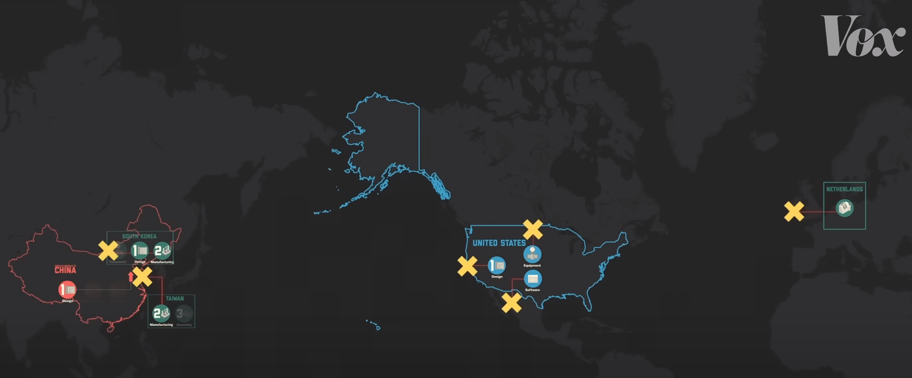
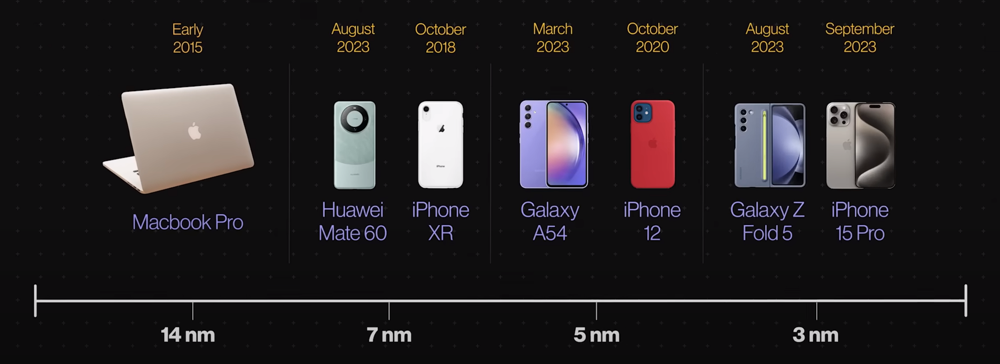

# 芯片制裁简述

## 简单描述美国对中国的芯片制裁

芯片生产过程大致可分为三步

1. Design 设计
2. Manufacturing 制造
3. Assembly 组装

最初，芯片技术仅在美国被用于军事目的，但到了1960年代，制造商们认识到，为商业市场设计和生产芯片具有巨大的经济潜力，这导致了对生产的需求急剧增加。

起初，芯片的设计、制造和组装步骤都在美国完成。然而，随着需求的增长，许多芯片企业开始将制造和组装环节迁移到劳动力成本更低的地区，例如台湾、韩国和日本。

在冷战期间，由于安全考虑，这些企业禁止向苏联和中国共享技术。但随着冷战结束和中美关系的改善，美国芯片公司开始在中国建立组装工厂。

随着中国国力的增强，中国政府决定投资本国的芯片设计和制造企业，旨在减少对外国技术的依赖。

在全球范围内，仅有三家美国公司掌握设计先进芯片所需的关键软件。而将这些设计转化为实际芯片，需要一种名为极紫外线（EUV）光刻机的特殊设备，这种设备仅由荷兰的ASML公司生产，而该设备又依赖于美国制造的关键组件。最终，只有台湾和韩国的企业能够整合所有这些技术，生产出最先进的处理器芯片。

中国的先进处理器生产严重依赖于几个关键的供应链节点，也称为“瓶颈”。为了降低对外部供应链的依赖，中国试图模仿ASML等关键技术提供商的产品，但这一策略引起了美国及其他国家的强烈反对。

2018年，美国政府回应这一策略，禁止美国企业向中兴通讯（ZTE）销售零部件，并在2019年进一步限制美国公司与华为的商业往来。

拜登政府上台后，对中国在芯片行业的限制措施进一步加码：首先，美国禁止所有本国企业向中国销售先进芯片，并且禁止中国的设计公司使用美国制造的设计软件和制造设备。此外，美国还阻止全球的半导体技术公司向中国销售先进芯片。

## 华为制造出麒麟9000s的意义在哪？

在华为mate60pro上拆解出来的麒麟9000s芯片是由中芯国际(SMIC)制造的自主设计芯片，中芯国际是中国最大的芯片制造商。

9000s采用的是7nm的晶体管，而最新的芯片采用的是3nm的晶体管，美国的策略 是让中国的晶体管制造工艺落后十年左右，而9000s只落后了四五年。

在遭受美国制裁之前，华为的子公司海思半导体有能力设计芯片，并委托台湾的台积电进行制造和进口。然而，美国的制裁中断了这一流程。

尽管如此，ASML仍被允许向外出口一种称为深紫外线（DUV）的技术。普遍认为，如果一个企业只能使用DUV技术，那么它将无法实现某些技术突破。

不过，华为巧妙地利用DUV技术，在半导体芯片生产方面，创造了超出美国预期的更先进生产线。

[^1]:Extreme ultraviolet lithography，光刻机，它们能将图案蚀刻到小至三纳米的芯片上。

[^2]:Deep ultraviolet lithography，相较于EUV是一种不同类型且比较落后的技术。