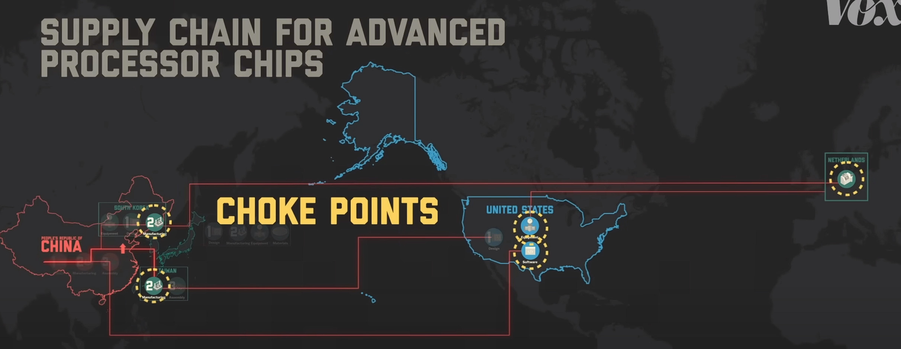

# 芯片制裁简述

## 简单描述美国对中国的芯片制裁

芯片生产过程大致可分为三步

1. Design 设计
2. Manufacturing 制造
3. Assembly 组装

最开始的芯片只是在美国用于军事技术，但在1960s，制造商们发现为企业/名用用产设计芯片可以赚大钱，这导致生产的需求巨幅增大。

最开始这三个步骤都在美国境内完成，但随着需求的增大，许多芯片公司开始将制造和组装这两个步骤转移至其他劳动力更加便宜的地方，如台湾、韩国、日本等地区的工厂。

由于当时还是冷战阶段，这些公司禁止这些工厂向苏联和中国共享技术。

冷战结束之后，中美关系好转，美国的芯片公司也开始在中国境内设置组装工厂。

后来随着中国国力日益增长，中国政府也决定在国内向自己的芯片设计和制造公司投入资金，以摆脱依靠外国技术的风险。

只有三家美国公司有着生产设计先进芯片所需的软件，然后要将这些设计图纸转化为真正的芯片需要一台仅由一家公司制造的机器：EUV[^1]，俗称光刻机，仅由荷兰的ASML公司生产，但这台机器需要仅在美国制造的设备。最后，只有台湾和韩国的公司才能将所有这些整合在一起并制造最先进的处理器芯片。

中国的最先进处理器完全依赖于这些“Choke Points”。

为了减少对外国供应链的依赖，中国正在找出像ASML这样的瓶颈并复制它们，但这一举措适得其反。

这一举动激怒了美国和其他一些国家的政府。在2018，美国政府禁止美国公司向中兴(ZTE)出售零件，在2019，又禁止了美国公司与华为开展商务活动。

2022年拜登上台后，进一步地在芯片行业上制裁中国：

首先，他禁止所有美国公司向中国出售先进芯片，并禁止中国设计公司使用美国制造的设计软件和美国制造的制造设备。此外还禁止了美国半导体技术的全球公司向中国出售先进芯片。

## 华为制造出麒麟9000s的意义在哪？

在华为mate60pro上拆解出来的麒麟9000s芯片是由中芯国际(SMIC)制造的自主设计芯片，中芯国际是中国最大的芯片制造商。

9000s采用的是7nm的晶体管，而最新的芯片采用的是3nm的晶体管，美国的策略 是让中国的晶体管制造工艺落后十年左右，而9000s只落后了四五年。

在被制裁之前，华为旗下的海思半导体能设计芯片并委托台积电制造和进口，但美国的制裁切断了这一过程。

ASML被允许出口一种叫DUV[^2]的技术，一般被认为如果将其他人限制在这种技术上，就永远无法突破某个阶段。

华为设法利用DUV技术在半导体芯片上制造出了比美国所设想的更先进的生产线。

[^1]:Extreme ultraviolet lithography，光刻机，它们能将图案蚀刻到小至三纳米的芯片上。

[^2]:Deep ultraviolet lithography，相较于EUV是一种不同类型且比较落后的技术。