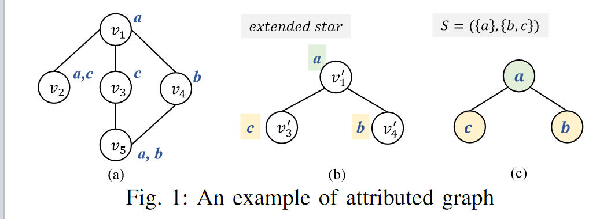

# CSPM

Discovering Representative Attribute-stars via Minimum Description Length

## Abstract

Graphs are a popular data type found in many domains. Numerous techniques have been proposed to find interesting patterns in graphs to help understand the data and support decision-making. However, there are generally two limitations that hinder their practical use: (1) they have multiple parameters that are hard to set but greatly influence results, (2) and they generally focus on identifying complex subgraphs while ignoring relationships between attributes of nodes. Graphs are a popular data type found in many domains. Numerous techniques have been proposed to find interesting patterns in graphs to help understand the data and support decision-making. However, there are generally two limitations that hinder their practical use: (1) they have multiple parameters that are hard to set but greatly influence results, (2) and they generally focus on identifying complex subgraphs while ignoring relationships between attributes of nodes. To address these problems, we propose a parameter-free algorithm named CSPM (Compressing Star Pattern Miner) which identifies star-shaped patterns that indicate strong correlations among attributes via the concept of conditional entropy and the minimum description length principle. Experiments performed on several benchmark datasets show that CSPM reveals insightful and interpretable patterns and is efficient in runtime. Moreover, quantitative evaluations on two real-world applications show that CSPM has broad applications as it successfully boosts the accuracy of graph attribute completion models by up to 30.68% and uncovers important patterns in telecommunication alarm data.

## Introduction

Former algorithms have two limitations :

1. People overlook the information carried by the attributes which is also important to understand the graph’s properties. For example, in a social network, the multiple attribute values associated with users are more informative than the topological structure.
2. graph pattern mining algorithms typically require the setting of multiple parameters to obtain patterns

To address the above limitations, this paper proposes an algorithm, named CSPM (Compressing Star Pattern Miner), for identifying representative patterns in attributed graphs.

These patterns, named attribute-stars (a-star), are starshaped and designed to reveal strong relationships between attribute values of connected nodes, in terms of conditional entropy. 

An **a-star** indicates that if some attribute values occur in a node, some other attribute values will appear in some neighbors of that node.

CSPM is easy to use as it is a parameter-free algorithm. Besides, CSPM applies a greedy search to quickly find an approximation of the best set of patterns that maximize the compression according to the MDL (Minimum Description Length) principle. Moreover, CSPM also relies on the concept of conditional entropy to assess how strong relationships between attributes are.

## Related Work

One of the most popular tasks to find patterns in a graph database or single graph is frequent subgraph mining (FSM)

Mining compressing patterns. To select a small set of patterns that represent well a database, an emerging solution is to find compressing patterns.

Summarizing and compressing a graph. A related research area is techniques for summarizing and compressing graphs.

## Preliminaries

An attributed graph G = (A, λ, V, E) is a set V of vertices, a set E of edges, a set of nominal attributes A, and a relation λ : V → A that maps vertices to attribute values.

The concept of appearance is defined. An extended star $X = (V_x, E_x, L, c, A_x, \lambda_x)$ is said to \textit{appear} in an attributed graph $G = (A_y, \lambda_y, V_y, E_y)$ if there exists a bijective mapping $f : V_x \rightarrow V_z$ (where $V_z \subseteq V_y$) that meets two conditions:

1. First, for each pair $(v, a) \in \lambda_x$, there exists a corresponding pair $(f(v), a) \in \lambda_y$. 
2. Second, for each edge $(u, v) \in E_x$, there is a corresponding edge $(f(u), f(v)) \in E_y$​.

## The CSPM Algorithm

This section describes the proposed CSPM algorithm to discover star-shaped attribute patterns revealing interesting relationships between attributes in an attributed graph.

### Pattern Format and Problem Statement

The goal of this study is to mine attribute patterns that can reveal strong inner relationships between attribute values with implicit connection information, instead of finding subgraphs or substructures meeting the given requirements(e.g. frequency).

With this premise, a star-shaped pattern format is selected.