# KRIMP

One of the main reasons for mining a dataset is to gain insight in the  data. Hence, for us, the best set of patterns is the set of patterns  that describes the data best.

Minimal Description Length Principle

One could summarize this approach by the slogan: the best model compresses the data best. By taking this approach we do not try to compress the set of frequent itemsets, rather, we want to find that set of frequent itemsets that yields the best lossless compression of the database.

## Minimal Description Length Principle

Insight: any regularity in the data can be used to compress the data,

### Kolmogorov Complexity and Ideal MDL

a formal language in which to express properties of the data.

This choice leads to the definition of the *Kolmogorov complexity* ：a sequence as the length of the shortest program that prints the sequence and then halts.

This idealized MDL is very general in scope, but not practically applicable, for the following two reasons: 

1. Uncomputability. It can be shown that there exists no computer program that, for every set of data D,when given D as input, returns the shortest program that prints D
2. Arbitrariness/dependence on syntax. In practice we are confronted with small data samples for which the invariance theorem does not say much. Then the hypothesis chosen by idealized MDL may depend on arbitrary details of the syntax of the programming language under consideration.

### Practical MDL

**MDL: The Basic Idea** 

The goal of statistical inference may be cast as trying to find regularity in the data. “Regularity” may be identified with “ability to compress.” MDL combines these two insights by viewing learning as data compression: it tells us that, for a given set of hypotheses H and data set D, we should try to find the hypothesis or combination of hypotheses in H that compresses D most.

## Theory

### MDL (Minimum Description Length)

For MDL, this principle can be roughly described as follows.

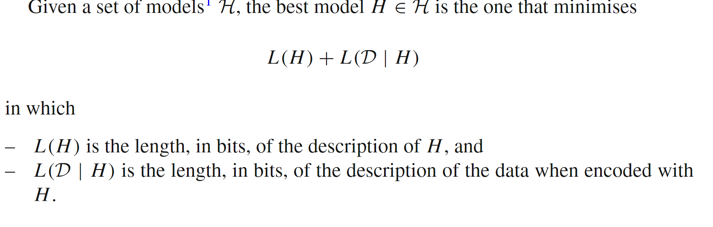

model and data are encoded together

### MDL for itemsets

The key idea of our compression based approach is the ***code table***. A code table is a simple two-column translation table that has itemsets on the left-hand side and a code for each itemset on its right-hand side.

#### Definition 1

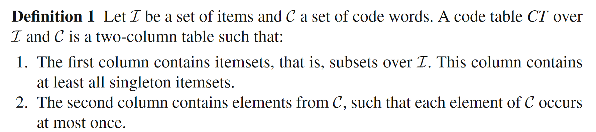

*I* denotes the number of the single items, *|CT|* denotes the number of the  itemsets in the codetable. *|CT \ I|* indicates the number of non-singleton itemsets in the code table.

A example code table: 

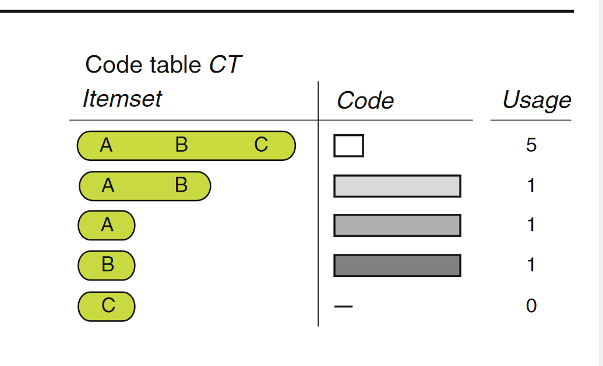

The usage column is not actually part of the code table—it is only shown for illustrative purposes .

To encode a transaction t from database D over I with code table CT , we require a cover function cover(CT , t) that identifies which elements  of CT are used to encode t. The parameters are a code table CT and a transaction t, the result is a disjoint set of elements of CT that cover t. Or, more formally, a cover function is defined as follows.

#### Definition 2

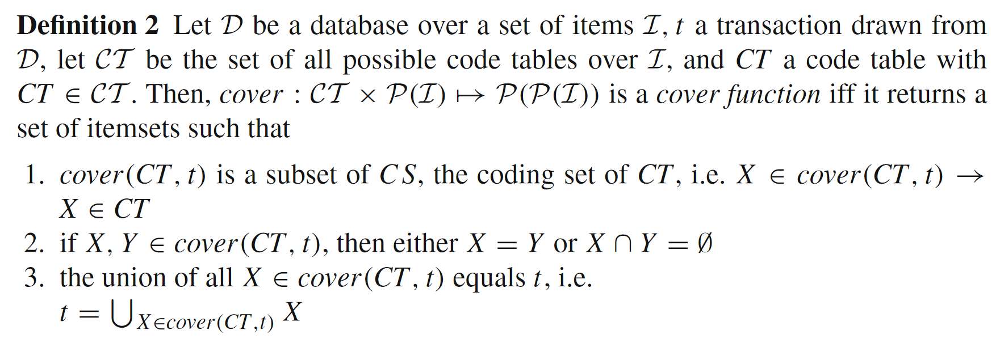

cover 函数必须满足以下条件：

1. cover 函数返回的集合是代码表 *CT* 的编码集 *CS* 的子集。如果*X* 在 cover(*CT*,*t* )中，则 *X* 是 *CT* 的元素。
2. 如果*X*,*Y* 都在 cover(*CT*,*t*)中，那么 *X* 和 *Y* 要么相等，要么交集为空（这意味着不允许重叠）。
3. cover 函数返回的所有项集 *X* 的并集等于事务*t*。这意味着所有*X* 的集合合在一起就是*t*。

Note that to ensure that we can decode an encoded database uniquely we assume that C is a prefix code, in which no code is the prefix of another code

Since MDL is concerned with the best compression, the codes in CT should be chosen such that the most often used code has the shortest length.

#### Theorem 1

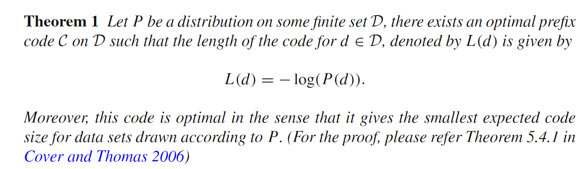

We define the usage count of an itemset X ∈ CT as the number of transactions t from D where X is used to cover. Normalised, this frequency represents the probability that that code is used in the encoding of an arbitrary t ∈ D. The optimal code length then is − log of this probability, and a code table is optimal if all its codes have their optimal length.

#### Definition 3

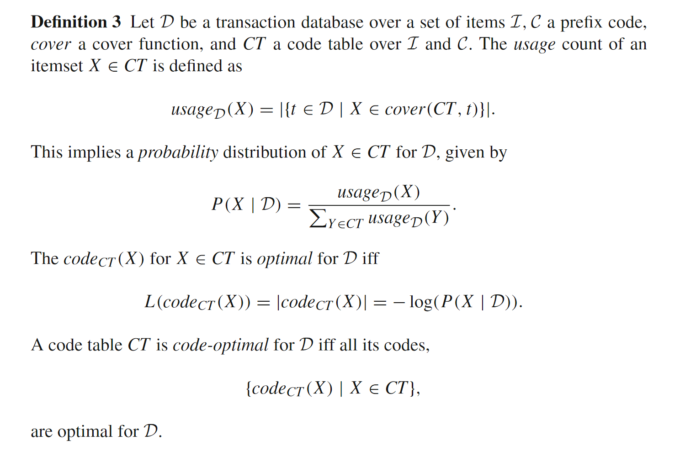

Example:

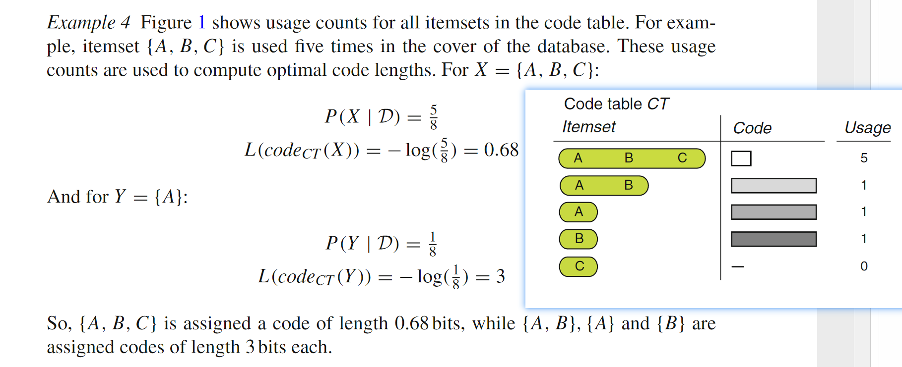

#### Lemma 1

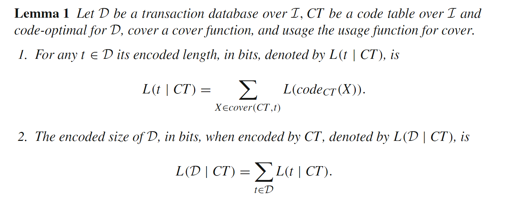

With Lemma 1, we can compute L(D | H ). To use the MDL principle, we still need to know what L(H ) is, i.e. the encoded size of a code table.

#### Standard Code Table

the code table that contains only the singleton itemsets X ∈ I. This code table, with optimal code lengths for database D, is called the standard code table for D, denoted by ST. It is the optimal encoding of D when nothing more is known than just the frequencies of the individual items; it assumes the items to be fully independent.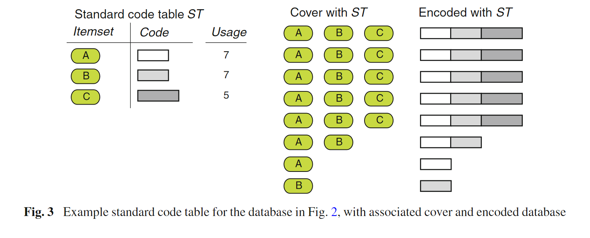

ST provides the simplest, independent, description of the data that compresses much better than a random code table.

But It is clear that the standard code table does not provide a good compression of the data.

#### Definition 4

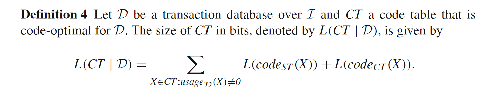

With these results we know the total size of our encoded database. It is simply the size of the encoded database plus the size of the code table.

#### Definition 5

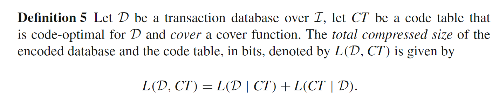

### The problem

##### *Minimal Coding Set Problem*

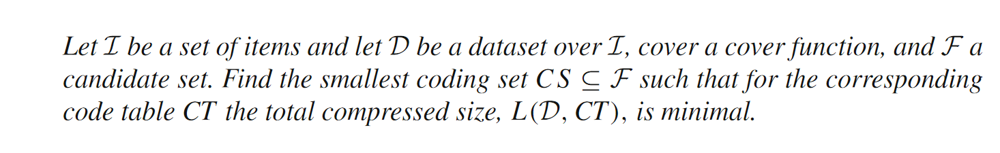

A solution for the Minimal Coding Set Problem allows us to find the ‘best’ coding set from a given collection of itemsets, e.g. (closed) frequent itemsets for a given minimal support

In order to solve the Minimal Coding Set Problem, we have to find the optimal code table and cover function. To this end, we have to consider a humonguous search space

## Algorithms

### Basic heuristic

To cut down a large part of the search space, we use the following simple greedy search strategy:

* Start with the standard code table ST, containing only the singleton itemsets X ∈ I
* Add the itemsets from F one by one. If the resulting codes lead to a better compression, keep it. Otherwise, discard the set.

The initial encoding

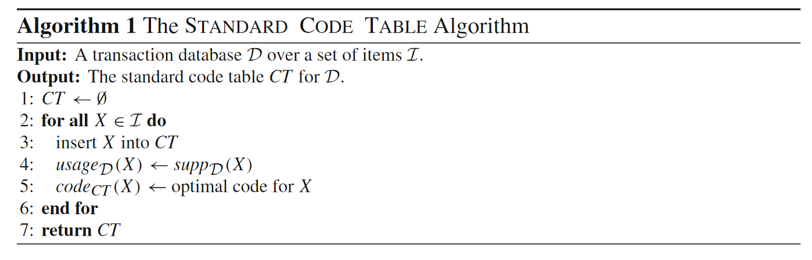

#### Standard cover function

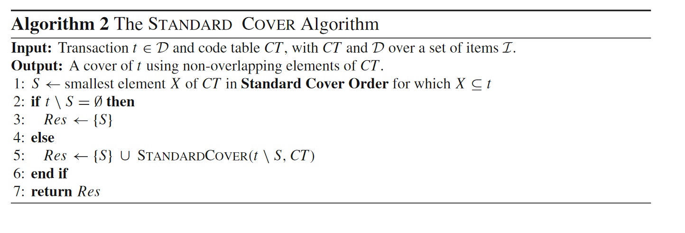

How this algorithm works:

* For a transaction t $\in$ D(Database) 
* Take a element of Code Table && X$\in$ t as S
	* We choose to sort the elements X ∈ CT first decreasing on cardinality, second decreasing on support in D and thirdly lexicographically increasing to make it a total order.
	* $|X| \downarrow \quad \text{supp}_D(X) \downarrow \quad \text{lexicographically} \uparrow$
* Calculate t\S(t without S)
* If t\s != null , recursive call STANDARDCOVER(t\S,CT)

We call this the Standard Cover Order. The rationale is as follows. To reach a good compression we need to replace as many individual items as possible, by as few and short as possible codes. The above order gives priority to long itemsets, as these can replace as many as possible items by just one code.

#### Standard candidate order

We therefore choose to sort the candidate itemsets such that long, frequently occurring itemsets are given priority. Again, to make it a total order we thirdly sort lexicographically. So, we sort the elements of F as follows: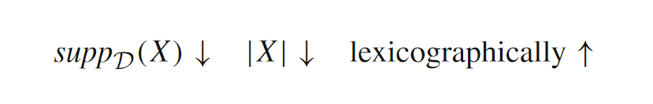

The rationale for it is as follows. Itemsets with the highest support, those with potentially the shortest codes, end up at the top of the list. Of those, we prefer the longest sets first, as these will be able to replace as many items as possible.

#### The KRIMP algorithm

We now have the ingredients for the basic version of our compression algorithm:

* Start with the standard code table ST;  
* Add the candidate itemsets from F one by one. Each time, take the itemset that is maximal w.r.t. (in) the standard candidate order. Cover the database using the standard cover algorithm. If the resulting encoding provides a smaller compressed size, keep it. Otherwise, discard it permanently.

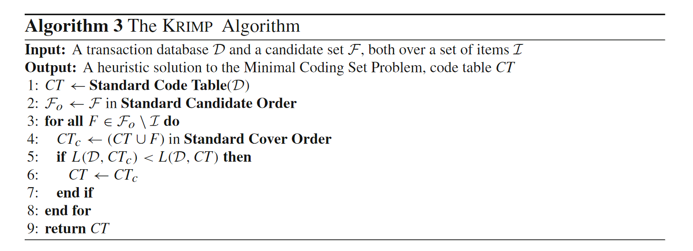

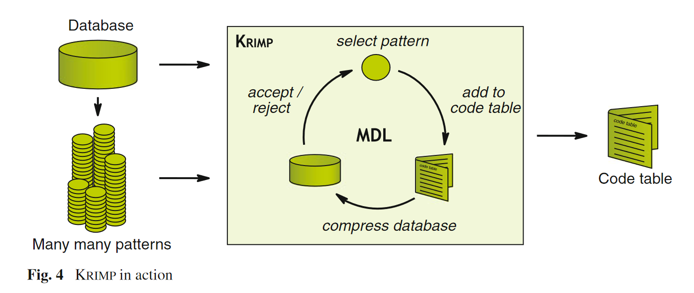

# Discovering Representative Attribute-stars via Minimum Description Length