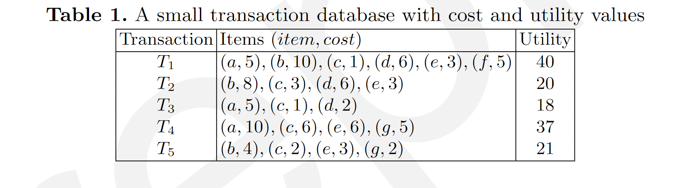
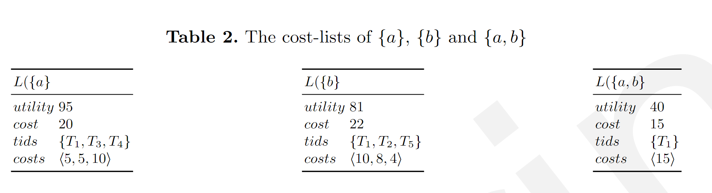
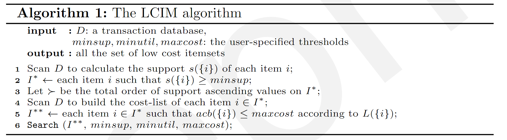
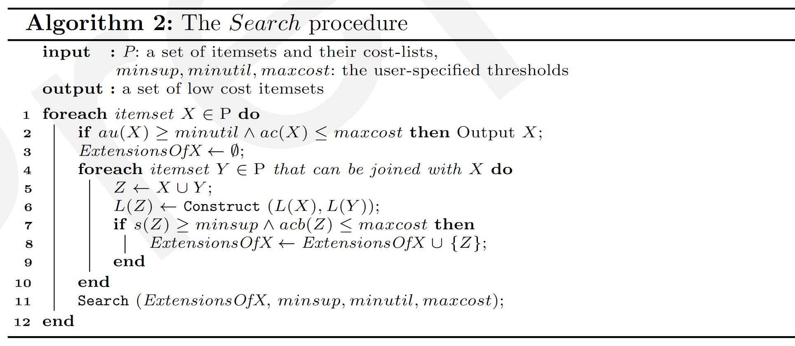
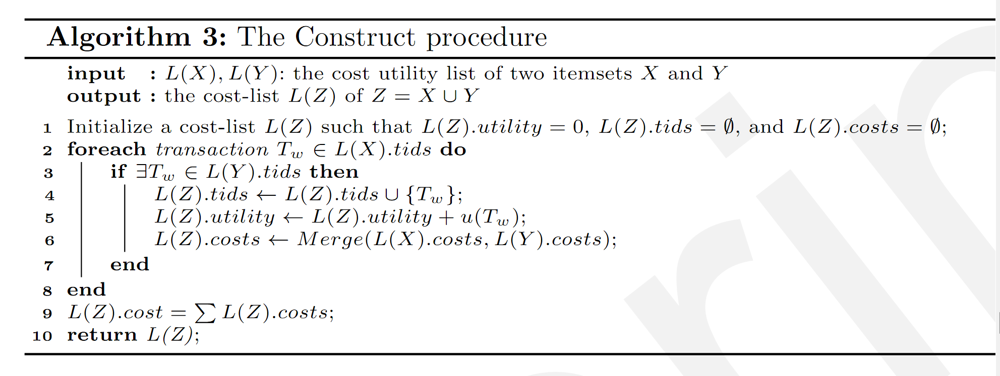

# LCIM: Mining Low Cost High Utility Itemsets

## Introduction

A popular subfield of data mining is pattern mining. The aim is to apply algorithms to find interesting patterns in data that meet some user-defined constraints.

Frequent itemset mining(FIM) $\rightarrow$ High utility itemset mining
(HUIM) 

High utility itemset is sets of values that bring high benefits, as measured by a utility function. 

Nonetheless, the focus of HUIM is on the utility of patterns and the cost associated with these patterns is ignored.

But jointly considering utility and cost in pattern mining is desirable but not simple and could be done in many ways. Because utility and cost may be expressed in different units. Like in e-learning, utility may be the grades you get, an cost may be the hours you spend.

Besides, for such applications, it is more meaningful to consider the average utility and the average cost of patterns rather than their sums.

Hence, this motivates us to separately model the utility and cost, and to consider their average.

The key contributions :

1. A novel problem called low cost high utility itemset mining is formalized to introduce the concept of cost in itemset mining. The aim is to find itemsets that have a high average utility, and a low average cost. 
2. An algorithm named LCIM (Low Cost Itemset Miner) is designed to solve this problem efficiently.  
3. To reduce the search space, LCIM applies a lower bound on the average cost called Average Cost Bound (ACB).

## Problem definition

* Itemset X: like {a,b},{a,b,c}, combination of items
* Support of an itemset: How many times an itemset appears in all transactions.
* Average cost of an itemset X: The **cost of an itemset X** in a database D is defined and denoted as $c(X)=\sum_{T\in g{X} }c(X,T)$. **The average cost of an itemset X** in a database D is defined and denoted as $ac(X)=c(X)\div s(X)$
* Utility of an itemset: The utility of an itemset X in a database D is defined and denoted as $u(X)=\sum_{T\in g(X)}u(T)$
* Average utility of an itemset X : $ac(X)=u(X)\div s(X)$

**Definition 1 (problem definition):** An itemset X is a low cost itemset if and only if au(X) ≥ minutil, ac(X) ≤ maxcost and s(X) ≥ minsup.

## The LCIM algorithm

### Search space exploration and pruning properties

**Definition 2 (Extension).** Two itemsets X and Y can be joined together to obtain a new itemset $Z=X \cup Y$ if all items in X and Y are the **same except the last one** according to ≻.(like the order in the alphabet) The itemset Z is then said to be an extension of X and Y .

**Property 1 (Support pruning)**. For any two itemsets X ⊆ Y , s(X) ≥ s(Y ).(is proven before in the itemset mining topic, like the support of {a} is always bigger than its superset(like {a,b},{a,b,c},etc.).)

**Definition 3 (Lower bound on the cost).**

1. **The sequence of cost values of X** is the unique sequence: $A(X)=(a_i)_{i=1}^N \ where \ a_i=c(X,T_i')$

2. **The K largest cost values** of X is the sequence:$A(X)^{(K)}=(c_i)_{i=1}^K$

3. **The average cost bound (ACB) of X** is defined as $acb(X)=\frac{\sum_{c_i \in A(X)^{minsup}}c_i }{s(X)}$. 

	For instance, let minsup = 1 and X = {b, c}. The sequence of cost values of X is A(X) = ⟨11, 11, 6⟩. Then, sort(A(X)) = ⟨6, 11, 11⟩, and $A(X)^{(1)}$ = ⟨6⟩. The average cost bound of X is acb(X) = 6/3 = 2.If minsup = 2, $A(X)^{(2)}$ = ⟨6, 11⟩, and acb(X) = $\frac{(6+11) }{3} $= $\frac{17}{2}$.

**Property 2 (lower bound of the ACB on the average cost).** For any itemset X, the average cost bound of X is a lower bound on the average cost of X. In other words, acb(X) ≥ ac(X).

**Property 3 (anti-monotonicity of the ACB).** For any two itemsets X ⊆ Y , then acb(X) ≤ acb(Y ).

**Property 4 (Search space pruning using the ACB)**. For an itemset X, if acb(X) > maxcost, X and its supersets are not low cost itemsets.

### The cost-list data structure

Another key consideration for the design of an efficient algorithm is how to efficiently calculate the utility and cost values of itemsets and also the ACB lower bound for reducing the search space. For this purpose, the designed LCIM algorithm relies on a novel data structure called the cost-list.

**Definition 4 (cost-list).** The cost-list of an itemset X is a tuple L(X) = (utility, cost, tids, costs) that stores information in four fields. The field utility contains u(X). The field cost stores c(X). The field tids stores g(X), while costs stores A(X). In the following, the notation L(X).field refers to the value of the field field in L(X).

The cost-lists of an itemset X is useful as it contains all the required information about it. The cost-list of X allows to directly obtain its support as s(X) = (|L(X).tids|), its average utility as au(X) = L(X).utility/s(X), and its average cost as ac(X) = L(X).utility/s(X). Moreover, the ACB lower bound can be calculated by finding the minsup smallest values in L(X).costs.

Let there be two itemsets X and Y that are joined to obtain an extension Z = X ∪ Y . The cost-list L(Z) is derived directly from the cost-lists L(X) and L(Y ) as follows. The field L(Z).costs is obtained by merging the cost values corresponding to the same transactions in L(X).cost and L(Y ).costs. The field L(Z).tids = L(X).tids ∩ L(Y ).tids. The field L(Z).cost is the sum of values in L(Z).costs. The field L(Z).utility is calculated as the sum of utility values for transactions in L(Z).tids.

### The algorithm

LCIM (Algorithm 1) takes as input a transaction database with cost/utility and the minsup, minutil and maxcost thresholds.

# Presentation

## Introduction

• **理解数据的需求**：面对大量的数据，有必要深入了解数据的特征、趋势、以及其中可能存在的规律。理解数据是为了更好地从中获取有价值的信息。

• **模式挖掘**：通过算法识别数据中的有趣模式，这些模式也需要具有可解释性。模式挖掘的目标是从数据中发现隐藏的、有意义的结构。

• **频繁项集挖掘**：寻找在数据中频繁出现的模式。频繁项集是指在数据集中经常共同出现的一组项。这对于了解数据中的共性和常见模式非常有用。

• **高效用项集挖掘（High Utility Itemset Mining，HUIM）**：最近越来越受到关注的挖掘任务，目标是找到在数据中共同出现并且具有高效用（重要性）的项集。与频繁项集挖掘类似，但更强调项的效用价值，适用于更广泛的应用场景。

首先介绍一下高效用项集挖掘（High Utility Itemset Mining，HUIM）每个项都被赋予一个关联的效用值，表示该项在数据中的重要性或价值。这个效用值可以是各种度量，比如销售额、利润、满意度等。任务的目标是找到那些共同出现且总效用值高的项集。

## Problem definition

然后我们来介绍一下我们所要研究的问题

对于这个问题，我们的输入是一个带有效用和成本值的交易数据库

* 假设我们有一组项目:a,b,c,d,…

- **项集（itemset）**：项集是由一组项组成的集合，比如学习活动a、b、c、d、e、f、g可以构成一个项集。
- **数据库（database）**：数据库是由多个交易组成的集合，每个交易记录了一系列项的出现情况。用𝑫表示，其中𝑻𝟏、𝑻𝟐直到𝑻𝒎是具体的交易。
- **交易（transaction）**：交易𝑻𝒊是项的集合，表示某一时刻某个用户或实体的一次行为。每个交易中的项都来自于项集𝑰。
- **项的成本值（cost value）**：每个项在交易中都有一个与之关联的成本值，表示在该交易中使用该项所需要的资源、代价等。记作c(i, T)，其中i是项，T是交易。
- **交易的效用值（utility value）**：每个交易都有一个效用值，用来表示该交易的益处或收益。这个值通常是一个正数，表示交易的重要性或好处。记作u(T)，其中T是交易。

举例来说，如果有一个数据库𝑫包含了多个交易，比如{𝑇₁, 𝑇₂, 𝑇₃}，其中𝑇₁ = {a, b, c}，𝑇₂ = {b, d, e}，𝑇₃ = {a, c, f}。每个项都有与之关联的成本值和每个交易都有一个效用值，比如c(a, 𝑇₁) = 2表示在交易𝑇₁中使用项a的成本为2，u(𝑇₁) = 10表示交易𝑇₁的效用值为10。

**Three parameters:** **minsup >0, minutil >0, maxcost >0**

**Output:** all the **low-cost high utility itemsets**

Each itemset X such that

its average utility au(X) ≥ minutil, 

its average cost ac(X) ≤ maxcost,

its support s(X) ≥ minsup.

我们要输入的还有**三个参数：**minsup>0，minutil>0，maxcost>0

**输出：**所有**低成本高实用性项目集**

每个项目集X使得

其平均效au（X）≥minutil，

其平均成本ac（X）≤maxcost，

其支撑s（X）≥minsup。

## Search space exploration and pruning properties

然后就是文章中用到的一些减少搜索空间的技巧

第一个property就是对于两个项集，如果X是属于Y的，那么X的support就一定大于等于Y的support，这个非常明显，比如项集{a,b}的support必定小于等于{a}的support，因为它包含了更多的项。

## The LCIM algorithm

**算法 1：LCIM算法**

1. 从扫描事务数据库（D）开始，计算每个项的支持度。
2. 选择满足最小支持阈值（minsup）的项。
3. 创建按支持值升序排列的项的总体顺序。
4. 再次扫描数据库，为满足minsup的每个项构建成本列表。
5. 根据它们的成本列表，选择同时满足最大成本阈值（maxcost）的项。
6. 最后，使用过滤后的项、minsup、最小效用（minutil）和maxcost调用搜索过程（算法 2）。

**算法 2：搜索过程**

1. 该算法接收一组项集及其成本列表(cost-list)。
2. 通过扩展满足效用和成本条件的项集，输出一组低成本项集。
3. 如果一个项集满足最小效用且不超过最大成本，考虑与其他项集连接。
4. 使用构建过程（算法 3）创建新的项集，如果它们满足条件，则将其添加到扩展列表中。

**算法 3：构建过程**

1. 该算法构建新项集Z的成本列表，Z是项集X和Y的并集。
2. 初始化Z的成本列表，然后迭代地添加在X和Y同时出现的事务中的效用和成本。
3. 最后，计算Z的总成本并返回成本列表。
