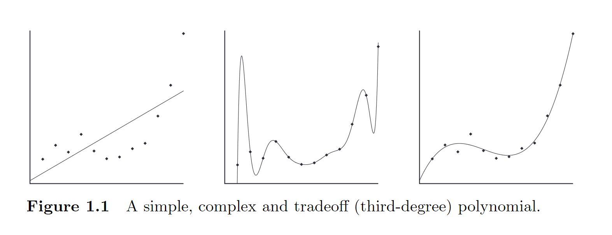
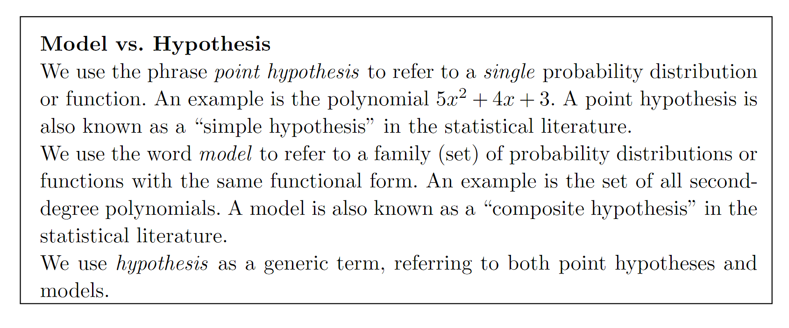
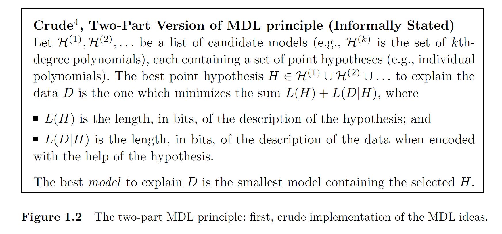

# MDL

## Introducing the Minimum Description Length Principle

### The Fundamental Idea: Learning as Data Compression

The description of data 

Any regularity detected in the data  can be used to compress the data, to describe it in a short manner.

Like we can use a C program to describe a sequence

```
for i = 1 to 2500; print ”0001”; next; halt
```

describes : “000100010001….0001”(2500*“0001”)

#### Kolmogorov Complexity and Ideal MDL

To formalize our ideas, we need to decide on a description method.

The most general choice is a general-purpose computer language such as C or Pascal

This choice leads to the definition of the *Kolmogorov complexity*  of a sequence as the length of the shortest program that prints the sequence and then halts.

The lower the Kolmogorov complexity of a sequence, the more regular it is.

However, it turns out that for every two general-purpose programming languages A and B and every data sequence D, the length of the shortest program for D written in language A and the length of the shortest program for D written in language B differ by no more than a constant c, which does not depend on the length of D. This so-called invariance theorem says that, **as long as the sequence D is long enough, it is not essential which computer language one chooses**, as long as it is general purpose.

This idealized MDL is very general in scope, but not practically applicable, for the following two reasons:

1. *Uncomputability*. It can be shown that there exists no computer program that, for every set of data D,when given D as input, returns the shortest program that prints D
2. *Arbitrariness/dependence on syntax.* In practice we are confronted with small data samples for which the invariance theorem does not say much. Then the hypothesis chosen by idealized MDL may depend on arbitrary details of the syntax of the programming language under consideration.

#### Practical MDL

Description methods C should be restrictive enough so that for any data sequence D, we can **always** **compute** the length of the shortest description of D that is attainable using method C; but they should be **general enough** to allow us to compress many of the intuitively “regular” sequences.

###  MDL and Model selection

**MDL: The Basic Idea** 

The goal of statistical inference may be cast as trying to find regularity in the data. “Regularity” may be identified with “ability to compress.” MDL combines these two insights by **viewing learning as data compression**: it tells us that, for a given set of hypotheses H and data set D, we should try to find the hypothesis or combination of hypotheses in H that compresses D most.

This idea can be applied to all sorts of inductive inference problems, but it turns out to be most fruitful in (and its development has mostly concentrated on) problems of **model selection** and, more generally, those dealing with ***overfitting***.

Example(Model Selection and Overfitting):



consider the points in the Figure, We would like to learn how the y-values depend on the x-values. To this end, we may want to fit a polynomial to the points.

Straightforward linear regression will give us the leftmost polynomial, like in the first 

Since for any set of n points there exists a polynomial of the (n − 1)st degree that goes exactly through all these points, simply looking for the polynomial with the least error will give us a polynomial like the one in the second picture.

But for the second picture, This polynomial seems overly complex: it reflects the random fluctuations in the data rather than the general pattern underlying it.

We say that the polynomial *overfits* the data.

Indeed, all model selection methods that are used in practice either implicitly or explicitly choose a **tradeoff** between goodness-of-fit and complexity of the models involved.

MDL provides one particular means of achieving such a tradeoff.



To apply MDL to polynomial or other types of hypothesis and model selection, we have to make precise the somewhat vague insight “learning may be viewed as data compression.”

the earliest and simplest implementation of the idea: *two-part code version* of MDL



A hypothesis that fits the data well gives us a lot of information about the data.

We can typically find a very complex point hypothesis (large L(H)) with a very good fit (small L(D|H)). We can also typically find a very simple point hypothesis (small L(H)) with a rather bad fit (large L(D|H)). The sum of the two description lengths will be minimized at a hypothesis that is quite (but not too) “simple,” with a good (but not perfect) fit.

### Crude and Refined MDL

***code=description methods***

**Crude MDL** picks the H minimizing the sum L(H)+L(D|H).