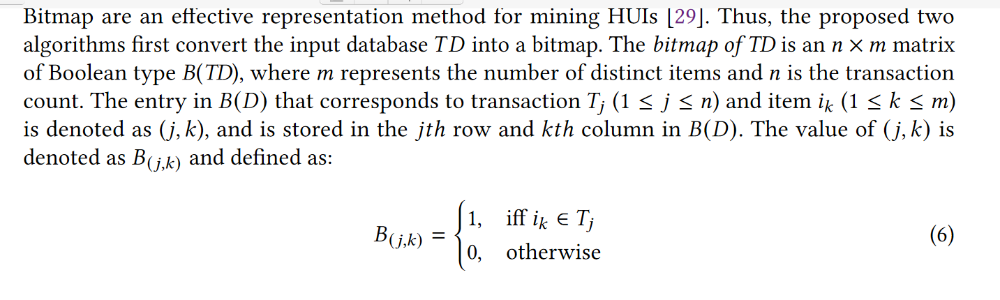

# Mining High Utility Itemsets with Hill Climbing and Simulated Annealing

The TWU of an itemset 𝑋 is the sum of the transaction utilities of all the transactions that contain 𝑋

An itemset 𝑋 is called a high transaction weighted-utilization itemset (HTWUI) if 𝑇𝑊𝑈 (𝑋 ) ≥ 𝑚𝑖𝑛_𝑢𝑡𝑖𝑙; otherwise, 𝑋 is a low transaction weighted-utilization itemset (LTWUI). An HTWUI/ LTWUI with 𝑘 items is called a 𝑘-HTWUI/𝑘-LTWUI.

## PROPOSED HEURISTIC ALGORITHMS FOR HUIM

### Bitmap Representation and Promising Encoding Vector

Definition 4.1. Let 𝑉 represents an encoding vector that contains 0s and/or 1s and corresponds to a solution. Let the encoding vector (𝑉 ) represents an itemset 𝑋 . If Bit(𝑋 ) only contains 0s then 𝑉 is called an unpromising encoding vector (𝑈 𝑃𝐸𝑉 ), otherwise 𝑉 is called a promising encoding vector (𝑃𝐸𝑉 ).

It’s easy to see that a HUI must be a UPEV.

### Population Initialization

The initial population for both HC and SA is first initialized randomly with 𝑃𝑆 solutions (where 𝑃𝑆 is an integer parameter). Algorithm 2 lists the population initialization procedure.

### HUIM-HC

The main steps in HC include: (1) generate population, (2) select candidate solutions (called chromosomes) from the population and (3) population exploration.

### HUIM-SA

SA consists of four main steps, that are: (1) problem configuration, (2) neighborhood configuration, (3) objective function, and (4) cooling/annealing process.