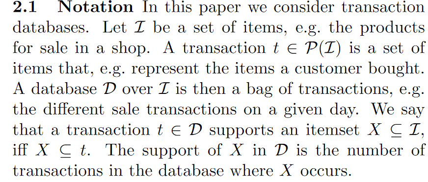

# SLIM

an any-time algorithm for mining high-quality sets of itemsets directly from data.

## Introduction

In this paper, we present Slim, an efficient heuristic for directly mining high-quality data descriptions on transaction data. Slim is a fast, one-phase, any-time alternative to Krimp.

Drawbacks of KRIMP:

1. mining candidates is expensive. As more candidates correspond to a larger search space, lower support thresholds correspond to better final results. Often, however, it is difficult to keep the number of candidates feasible—for large and dense databases especially, a small drop of the threshold can lead to an enormous increase in patterns. Moreover, as most candidates will be rejected, this step is quite wasteful.
2. by considering candidates only once, and in a fixed order, Krimp sometimes rejects candidates that it could have used later on. A more powerful strategy would be to iteratively select the best addition out of all candidates—which naively, however, quickly becomes infeasible for larger databases or candidate collections.

With Slim, we address these issues, and give an efficient any-time algorithm for mining descriptive pattern sets directly from data.

Slim closely approximates the powerful **greedy approach** of selecting the best candidate out of all candidates; all while being much more efficient.

## Preliminaries

### Notation

In this paper we consider transaction databases.

Throughout this paper all logarithms are to base 2, and by convention we use 0 log 0 = 0.

### MDL

in which L(M ) is the length in bits of the description of M , and L(D | M ) is the length of the description of the data when encoded with model M .

To use MDL, we have to define what our models M are, how a M ∈ *M* describes a database, and how we encode these in bits. Note, that in MDL we are only concerned with code lengths, not actual code words.

### Code tables

As our itemset-based models we use code tables. A code table is a simple dictionary: a two-column table with itemsets on the left-hand side, and corresponding codes on its righthand side. The itemsets in the code table are ordered first descending on cardinality, second descending on support, and third lexicographically. We refer to this as the Standard Cover Order.

## Identifying good candidates

Instead of filtering pre-mined candidates, we rather mine code tables directly from data. To do so, we need to be able to identify good candidates on the fly

### Covering data

Intuitively, SetCover seems like a suited approach for approximating the optimal code table. Its goal is to find the smallest set of itemsets that cover all 1s in the data. This problem is NP-hard, but good approximation bounds exists for the greedy approach. **That approach, also known as Tiling , iteratively finds that itemset (or, tile) by which the most uncovered 1s in the data are covered.**

### Covering Codes

We can regard the cover of a database D by a code table CT as follows. Let C be the |D|-by-|CT | binary matrix, where the rows correspond to transactions t ∈ D and the columns to elements X ∈ CT . The cell values are 1 when X ∈ cover (t), and 0 otherwise.

### Estimating candidate quality

We would calculate the gain of each candidate. 

Next, once we know the gains in compression for every candidate, we simply locally optimise and accept that X into CT which maximises compression.

Instead, we can estimate the gain first, and only calculate exact gain for the best estimated candidate.

we can say more on what itemsets we want: highly frequent sets of only few items.