# JavaWeb

## HTML&CSS

HTML: Hypertext Markup Language

CSS: Cascading Style Sheet

### HTML快速入门

HTML页面的基础结构标签：

```html
<html>
 	<head>
 		<title> </title>
	</head>
	<body>
        
        
	</body>
</html>
```

HTML中的标签特点：

1. HTML标签不区分大小写
2. HTML标签的属性值，采用单引号、双引号都可以
3. HTML语法相对比较松散 (建议大家编写HTML标签的时候尽量严谨一些)

### 新浪新闻

#### 标题实现

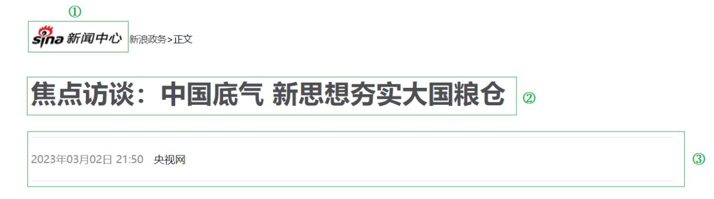

1. 图片，用到HTML中的图片标签来实现。
2. 标题，用HTML中的标题标签来实现。
3. 两条水平分割线，用HTML中的标签来定义分割线

##### 标签

图片标签 img

```html
A. 图片标签: 
B. 常见属性:
 src: 指定图像的url (可以指定 绝对路径 , 也可以指定 相对路径)
 width: 图像的宽度 (像素 / 百分比 , 相对于父元素的百分比)
 height: 图像的高度 (像素 / 百分比 , 相对于父元素的百分比)
 
 备注: 一般width 和 height 我们只会指定一个，另外一个会自动的等比例缩放。
 
C. 路径书写方式:
 绝对路径:
 1. 绝对磁盘路径:
C:\Users\Administrator\Desktop\HTML\img\news_logo.png
 
 2. 绝对网络路径:
https://i2.sinaimg.cn/dy/deco/2012/0613/yocc20120613img01/news_logo.png

 相对路径:
 ./ : 当前目录 , ./ 可以省略的
 ../: 上一级目录
```

标题标签h

```html
A. 标题标签: <h1> - <h6>
 <h1>111111111111</h1>
 <h2>111111111111</h2>
 <h3>111111111111</h3>
 <h4>111111111111</h4>
 <h5>111111111111</h5>
 <h6>111111111111</h6>
 
B. 效果 : h1为一级标题，字体也是最大的 ； h6为六级标题，字体是最小的。
```

水平分页线标签 <hr>


```html
<p>This is some content above the horizontal rule.</p>
<hr>
<p>This is some content below the horizontal rule.</p>
```

#### 标题样式

##### CSS引入方式

| 名称     | 语法描述                                     | 示例                                        |
| -------- | -------------------------------------------- | ------------------------------------------- |
| 行内样式 | 在标签内使用style属性，属性值是css属性键值对 | <h1 style="xxx:xxx;">中国新闻网</h1>        |
| 内嵌样式 | 定义<style>标签，在标签内部定义css样式       | <style> h1 {...} </style>                   |
| 外联样式 | 定义<link>标签，通过href属性引入外部css文件  | <link rel="stylesheet" href="css/news.css"> |

内部样式，通过定义css选择器，让样式作用于当前页面的指定的标签上。

外部样式，html和css实现了完全的分离，企业开发常用方式。

#### 颜色表示

| **表示方式**   | **表示含义**                      | **取值**                                    |
| -------------- | --------------------------------- | ------------------------------------------- |
| 关键字         | 预定义的颜色名                    | red、green、blue...                         |
| rgb表示法      | 红绿蓝三原色，每项取值范围：0-255 | rgb(0,0,0)、rgb(255,255,255)、rgb(255,0,0)  |
| 十六进制表示法 | #开头，将数字转换成十六进制表示   | #000000、#ff0000、#cccccc，简写：#000、#ccc |

#### CSS选择器

选择器是选取需设置样式的元素（标签）

**选择器通用语法如下**：

```css
选择器名   {
    css样式名：css样式值;
    css样式名：css样式值;
}
```


1. **元素（标签）选择器**：

- 选择器的名字必须是标签的名字
- 作用：选择器中的样式会作用于所有同名的标签上

~~~
元素名称 {
    css样式名:css样式值；
}
~~~

例子如下：

~~~css
 div{
     color: red;
 }
~~~


**2.id选择器:**

- 选择器的名字前面需要加上#
- 作用：选择器中的样式会作用于指定id的标签上，而且有且只有一个标签（由于id是唯一的）

~~~
#id属性值 {
    css样式名:css样式值；
}
~~~

例子如下：

~~~css
#did {
    color: blue;
}
~~~


**3.类选择器：**

- 选择器的名字前面需要加上 .
- 作用：选择器中的样式会作用于所有class的属性值和该名字一样的标签上，可以是多个

~~~
.class属性值 {
    css样式名:css样式值；
}
~~~

例子如下：

~~~css
.cls{
     color: green;
 }
~~~

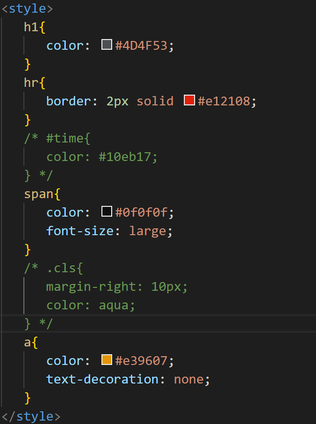

#### 超链接

* 标签: &lt;a href="..." target="...">央视网</a>
* 属性：
	* href: 指定资源访问的url
	* target: 指定在何处打开资源链接
		* _self: 默认值，在当前页面打开
		* _blank: 在空白页面打开

#### 正文实现

##### 正文排班

整个正文部分的排版，主要分为这么四个部分：

1). 视频 (当前这种新闻页面,可能也会存在音频)

2). 文字段落

3). 字体加粗

4). 图片

##### 标签

1. **视频、音频标签**

- 视频标签: &lt;video>
	- 属性: 
		- src: 规定视频的url
		- controls: 显示播放控件
		- width: 播放器的宽度
		- height: 播放器的高度

- 音频标签: &lt;audio>
	- 属性:
		- src: 规定音频的url
		- controls: 显示播放控件

2. **段落标签**

- 换行标签: &lt;br>
	- 注意: 在HTML页面中,我们在编辑器中通过回车实现的换行, 仅仅在文本编辑器中会看到换行效果, 浏览器是不会解析的, HTML中换行需要通过br标签

- 段落标签: &lt;p>
	- 如: &lt;p> 这是一个段落 &lt;/p>

3. **文本格式标签**

| 效果   | 标签 | 标签(强调) |
| ------ | ---- | ---------- |
| 加粗   | b    | strong     |
| 倾斜   | i    | em         |
| 下划线 | u    | ins        |
| 删除线 | s    | del        |

前面的标签 b、i、u、s 就仅仅是实现加粗、倾斜、下划线、删除线的效果，是没有强调语义的。 而后面的strong、em、ins、del在实现加粗、倾斜、下划线、删除线的效果的同时，还带有强调语义。

几个CSS属性：

- text-indent: 设置段落的首行缩进 
- line-height: 设置行高
- text-align: 设置对齐方式, 可取值为 left / center / right

#### 页面布局

##### 盒子模型

- 盒子：页面中所有的元素（标签），都可以看做是一个 盒子，由盒子将页面中的元素包含在一个矩形区域内，通过盒子的视角更方便的进行页面布局

- 盒子模型组成：内容区域（content）、内边距区域（padding）、边框区域（border）、外边距区域（margin）

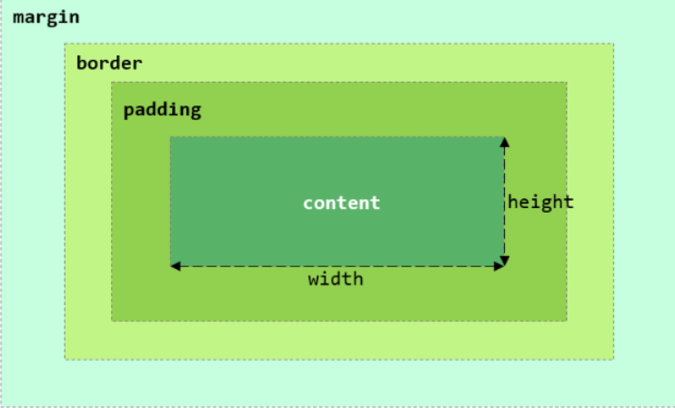

CSS盒子模型，其实和日常生活中的包装盒是非常类似的，就比如：

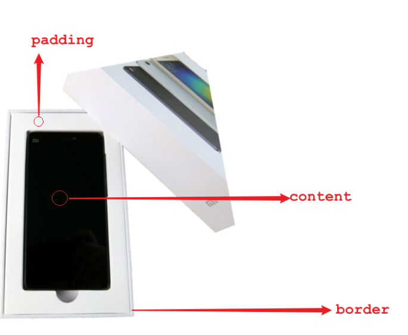

盒子的大小，其实就包括三个部分： border、padding、content，而margin外边距是不包括在盒子之内的。

##### 布局实现

在实现新闻页面的布局时，我们需要做两部操作：

- 第一步：需要将body中的新闻标题部分、正文部分使用一个 div 布局标签将其包裹起来，方便通过css设置内容占用的宽度，比如：65%。
- 第二步：通过css为该div设置外边距，左右的外边距分别为：17.5%，上下外边距靠边展示即可，为：0%。

### 表格标签

**场景：**在网页中以表格（行、列）形式整齐展示数据，我们在一些管理类的系统中，会看到数据通常都是以表格的形式呈现出来的，比如：班级表、学生表、课程表、成绩表等等。

**标签：**

- &lt;table> : 用于定义整个表格, 可以包裹多个 &lt;tr>， 常用属性如下： 
	- border：规定表格边框的宽度
	- width：规定表格的宽度
	- cellspacing: 规定单元之间的空间

- &lt;tr> : 表格的行，可以包裹多个 &lt;td>  
- &lt;td> : 表格单元格(普通)，可以包裹内容 , 如果是表头单元格，可以替换为 &lt;th>  

### 表单标签

#### 表单

- 表单场景: 表单就是在网页中负责数据采集功能的，如：注册、登录的表单。 

- 表单标签: &lt;form>
- 表单属性:
	- action: 规定表单提交时，向何处发送表单数据，表单提交的URL。
	- method: 规定用于发送表单数据的方式，常见为： GET、POST。
		- GET：表单数据是拼接在url后面的， 如： xxxxxxxxxxx?username=Tom&age=12，url中能携带的表单数据大小是有限制的。
		- POST： 表单数据是在请求体（消息体）中携带的，大小没有限制。

- 表单项标签: 不同类型的input元素、下拉列表、文本域等。
	- input: 定义表单项，通过type属性控制输入形式
	- select: 定义下拉列表
	- textarea: 定义文本域

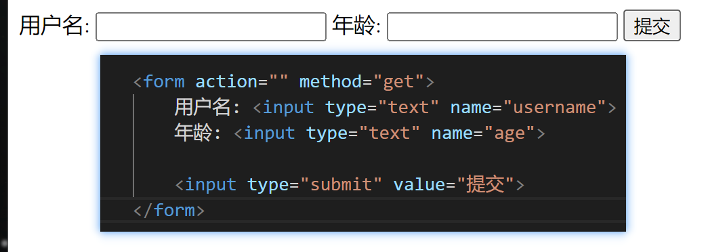

#### 表单项

 在一个表单中，可以存在很多的表单项，而虽然表单项的形式各式各样，但是表单项的标签其实就只有三个，分别是：

- &lt;input>: 表单项 , 通过type属性控制输入形式。

	| type取值                 | **描述**                             |
	| ------------------------ | ------------------------------------ |
	| text                     | 默认值，定义单行的输入字段           |
	| password                 | 定义密码字段                         |
	| radio                    | 定义单选按钮                         |
	| checkbox                 | 定义复选框                           |
	| file                     | 定义文件上传按钮                     |
	| date/time/datetime-local | 定义日期/时间/日期时间               |
	| number                   | 定义数字输入框                       |
	| email                    | 定义邮件输入框                       |
	| hidden                   | 定义隐藏域                           |
	| submit / reset / button  | 定义提交按钮 / 重置按钮 / 可点击按钮 |

- &lt;select>: 定义下拉列表, &lt;option> 定义列表项

- &lt;textarea>: 文本域

```html
    <form action="" method="post">
        姓名: <input type="text" name="name"> <br><br>
        密码: <input type="password" name="password"> <br><br> 
        性别: <input type="radio" name="gender" value="1"> 男
             <label><input type="radio" name="gender" value="2"> 女 </label> <br><br>
        爱好: <label><input type="checkbox" name="hobby" value="java"> java </label>
             <label><input type="checkbox" name="hobby" value="game"> game </label>
             <label><input type="checkbox" name="hobby" value="sing"> sing </label> <br><br>
        图像: <input type="file" name="image">  <br><br>
        生日: <input type="date" name="birthday"> <br><br>
        时间: <input type="time" name="time"> <br><br>
        日期时间: <input type="datetime-local" name="datetime"> <br><br>
        邮箱: <input type="email" name="email"> <br><br>
        年龄: <input type="number" name="age"> <br><br>
        学历: <select name="degree">
                  <option value="">----------- 请选择 -----------</option>
                  <option value="1">大专</option>
                  <option value="2">本科</option>
                  <option value="3">硕士</option>
                  <option value="4">博士</option>
             </select>  <br><br>
        描述: <textarea name="description" cols="30" rows="10"></textarea>  <br><br>
        <input type="hidden" name="id" value="1">
            
        <!-- 表单常见按钮 -->
        <input type="button" value="按钮">
        <input type="reset" value="重置"> 
        <input type="submit" value="提交">   
        <br>
    </form>
```

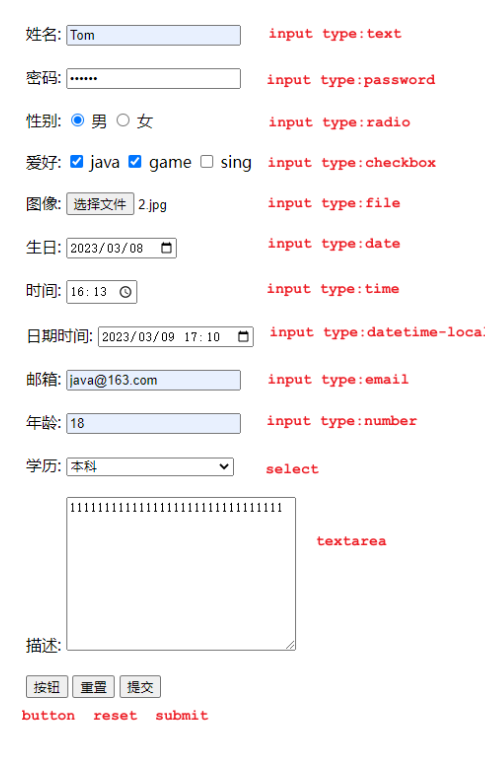

###  文档查阅

文档地址: https://www.w3school.com.cn/index.html

## JavaScript & Vue

### JavaScript

#### 引入方式

同样，js代码也是书写在html中的，那么html中如何引入js代码呢？主要通过下面的2种引入方式：

**第一种方式：**内部脚本，将JS代码定义在HTML页面中

- JavaScript代码必须位于&lt;script&gt;&lt;/script&gt;标签之间
- 在HTML文档中，可以在任意地方，放置任意数量的&lt;script&gt;
- 一般会把脚本置于&lt;body&gt;元素的底部，可改善显示速度

例子：

~~~html
<script>
    alert("Hello JavaScript")
</script>
~~~


**第二种方式：**外部脚本将， JS代码定义在外部 JS文件中，然后引入到 HTML页面中

- 外部JS文件中，只包含JS代码，不包含&ltscript&gt;标签
- 引入外部js的&lt;script&gt;标签，必须是双标签

例子：

~~~html
<script src="js/demo.js"></script>
~~~

注意：demo.js中只有js代码，没有&lt;script&gt;标签

#### 基础语法

##### 书写语法

掌握了js的引入方式，那么接下来我们需要学习js的书写了，首先需要掌握的是js的书写语法，语法规则如下：

- 区分大小写：与 Java 一样，变量名、函数名以及其他一切东西都是区分大小写的

- 每行结尾的分号可有可无

- 大括号表示代码块

- 注释：

	- 单行注释：// 注释内容

	- 多行注释：/* 注释内容 */

我们需要借助js中3钟输出语句，来演示书写语法

| api              | 描述             |
| ---------------- | ---------------- |
| window.alert()   | 警告框           |
| document.write() | 在HTML 输出内容  |
| console.log()    | 写入浏览器控制台 |

##### 变量

| 关键字 | 解释                                                         |
| ------ | ------------------------------------------------------------ |
| var    | 早期ECMAScript5中用于变量声明的关键字                        |
| let    | ECMAScript6中新增的用于变量声明的关键字，相比较var，let只在代码块内生效 |
| const  | 声明常量的，常量一旦声明，不能修改                           |

- JavaScript 是一门弱类型语言，变量可以存放不同类型的值 。
- 变量名需要遵循如下规则：
	- 组成字符可以是任何字母、数字、下划线（_）或美元符号（$）
	- 数字不能开头
	- 建议使用驼峰命名

##### 数据类型和运算符

| 数据类型  | 描述                                               |
| --------- | -------------------------------------------------- |
| number    | 数字（整数、小数、NaN(Not a Number)）              |
| string    | 字符串，单双引皆可                                 |
| boolean   | 布尔。true，false                                  |
| null      | 对象为空                                           |
| undefined | 当声明的变量未初始化时，该变量的默认值是 undefined |

| 运算规则   | 运算符                                                       |
| ---------- | ------------------------------------------------------------ |
| 算术运算符 | + , - , * , / , % , ++ , --                                  |
| 赋值运算符 | = , += , -= , *= , /= , %=                                   |
| 比较运算符 | &gt; , < , >= , <= , != , == , ===   注意     == 会进行类型转换，=== 不会进行类型转换 |
| 逻辑运算符 | && , \|\| , !                                                |
| 三元运算符 | 条件表达式 ? true_value: false_value                         |

在js中，绝大多数的运算规则和java中是保持一致的，但是js中的\==和===是有区别的。

- \==：只比较值是否相等，不区分数据类型，哪怕类型不一致，==也会自动转换类型进行值得比较
- ===：不光比较值，还要比较类型，如果类型不一致，直接返回false

#### 函数

##### 第一种定义格式

~~~js
function 函数名(参数1,参数2..){
    要执行的代码
}
~~~

- 形式参数不需要声明类型，并且JavaScript中不管什么类型都是let或者var去声明，加上也没有意义。
- 返回值也不需要声明类型，直接return即可

##### 第二种定义格式

~~~js
var functionName = function (参数1,参数2..){   
	//要执行的代码
}
~~~

#### JavaScript对象

第一类：基本对象,我们主要学习Array和JSON和String

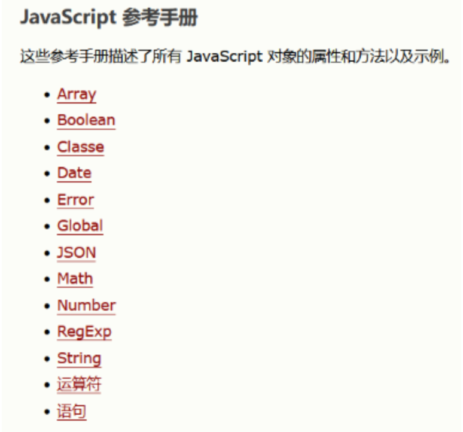

第二类：BOM对象,主要是和浏览器相关的几个对象

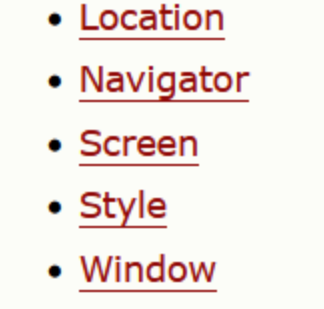

第三类：DOM对象，JavaScript中将html的每一个标签都封装成一个对象

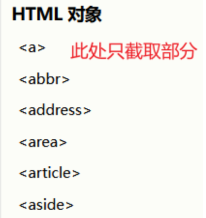

##### 基本对象

###### Array

Array对象时用来定义数组的。常用语法格式有如下2种：

方式1：

~~~js
var 变量名 = new Array(元素列表); 
~~~

例如：

~~~js
var arr = new Array(1,2,3,4); //1,2,3,4 是存储在数组中的数据（元素）
~~~

方式2：

~~~js
var 变量名 = [ 元素列表 ]; 
~~~

例如：

~~~js
var arr = [1,2,3,4]; //1,2,3,4 是存储在数组中的数据（元素）
~~~

通过索引来获取数组中的值。语法如下：

~~~js
arr[索引] = 值;
~~~

与java中不一样的是，JavaScript中数组相当于java中的集合，数组的长度是可以变化的。而且JavaScript是弱数据类型的语言，所以数组中可以存储任意数据类型的值。接下来我们通过代码来演示上述特点。

属性和方法

Array作为一个对象，那么对象是有属性和方法的，所以接下来我们介绍一下Array对象的属性和方法

官方文档中提供了Array的很多属性和方法，但是我们只学习常用的属性和方法，如下图所示：

属性：

| 属性   | 描述                         |
| :----- | :--------------------------- |
| length | 设置或返回数组中元素的数量。 |

方法：

| 方法方法  | 描述                                             |
| :-------- | :----------------------------------------------- |
| forEach() | 遍历数组中的每个有值得元素，并调用一次传入的函数 |
| push()    | 将新元素添加到数组的末尾，并返回新的长度         |
| splice()  | 从数组中删除元素                                 |

splice()函数

splice()函数用来数组中的元素，函数中填入2个参数。

参数1：表示从哪个索引位置删除

参数2：表示删除元素的个数

###### String

String对象的创建方式有2种：

方式1：

~~~js
var 变量名 = new String("…") ; //方式一
~~~

例如：

~~~js
var str = new String("Hello String");
~~~

方式2：

~~~js
var 变量名 = "…" ; //方式二
~~~

例如：

~~~js
var str = 'Hello String';
~~~

属性和方法

String对象也提供了一些常用的属性和方法，如下表格所示：

属性：

| 属性   | 描述           |
| ------ | -------------- |
| length | 字符串的长度。 |

方法：

| 方法        | 描述                                     |
| ----------- | ---------------------------------------- |
| charAt()    | 返回在指定位置的字符。                   |
| indexOf()   | 检索字符串。                             |
| trim()      | 去除字符串两边的空格                     |
| substring() | 提取字符串中两个指定的索引号之间的字符。 |

###### JSON对象

对象：

在 JavaScript 中自定义对象特别简单，其语法格式如下：

~~~js
var 对象名 = {
    属性名1: 属性值1, 
    属性名2: 属性值2,
    属性名3: 属性值3,
    函数名称: function(形参列表){}
};

~~~

我们可以通过如下语法调用属性：

~~~js
对象名.属性名
~~~

通过如下语法调用函数：

~~~js
对象名.函数名()
~~~

JSON对象：**J**ava**S**cript **O**bject **N**otation，JavaScript对象标记法。是通过JavaScript标记法书写的文本。其格式如下：

~~~js
{
    "key":value,
    "key":value,
    "key":value
}
~~~

其中，**key必须使用引号并且是双引号标记，value可以是任意数据类型。**

前后台交互时，我们需要传输数据，但是java中的对象我们该怎么去描述呢？我们可以使用如图所示的xml格式，可以清晰的描述java中需要传递给前端的java对象。

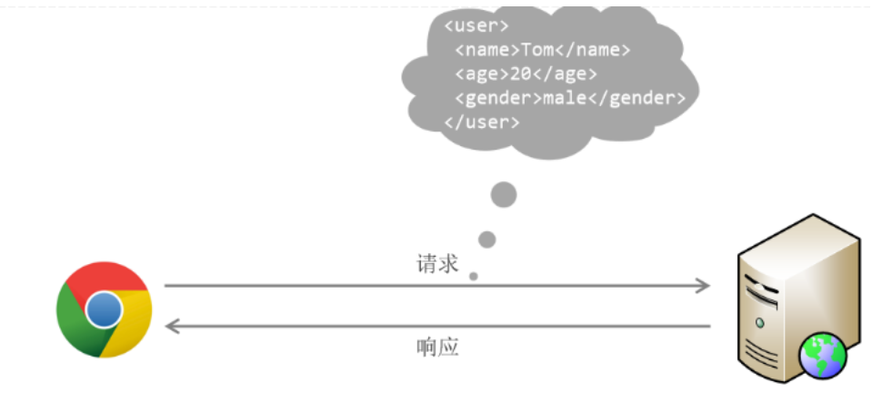

但是xml格式存在如下问题：

- 标签需要编写双份，占用带宽，浪费资源
- 解析繁琐

所以我们可以使用json来替代，如下图所示：

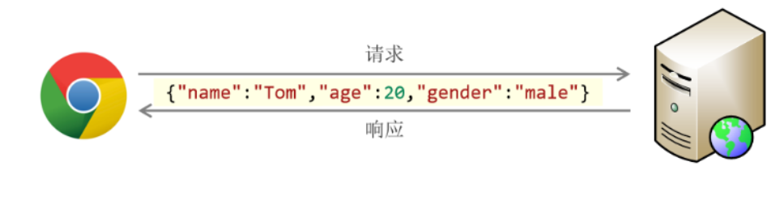

##### BOM对象

BOM的全称是Browser Object Model,翻译过来是浏览器对象模型。也就是JavaScript将浏览器的各个组成部分封装成了对象。我们要操作浏览器的部分功能，可以通过操作BOM对象的相关属性或者函数来完成。

BOM中提供了如下5个对象：

| 对象名称  | 描述           |
| :-------- | :------------- |
| Window    | 浏览器窗口对象 |
| Navigator | 浏览器对象     |
| Screen    | 屏幕对象       |
| History   | 历史记录对象   |
| Location  | d地址栏对象    |

上述5个对象与浏览器各组成对应的关系如下图所示：

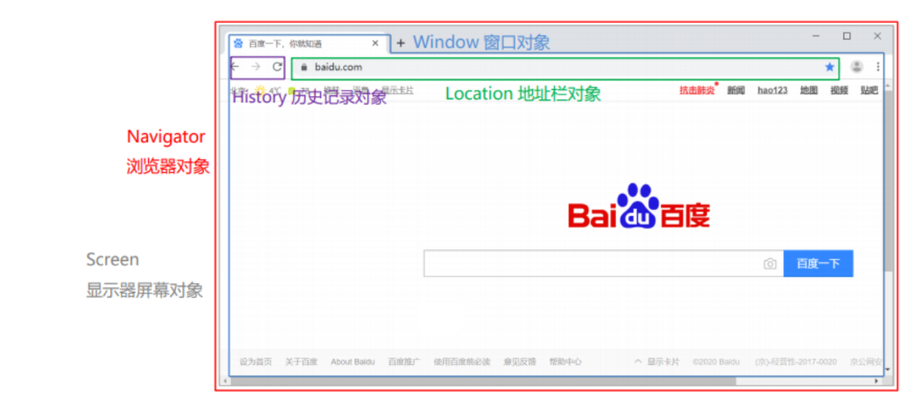

重点学习的是Window对象、Location对象这2个。

###### Windows对象

window对象指的是浏览器窗口对象，是JavaScript的全部对象，所以对于window对象，我们可以直接使用，并且对于window对象的方法和属性，我们可以省略window.例如：我们之前学习的alert()函数其实是属于window对象的,其完整的代码如下：

~~~
window.alert('hello');
~~~

其可以省略window.  所以可以简写成

~~~
alert('hello')
~~~

所以对于window对象的属性和方法，我们都是采用简写的方式。window提供了很多属性和方法，下表列出了常用属性和方法

window对象提供了获取其他BOM对象的属性：

| 属性      | 描述                  |
| --------- | --------------------- |
| history   | 用于获取history对象   |
| location  | 用于获取location对象  |
| Navigator | 用于获取Navigator对象 |
| Screen    | 用于获取Screen对象    |

也就是说我们要使用location对象，只需要通过代码`window.location`或者简写`location`即可使用

window也提供了一些常用的函数，如下表格所示：

| 函数          | 描述                                                         |
| ------------- | ------------------------------------------------------------ |
| alert()       | 显示带有一段消息和一个确认按钮的警告框。                     |
| comfirm()     | 显示带有一段消息以及确认按钮和取消按钮的对话框。会返回一个boolean值 |
| setInterval() | 按照指定的周期（以毫秒计）来调用函数或计算表达式。           |
| setTimeout()  | 在指定的毫秒数后调用函数或计算表达式。                       |

* setInterval(fn,毫秒值)：定时器，用于周期性的执行某个功能，并且是**循环执行**。该函数需要传递2个参数：
	* fn:函数，需要周期性执行的功能代码
	* 毫秒值：间隔时间
* setTimeout(fn,毫秒值) ：定时器，只会在一段时间后**执行一次功能**。参数和上述setInterval一致

###### Location对象

location是指代浏览器的地址栏对象，对于这个对象，我们常用的是href属性，用于获取或者设置浏览器的地址信息，添加如下代码：


~~~js
//获取浏览器地址栏信息
alert(location.href);
//设置浏览器地址栏信息
location.href = "https://www.enz0cez.github.io";
~~~

##### DOM对象

DOM：Document Object Model 文档对象模型。也就是 JavaScript 将 HTML 文档的各个组成部分封装为对象。

- Document：整个文档对象
- Element：元素对象
- Attribute：属性对象
- Text：文本对象
- Comment：注释对象

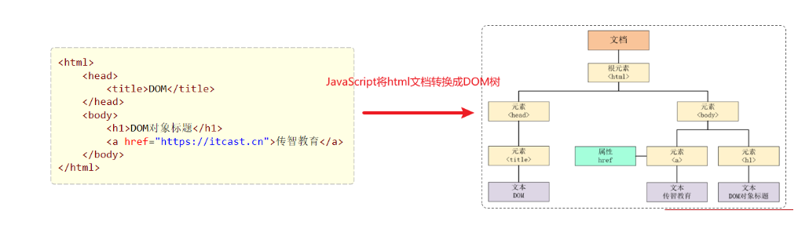

主要作用如下：

- 改变 HTML 元素的内容
- 改变 HTML 元素的样式（CSS）
- 对 HTML DOM 事件作出反应
- 添加和删除 HTML 元素

HTML中的Element对象可以通过Document对象获取，而Document对象是通过window对象获取的。document对象提供的用于获取Element元素对象的api如下表所示：

| 函数                              | 描述                                     |
| --------------------------------- | ---------------------------------------- |
| document.getElementById()         | 根据id属性值获取，返回单个Element对象    |
| document.getElementsByTagName()   | 根据标签名称获取，返回Element对象数组    |
| document.getElementsByName()      | 根据name属性值获取，返回Element对象数组  |
| document.getElementsByClassName() | 根据class属性值获取，返回Element对象数组 |

#### JavaScript事件

##### 事件绑定

JavaScript对于事件的绑定提供了2种方式：

- 方式1：通过html标签中的事件属性进行绑定

	例如一个按钮，我们对于按钮可以绑定单机事件，可以借助标签的onclick属性，属性值指向一个函数。

	~~~html
	<input type="button" id="btn1" value="事件绑定1" onclick="on()">
	~~~

	很明显没有on函数，所以我们需要创建该函数，代码如下：

	~~~html
	<script>
	    function on(){
	        alert("按钮1被点击了...");
	    }
	</script>
	~~~

	

- 方式2：通过DOM中Element元素的事件属性进行绑定

	依据我们学习过得DOM的知识点，我们知道html中的标签被加载成element对象，所以我们也可以通过element对象的属性来操作标签的属性。

	~~~html
	<input type="button" id="btn2" value="事件绑定2">
	~~~

	我们可以先通过id属性获取按钮对象，然后操作对象的onclick属性来绑定事件，代码如下：

	~~~js
	document.getElementById('btn2').onclick = function(){
	    alert("按钮2被点击了...");
	}
	~~~

	

##### 常见事件

| 事件属性名  | 说明                     |
| ----------- | ------------------------ |
| onclick     | 鼠标单击事件             |
| onblur      | 元素失去焦点             |
| onfocus     | 元素获得焦点             |
| onload      | 某个页面或图像被完成加载 |
| onsubmit    | 当表单提交时触发该事件   |
| onmouseover | 鼠标被移到某元素之上     |
| onmouseout  | 鼠标从某元素移开         |

### Vue

个完整的html页面包括了视图和数据，数据是通过请求 从后台获取的，那么意味着我们需要将后台获取到的数据呈现到页面上，很明显， 这就需要我们使用DOM操作。正因为这种开发流程，所以我们引入了一种叫做**MVVM(Model-View-ViewModel)的前端开发思想**，即让我们开发者更加关注数据，而非数据绑定到视图这种机械化的操作。

MVVM:其实是Model-View-ViewModel的缩写，有3个单词，具体释义如下：

- Model: 数据模型，特指前端中通过请求从后台获取的数据
- View: 视图，用于展示数据的页面，可以理解成我们的html+css搭建的页面，但是没有数据
- ViewModel: 数据绑定到视图，负责将数据（Model）通过JavaScript的DOM技术，将数据展示到视图（View）上

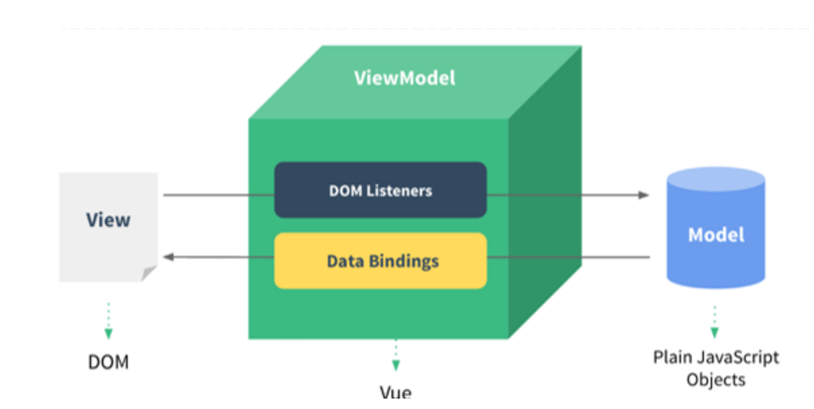

#### Vue案例

编写&lt;script&gt;标签来引入vue.js文件，代码如下：

~~~html
<script src="js/vue.js"></script>
~~~

第三步：在js代码区域定义vue对象,代码如下：

~~~html
<script>
    //定义Vue对象
    new Vue({
        el: "#app", //vue接管区域
        data:{
            message: "Hello Vue"
        }
    })
</script>
~~~

在创建vue对象时，有几个常用的属性：

- el:  用来指定哪儿些标签受 Vue 管理。 该属性取值 `#app` 中的 `app` 需要是受管理的标签的id属性值
- data: 用来定义数据模型
- methods: 用来定义函数。这个我们在后面就会用到

第四步：在html区域编写视图，其中{{}}是插值表达式，用来将vue对象中定义的model展示到页面上的

~~~html
<body>
    <div id="app">
        <input type="text" v-model="message">
        {{message}}
    </div>
</body>
~~~

#### Vue指令

在vue中，通过大量的指令来实现数据绑定到视图的，所以接下来我们需要学习vue的常用指令，如下表所示：

| **指令**  | **作用**                                            |
| --------- | --------------------------------------------------- |
| v-bind    | 为HTML标签绑定属性值，如设置  href , css样式等      |
| v-model   | 在表单元素上创建双向数据绑定                        |
| v-on      | 为HTML标签绑定事件                                  |
| v-if      | 条件性的渲染某元素，判定为true时渲染,否则不渲染     |
| v-else    |                                                     |
| v-else-if |                                                     |
| v-show    | 根据条件展示某元素，区别在于切换的是display属性的值 |
| v-for     | 列表渲染，遍历容器的元素或者对象的属性              |

##### v-bind和v-model

| **指令** | **作用**                                       |
| -------- | ---------------------------------------------- |
| v-bind   | 为HTML标签绑定属性值，如设置  href , css样式等 |
| v-model  | 在表单元素上创建双向数据绑定                   |

v-bind:  为HTML标签绑定属性值，如设置  href , css样式等。当vue对象中的数据模型发生变化时，标签的属性值会随之发生变化。

```html
<body>
    <div id="app">

        <a >链接1</a>
        <a >链接2</a>

        <input type="text" >

    </div>
</body>
<script>
    //定义Vue对象
    new Vue({
        el: "#app", //vue接管区域
        data:{
           url: "https://www.baidu.com"
        }
    })
</script>
```

在上述的代码中，我们需要给&lt;a&gt;标签的href属性赋值，并且值应该来自于vue对象的数据模型中的url变量。所以编写如下代码：

~~~html
<a v-bind:href="url">链接1</a>
~~~

在上述的代码中，v-bind指令是可以省略的，但是:不能省略，所以第二个超链接的代码编写如下：

~~~html
<a :href="url">链接2</a>
~~~

v-model： 在表单元素上创建双向数据绑定。什么是双向？

-  vue对象的data属性中的数据变化，视图展示会一起变化
-  视图数据发生变化，vue对象的data属性中的数据也会随着变化。

##### v-on

v-on: 用来给html标签绑定事件的。**需要注意的是如下2点**：

- v-on语法给标签的事件绑定的函数，必须是vue对象种声明的函数

- v-on语法绑定事件时，事件名相比较js中的事件名，没有on

	例如：在js中，事件绑定demo函数

	~~~html
	<input onclick="demo()">
	~~~

	vue中，事件绑定demo函数

	~~~html
	<input v-on:click="demo()">
	~~~

##### v-if和v-show

| 指令      | 描述                                                |
| --------- | --------------------------------------------------- |
| v-if      | 条件性的渲染某元素，判定为true时渲染,否则不渲染     |
| v-if-else |                                                     |
| v-else    |                                                     |
| v-show    | 根据条件展示某元素，区别在于切换的是display属性的值 |

##### v-for

v-for: 从名字我们就能看出，这个指令是用来遍历的。其语法格式如下：

~~~html
<标签 v-for="变量名 in 集合模型数据">
    {{变量名}}
</标签>
~~~

需要注意的是：需要循环那个标签，v-for 指令就写在那个标签上。

有时我们遍历时需要使用索引，那么v-for指令遍历的语法格式如下：

~~~html
<标签 v-for="(变量名,索引变量) in 集合模型数据">
    <!--索引变量是从0开始，所以要表示序号的话，需要手动的加1-->
   {{索引变量 + 1}} {{变量名}}
</标签>
~~~

#### 生命周期

vue的生命周期：指的是vue对象从创建到销毁的过程。vue的生命周期包含8个阶段：每触发一个生命周期事件，会自动执行一个生命周期方法，这些生命周期方法也被称为钩子方法。其完整的生命周期如下图所示：

| 状态          | 阶段周期 |
| ------------- | -------- |
| beforeCreate  | 创建前   |
| created       | 创建后   |
| beforeMount   | 挂载前   |
| mounted       | 挂载完成 |
| beforeUpdate  | 更新前   |
| updated       | 更新后   |
| beforeDestroy | 销毁前   |
| destroyed     | 销毁后   |

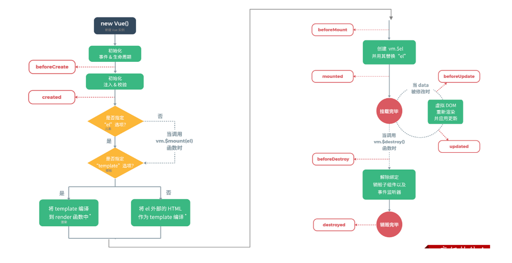

其中我们需要重点关注的是**mounted,**其他的我们了解即可。

mounted：挂载完成，Vue初始化成功，HTML页面渲染成功。**以后我们一般用于页面初始化自动的ajax请求后台数据**

## Vue-Element

### Ajax

Ajax: 全称Asynchronous JavaScript And XML，异步的JavaScript和XML。其作用有如下2点：

- 与服务器进行数据交换：通过Ajax可以给服务器发送请求，并获取服务器响应的数据。
- 异步交互：可以在**不重新加载整个页面**的情况下，与服务器交换数据并**更新部分网页**的技术，如：搜索联想、用户名是否可用的校验等等。

#### 原生Ajax

