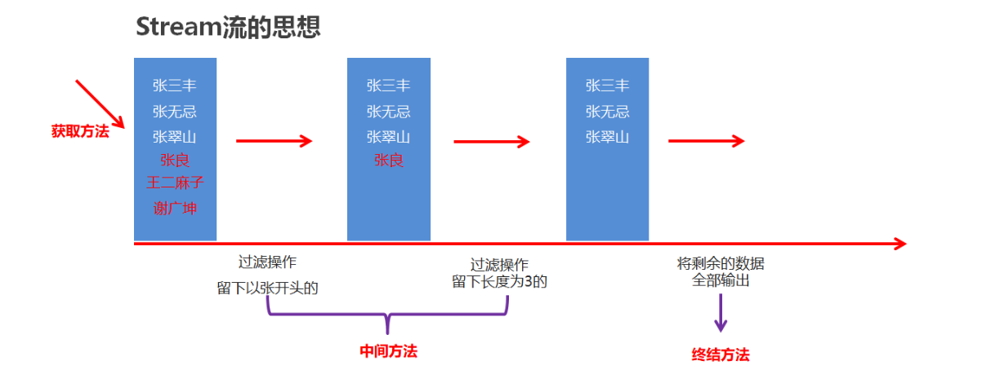
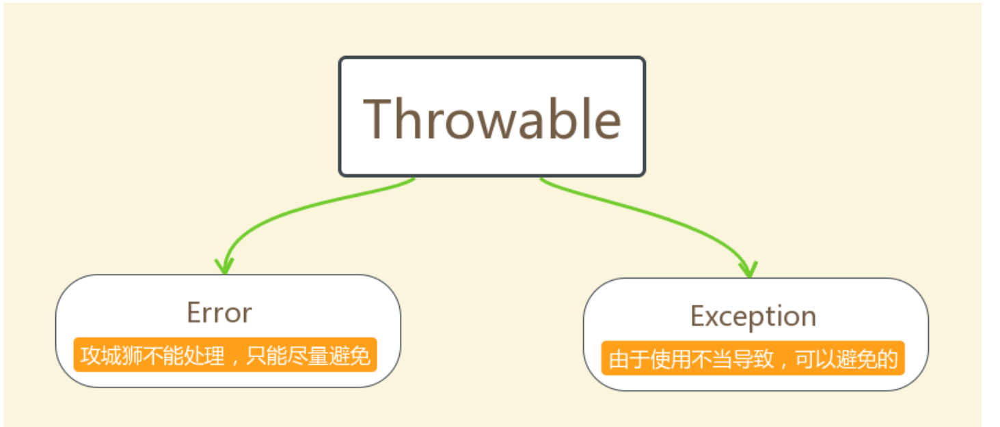

# Java笔记

## API基础语法

Lambda表达式基本上是一个匿名函数。它由三个部分组成：

- 参数列表
- 箭头（->）
- 函数体

语法如下：

```java
(parameters) -> { expression; }
```

或者如果函数体只包含一个语句，可以省略大括号：

```java
(parameters) -> expression
```

### 示例

假设我们有一个字符串列表，并且我们想对它进行排序。不使用lambda表达式，我们可能需要这样写：

```java
Collections.sort(list, new Comparator<String>() {
    public int compare(String s1, String s2) {
        return s1.compareTo(s2);
    }
});
```

使用lambda表达式，我们可以这样写：

```
Collections.sort(list, (String s1, String s2) -> s1.compareTo(s2));
```

如果编译器能从上下文推断出参数类型，那么类型声明也可以省略：

```
Collections.sort(list, (s1, s2) -> s1.compareTo(s2));
```

### 使用场景

Lambda表达式在Java中最常见的使用场景包括：

- 使用在集合上的内置函数式接口，如 `Consumer`, `Supplier`, `Function`, `Predicate` 等。
- 创建简洁的事件监听器。
- 简化线程的创建。

### 函数式接口

Lambda表达式通常与函数式接口一起使用，这是只有一个抽象方法的接口。Java API中定义了许多函数式接口。例如，`Runnable`, `Callable`, `Comparator`, `Consumer` 等。

```java
// 使用 Runnable 和 lambda 表达式创建一个线程
new Thread(() -> System.out.println("Hello from a thread")).start();
javaCopy code// 使用 Consumer 函数式接口处理列表中的每个元素
List<String> names = Arrays.asList("John", "Doe", "Jane");
names.forEach(name -> System.out.println(name));
```

### 作用域和闭包

Lambda表达式可以访问其外部作用域的变量。但是，与匿名内部类一样，它们受到某些限制。Lambda可以捕获静态变量、实例变量和effectively final的局部变量（即，一旦赋值后就不再改变的变量）。

### 1、Math类


在API文档中没有体现可用的构造方法，因此我们就不能直接通过new关键字去创建Math类的对象。同时我们发现Math类中的方法都是静态的，因此在使用的时候我们可以直接通过类名去调用。在Math类中

####  常见方法

```java
public static int abs(int a)					// 返回参数的绝对值
public static double ceil(double a)				// 返回大于或等于参数的最小整数
public static double floor(double a)			// 返回小于或等于参数的最大整数
public static int round(float a)				// 按照四舍五入返回最接近参数的int类型的值
public static int max(int a,int b)				// 获取两个int值中的较大值
public static int min(int a,int b)				// 获取两个int值中的较小值
public static double pow (double a,double b)	// 计算a的b次幂的值
public static double random()					// 返回一个[0.0,1.0)的随机值
```

### 2、System类

System类所在包为java.lang包，因此在使用的时候不需要进行导包。并且System类被final修饰了，因此该类是不能被继承的。

System包含了系统操作的一些常用的方法。比如获取当前时间所对应的毫秒值，再比如终止当前JVM等等。

System类中的方法都是静态的，因此在使用的时候我们可以直接通过类名去调用。

`````java
public static long currentTimeMillis()			// 获取当前时间所对应的毫秒值（当前时间为0时区所对应的时间即就是英国格林尼治天文台旧址所在位置）
public static void exit(int status)				// 终止当前正在运行的Java虚拟机，0表示正常退出，非零表示异常退出
public static native void arraycopy(Object src,  int  srcPos, Object dest, int destPos, int length); // 进行数值元素copy 
//src：源数组，要复制的数组。
//srcPos：源数组中开始复制的位置。
//dest：目标数组，复制的目标。
//destPos：目标数组中开始粘贴的位置。
//length：要复制的元素数量。
`````

### 3、Date类

简单来说：使用无参构造，可以自动设置当前系统时间的毫秒时刻；指定long类型的构造参数，可以自定义毫秒时刻。例如：

```java
import java.util.Date;

public class Demo01Date {
    public static void main(String[] args) {
        // 创建日期对象，把当前的时间
        System.out.println(new Date()); // Tue Jan 16 14:37:35 CST 2020
        // 创建日期对象，把当前的毫秒值转成日期对象
        System.out.println(new Date(0L)); // Thu Jan 01 08:00:00 CST 1970
    }
}
```

常用方法：

Date类中的多数方法已经过时，常用的方法有：

- `public long getTime()` 把日期对象转换成对应的时间毫秒值。
- `public void setTime(long time)` 把方法参数给定的毫秒值设置给日期对象

示例代码

```java
public class DateDemo02 {
    public static void main(String[] args) {
        //创建日期对象
        Date d = new Date();
        
        //public long getTime():获取的是日期对象从1970年1月1日 00:00:00到现在的毫秒值
        //System.out.println(d.getTime());
        //System.out.println(d.getTime() * 1.0 / 1000 / 60 / 60 / 24 / 365 + "年");

        //public void setTime(long time):设置时间，给的是毫秒值
        //long time = 1000*60*60;
        long time = System.currentTimeMillis();
        d.setTime(time);

        System.out.println(d);
    }
}
```

> 小结：Date表示特定的时间瞬间，我们可以使用Date对象对时间进行操作。

### 4、SimpleDateFormat类

`java.text.SimpleDateFormat` 是日期/时间格式化类，我们通过这个类可以帮我们完成日期和文本之间的转换,也就是可以在Date对象与String对象之间进行来回转换。


## 正则表达式

在Java中，我们经常需要验证一些字符串，例如：年龄必须是2位的数字、用户名必须是8位长度而且只能包含大小写字母、数字等。正则表达式就是用来验证各种字符串的规则。它内部描述了一些规则，我们可以验证用户输入的字符串是否匹配这个规则。


规则是从左到右一个一个比较的

#### 1、字符类(只匹配一个字符)

1. \[abc\]：代表a或者b，或者c字符中的一个。
2. \[^abc\]：代表除a,b,c以外的任何字符。
3. [a-z]：代表a-z的所有小写字符中的一个。
4. [A-Z]：代表A-Z的所有大写字符中的一个。
5. [0-9]：代表0-9之间的某一个数字字符。
6. [a-zA-Z0-9]：代表a-z或者A-Z或者0-9之间的任意一个字符。
7. [a-dm-p]：a 到 d 或 m 到 p之间的任意一个字符。 

### 2、预定义字符(只匹配一个字符)

1. "." ： 匹配任何字符。
2. "\d"：任何数字[0-9]的简写；
3. "\D"：任何非数字\[^0-9\]的简写；
4. "\s"： 空白字符：[ \t\n\x0B\f\r] 的简写
5. "\S"： 非空白字符：\[^\s\] 的简写
6. "\w"：单词字符：[a-zA-Z_0-9]的简写
7. "\W"：非单词字符：\[^\w\]

tips: \ 在java中表示转义的意思，就是改变后面那个字符原本的含义，可以用来打印分号，\\\前面的\是一个转义字符，改变了后面\原本的含义，把它变成了一个普通的\

### 3、数量词

1. X? : X出现0次或1次
2. X* : X出现0次到多次
3. X+ : X出现1次或多次
4. X{n} : X出现恰好n次
5. X{n,} : X出现至少n次
6. X{n,m}: X出现n到m次(n和m都是包含的)

以上内容不用背，可以通过查看Pattern类的API得知。

String中有一个方法matchs(String regex)，这个regex表示一个正则表达式，返回的是boolean类型，表示此字符是否匹配给定的正则表达式

## 集合

### Map集合

- Map集合概述

	```java
	interface Map<K,V>  K：键的类型；V：值的类型
	```

- Map集合的特点

	- 双列集合,一个键对应一个值
	- 键不可以重复,值可以重复


```java
Map map = new HashMap();
map.put(1,"cez");
map.put(2,"zjy");
map.put(3,"zyj");
System.out.println(map);
System.out.println(map.get(1));
```

方法介绍

| 方法名                              | 说明                                 |
| ----------------------------------- | ------------------------------------ |
| V   put(K key,V   value)            | 添加元素                             |
| V   remove(Object key)              | 根据键删除键值对元素                 |
| void   clear()                      | 移除所有的键值对元素                 |
| boolean containsKey(Object key)     | 判断集合是否包含指定的键             |
| boolean containsValue(Object value) | 判断集合是否包含指定的值             |
| boolean isEmpty()                   | 判断集合是否为空                     |
| int size()                          | 集合的长度，也就是集合中键值对的个数 |

| 方法名                           | 说明                     |
| -------------------------------- | ------------------------ |
| V   get(Object key)              | 根据键获取值             |
| Set<K>   keySet()                | 获取所有键的集合         |
| Collection<V>   values()         | 获取所有值的集合         |
| Set<Map.Entry<K,V>>   entrySet() | 获取所有键值对对象的集合 |

#### Map集合的遍历方式

- 获取所有键的集合。用keySet()方法实现
- 遍历键的集合，获取到每一个键。用增强for实现  
- 根据键去找值。用get(Object key)方法实现

### HashMap集合

+ HashMap底层是哈希表结构的
+ 依赖hashCode方法和equals方法保证键的唯一
+ 如果键要存储的是自定义对象，需要重写hashCode和equals方法

### TreeMap集合

+ TreeMap底层是红黑树结构
+ 依赖自然排序或者比较器排序,对键进行排序
+ 如果键存储的是自定义对象,需要实现Comparable接口或者在创建TreeMap对象时候给出比较器排序规则

## 可变参数

在**JDK1.5**之后，如果我们定义一个方法需要接受多个参数，并且多个参数类型一致，我们可以对其简化.

**格式：**

```
修饰符 返回值类型 方法名(参数类型... 形参名){  }
```

**底层：**

​	其实就是一个数组

**好处：**

​	在传递数据的时候，省的我们自己创建数组并添加元素了，JDK底层帮我们自动创建数组并添加元素了

**代码演示:**

```java
  public class ChangeArgs {
    public static void main(String[] args) {
        int sum = getSum(6, 7, 2, 12, 2121);
        System.out.println(sum);
    }
    
    public static int getSum(int... arr) {
   		int sum = 0;
   	     for (int a : arr) {
         sum += a;
        }
   		 return sum;
    }
}
```

**注意：**

	1. 一个方法只能有一个可变参数
	1. 如果方法中有多个参数，可变参数要放到最后。

## Collection类

## Collections常用功能

- `java.utils.Collections`是集合工具类，用来对集合进行操作。

	常用方法如下：

- `public static void shuffle(List<?> list) `:打乱集合顺序。

- `public static <T> void sort(List<T> list)`:将集合中元素按照默认规则排序。

- `public static <T> void sort(List<T> list，Comparator<? super T> )`:将集合中元素按照指定规则排序。

## 不可变集合

是一个长度不可变，内容也无法修改的集合

### 不可变集合分类

* 不可变的list集合

```java
        //一旦创建完毕之后，是无法进行修改的，在下面的代码中，只能进行查询操作
        List<String> list = List.of("张三", "李四", "王五", "赵六");
		//Java 9及之后才有.of功能
```

* 不可变的set集合

```java
		//一旦创建完毕之后，是无法进行修改的，在下面的代码中，只能进行查询操作
        Set<String> set = Set.of("张三", "张三", "李四", "王五", "赵六");
		//Java 9及之后才有.of功能
```

* 不可变的map集合

```java
        //一旦创建完毕之后，是无法进行修改的，在下面的代码中，只能进行查询操作
        Map<String, String> map = Map.of("张三", "南京", "张三", "北京", "王五", "上海",
                "赵六", "广州", "孙七", "深圳", "周八", "杭州",
                "吴九", "宁波", "郑十", "苏州", "刘一", "无锡",
                "陈二", "嘉兴");
		//Java 9及之后才有.of功能
```


## Stream流



Stream流的三类方法

- 获取Stream流
	- 创建一条流水线,并把数据放到流水线上准备进行操作
- 中间方法
	- 流水线上的操作
	- 一次操作完毕之后,还可以继续进行其他操作
- 终结方法
	- 一个Stream流只能有一个终结方法
	- 是流水线上的最后一个操作

* 生成Stream流的方式

	- Collection体系集合

		使用默认方法stream()生成流， default Stream<E> stream()


	- Map体系集合
	
		把Map转成Set集合，间接的生成流


	- 数组
	
		通过Arrays中的静态方法stream生成流


	- 同种数据类型的多个数据
	
		通过Stream接口的静态方法of(T... values)生成流

```java
        //Collection体系的集合可以使用默认方法stream()生成流
        List<String> list = new ArrayList<String>();
        Stream<String> listStream = list.stream();

        Set<String> set = new HashSet<String>();
        Stream<String> setStream = set.stream();

        //Map体系的集合间接的生成流
        Map<String,Integer> map = new HashMap<String, Integer>();
        Stream<String> keyStream = map.keySet().stream();
        Stream<Integer> valueStream = map.values().stream();
        Stream<Map.Entry<String, Integer>> entryStream = map.entrySet().stream();

        //数组可以通过Arrays中的静态方法stream生成流
        String[] strArray = {"hello","world","java"};
        Stream<String> strArrayStream = Arrays.stream(strArray);
      
      	//同种数据类型的多个数据可以通过Stream接口的静态方法of(T... values)生成流
        Stream<String> strArrayStream2 = Stream.of("hello", "world", "java");
        Stream<Integer> intStream = Stream.of(10, 20, 30);
```

### Stream流中间操作方法【应用】

- 概念

	中间操作的意思是,执行完此方法之后,Stream流依然可以继续执行其他操作

- 常见方法

	| 方法名                                          | 说明                                                       |
	| ----------------------------------------------- | ---------------------------------------------------------- |
	| Stream<T> filter(Predicate predicate)           | 用于对流中的数据进行过滤                                   |
	| Stream<T> limit(long maxSize)                   | 返回此流中的元素组成的流，截取前指定参数个数的数据         |
	| Stream<T> skip(long n)                          | 跳过指定参数个数的数据，返回由该流的剩余元素组成的流       |
	| static <T> Stream<T> concat(Stream a, Stream b) | 合并a和b两个流为一个流                                     |
	| Stream<T> distinct()                            | 返回由该流的不同元素（根据Object.equals(Object) ）组成的流 |

### Stream流终结操作方法【应用】

- 概念

	终结操作的意思是,执行完此方法之后,Stream流将不能再执行其他操作

- 常见方法

	| 方法名                        | 说明                     |
	| ----------------------------- | ------------------------ |
	| void forEach(Consumer action) | 对此流的每个元素执行操作 |
	| long count()                  | 返回此流中的元素数       |

### Stream流的收集操作【应用】

- 概念

	对数据使用Stream流的方式操作完毕后,可以把流中的数据收集到集合中

- 常用方法

	| 方法名                         | 说明               |
	| ------------------------------ | ------------------ |
	| R collect(Collector collector) | 把结果收集到集合中 |

- 工具类Collectors提供了具体的收集方式

	| 方法名                                                       | 说明                   |
	| ------------------------------------------------------------ | ---------------------- |
	| public static <T> Collector toList()                         | 把元素收集到List集合中 |
	| public static <T> Collector toSet()                          | 把元素收集到Set集合中  |
	| public static  Collector toMap(Function keyMapper,Function valueMapper) | 把元素收集到Map集合中  |

## 方法引用

- 方法引用符

	::  该符号为引用运算符，而它所在的表达式被称为方法引用

- 推导与省略

	- 如果使用Lambda，那么根据“可推导就是可省略”的原则，无需指定参数类型，也无需指定的重载形式，它们都将被自动推导
	- 如果使用方法引用，也是同样可以根据上下文进行推导
	- 方法引用是Lambda的孪生兄弟

### 引用类方法【应用】

引用类方法，其实就是引用类的静态方法

- 格式

	类名::静态方法

- 范例

	Integer::parseInt

	Integer类的方法：public static int parseInt(String s) 将此String转换为int类型数据

- 练习描述

	- 定义一个接口(Converter)，里面定义一个抽象方法 int convert(String s);
	- 定义一个测试类(ConverterDemo)，在测试类中提供两个方法
		- 一个方法是：useConverter(Converter c)
		- 一个方法是主方法，在主方法中调用useConverter方法

- 代码演示

	```java
	public interface Converter {
	    int convert(String s);
	}
	
	public class ConverterDemo {
	    public static void main(String[] args) {
	
			//Lambda写法
	        useConverter(s -> Integer.parseInt(s));
	
	        //引用类方法
	        useConverter(Integer::parseInt);
	
	    }
	
	    private static void useConverter(Converter c) {
	        int number = c.convert("666");
	        System.out.println(number);
	    }
	}
	```

- 使用说明

	Lambda表达式被类方法替代的时候，它的形式参数全部传递给静态方法作为参数

## 异常

* **异常** ：指的是程序在执行过程中，出现的非正常的情况，最终会导致JVM的非正常停止。

在Java等面向对象的编程语言中，异常本身是一个类，产生异常就是创建异常对象并抛出了一个异常对象。Java处理异常的方式是中断处理。

### 异常体系

异常机制其实是帮助我们**找到**程序中的问题，异常的根类是`java.lang.Throwable`，其下有两个子类：`java.lang.Error`与`java.lang.Exception`，平常所说的异常指`java.lang.Exception`。



**Throwable体系：**

* **Error**:严重错误Error，无法通过处理的错误，只能事先避免，好比绝症。
* **Exception**:表示异常，异常产生后程序员可以通过代码的方式纠正，使程序继续运行，是必须要处理的。好比感冒、阑尾炎。

**Throwable中的常用方法：**

* `public void printStackTrace()`:打印异常的详细信息。

	*包含了异常的类型,异常的原因,还包括异常出现的位置,在开发和调试阶段,都得使用printStackTrace。*

* `public String getMessage()`:获取发生异常的原因。

	*提示给用户的时候,就提示错误原因。*

* `public String toString()`:获取异常的类型和异常描述信息(不用)。

***出现异常,不要紧张,把异常的简单类名,拷贝到API中去查。***

### 异常分类

**异常(Exception)的分类**:根据在编译时期还是运行时期去检查异常?

* **编译时期异常**:checked异常。在编译时期,就会检查,如果没有处理异常,则编译失败。(如日期格式化异常)
* **运行时期异常**:runtime异常。在运行时期,检查异常.在编译时期,运行异常不会编译器检测(不报错)。(如数学异常)

### 抛出异常throw

在java中，提供了一个**throw**关键字，它用来抛出一个指定的异常对象。那么，抛出一个异常具体如何操作呢？

1. 创建一个异常对象。封装一些提示信息(信息可以自己编写)。

2. 需要将这个异常对象告知给调用者。怎么告知呢？怎么将这个异常对象传递到调用者处呢？通过关键字throw就可以完成。throw 异常对象。

	throw**用在方法内**，用来抛出一个异常对象，将这个异常对象传递到调用者处，并结束当前方法的执行。

**使用格式：**

```
throw new 异常类名(参数);
```

 例如：

```java
throw new NullPointerException("要访问的arr数组不存在");

throw new ArrayIndexOutOfBoundsException("该索引在数组中不存在，已超出范围");
```

### 声明异常throws

**声明异常**：将问题标识出来，报告给调用者。如果方法内通过throw抛出了编译时异常，而没有捕获处理（稍后讲解该方式），那么必须通过throws进行声明，让调用者去处理。

关键字**throws**运用于方法声明之上,用于表示当前方法不处理异常,而是提醒该方法的调用者来处理异常(抛出异常).

**声明异常格式：**

```
修饰符 返回值类型 方法名(参数) throws 异常类名1,异常类名2…{   }	
```

### 捕获异常try…catch

如果异常出现的话,会立刻终止程序,所以我们得处理异常:

1. 该方法不处理,而是声明抛出,由该方法的调用者来处理(throws)。
2. 在方法中使用try-catch的语句块来处理异常。

**try-catch**的方式就是捕获异常。

* **捕获异常**：Java中对异常有针对性的语句进行捕获，可以对出现的异常进行指定方式的处理。

捕获异常语法如下：

```java
try{
     编写可能会出现异常的代码
}catch(异常类型  e){//try中抛出的是什么异常，在括号中就定义什么异常类型
     处理异常的代码
     //记录日志/打印异常信息/继续抛出异常
}
```

**try：**该代码块中编写可能产生异常的代码。

**catch：**用来进行某种异常的捕获，实现对捕获到的异常进行处理。

> 注意:try和catch都不能单独使用,必须连用。

如何获取异常信息：

Throwable类中定义了一些查看方法:

* `public String getMessage()`:获取异常的描述信息,原因(提示给用户的时候,就提示错误原因。


* `public String toString()`:获取异常的类型和异常描述信息(不用)。
* `public void printStackTrace()`:打印异常的跟踪栈信息并输出到控制台。

​            *包含了异常的类型,异常的原因,还包括异常出现的位置,在开发和调试阶段,都得使用printStackTrace。*

在开发中呢也可以在catch将编译期异常转换成运行期异常处理。

多个异常使用捕获又该如何处理呢？

1. 多个异常分别处理。
2. 多个异常一次捕获，多次处理。
3. 多个异常一次捕获一次处理。

一般我们是使用一次捕获多次处理方式，格式如下：

```java
try{
     编写可能会出现异常的代码
}catch(异常类型A  e){  当try中出现A类型异常,就用该catch来捕获.
     处理异常的代码
     //记录日志/打印异常信息/继续抛出异常
}catch(异常类型B  e){  当try中出现B类型异常,就用该catch来捕获.
     处理异常的代码
     //记录日志/打印异常信息/继续抛出异常
}
```

> 注意:这种异常处理方式，要求多个catch中的异常不能相同，并且若catch中的多个异常之间有子父类异常的关系，那么子类异常要求在上面的catch处理，父类异常在下面的catch处理。

### finally 代码块

**finally**：有一些特定的代码无论异常是否发生，都需要执行。另外，因为异常会引发程序跳转，导致有些语句执行不到。而finally就是解决这个问题的，在finally代码块中存放的代码都是一定会被执行的。

什么时候的代码必须最终执行？

当我们在try语句块中打开了一些物理资源(磁盘文件/网络连接/数据库连接等),我们都得在使用完之后,最终关闭打开的资源。

finally的语法:

 try...catch....finally:自身需要处理异常,最终还得关闭资源。

> 注意:finally不能单独使用。

比如在我们之后学习的IO流中，当打开了一个关联文件的资源，最后程序不管结果如何，都需要把这个资源关闭掉。

### 注意事项

* 运行时异常被抛出可以不处理。即不捕获也不声明抛出。
* 如果父类抛出了多个异常,子类覆盖父类方法时,只能抛出相同的异常或者是他的子集。
* 父类方法没有抛出异常，子类覆盖父类该方法时也不可抛出异常。此时子类产生该异常，只能捕获处理，不能声明抛出
* 当多异常处理时，捕获处理，前边的类不能是后边类的父类
* 在try/catch后可以追加finally代码块，其中的代码一定会被执行，通常用于资源回收。

### 自定义异常类

**为什么需要自定义异常类:**

我们说了Java中不同的异常类,分别表示着某一种具体的异常情况,那么在开发中总是有些异常情况是SUN没有定义好的,此时我们根据自己业务的异常情况来定义异常类。,例如年龄负数问题,考试成绩负数问题。

在上述代码中，发现这些异常都是JDK内部定义好的，但是实际开发中也会出现很多异常,这些异常很可能在JDK中没有定义过,例如年龄负数问题,考试成绩负数问题.那么能不能自己定义异常呢？

**什么是自定义异常类:**

在开发中根据自己业务的异常情况来定义异常类.

自定义一个业务逻辑异常: **LoginException**。一个登陆异常类。

**异常类如何定义:**

1. 自定义一个编译期异常: 自定义类 并继承于`java.lang.Exception`。
2. 自定义一个运行时期的异常类:自定义类 并继承于`java.lang.RuntimeException`。

## File类

`java.io.File` 类是文件和目录路径名的抽象表示，主要用于文件和目录的创建、查找和删除等操作。

File实例主要表示文件或者目录的路径信息。通过`File`实例，你可以执行文件和目录的创建、文件搜索、目录列表获取、文件属性读取等操作。

### 构造方法

- `public File(String pathname) ` ：通过将给定的**路径名字符串**转换为抽象路径名来创建新的 File实例。  
- `public File(String parent, String child) ` ：从**父路径名字符串和子路径名字符串**创建新的 File实例。
- `public File(File parent, String child)` ：从**父抽象路径名和子路径名字符串**创建新的 File实例。  

### 常用方法

#### 获取功能的方法

- `public String getAbsolutePath() ` ：返回此File的绝对路径名字符串。

- ` public String getPath() ` ：将此File转换为路径名字符串。 

- `public String getName()`  ：返回由此File表示的文件或目录的名称。  

- `public long length()`  ：返回由此File表示的文件的长度。 

#### 绝对路径和相对路径

- **绝对路径**：从盘符开始的路径，这是一个完整的路径。
- **相对路径**：相对于项目目录的路径，这是一个便捷的路径，开发中经常使用。

#### 判断功能的方法

- `public boolean exists()` ：此File表示的文件或目录是否实际存在。
- `public boolean isDirectory()` ：此File表示的是否为目录。
- `public boolean isFile()` ：此File表示的是否为文件。

#### 创建删除功能的方法

- `public boolean createNewFile()` ：当且仅当具有该名称的文件尚不存在时，创建一个新的空文件。 
- `public boolean delete()` ：删除由此File表示的文件或目录。  
- `public boolean mkdir()` ：创建由此File表示的目录。
- `public boolean mkdirs()` ：创建由此File表示的目录，包括任何必需但不存在的父目录。

#### 目录的遍历

- `public String[] list()` ：返回一个String数组，表示该File目录中的所有子文件或目录。
- `public File[] listFiles()` ：返回一个File数组，表示该File目录中的所有的子文件或目录。  

## 字节流

一切文件数据(文本、图片、视频等)在存储时，都是以二进制数字的形式保存，都一个一个的字节，那么传输时一样如此。所以，字节流可以传输任意文件数据。在操作流的时候，我们要时刻明确，无论使用什么样的流对象，底层传输的始终为二进制数据。

### 字节输出流【OutputStream】

`java.io.OutputStream `抽象类是表示字节输出流的所有类的超类，将指定的字节信息写出到目的地。它定义了字节输出流的基本共性功能方法。

* `public void close()` ：关闭此输出流并释放与此流相关联的任何系统资源。  
* `public void flush() ` ：刷新此输出流并强制任何缓冲的输出字节被写出。  
* `public void write(byte[] b)`：将 b.length字节从指定的字节数组写入此输出流。  
* `public void write(byte[] b, int off, int len)` ：从指定的字节数组写入 len字节，从偏移量 off开始输出到此输出流。  
* `public abstract void write(int b)` ：将指定的字节输出流。

> 小贴士：
>
> close方法，当完成流的操作时，必须调用此方法，释放系统资源。

### FileOutputStream类

`OutputStream`有很多子类，我们从最简单的一个子类开始。

`java.io.FileOutputStream `类是文件输出流，用于将数据写出到文件。

##### 构造方法

* `public FileOutputStream(File file)`：创建文件输出流以写入由指定的 File对象表示的文件。 
* `public FileOutputStream(String name)`： 创建文件输出流以指定的名称写入文件。  

当你创建一个流对象时，必须传入一个文件路径。该路径下，如果没有这个文件，会创建该文件。如果有这个文件，会清空这个文件的数据。

* 构造举例，代码如下：

```java
public class FileOutputStreamConstructor throws IOException {
    public static void main(String[] args) {
   	 	// 使用File对象创建流对象
        File file = new File("a.txt");
        FileOutputStream fos = new FileOutputStream(file);
      
        // 使用文件名称创建流对象
        FileOutputStream fos = new FileOutputStream("b.txt");
    }
}
```

##### 写出字节数据

1. **写出字节**：`write(int b)` 方法，每次可以写出一个字节数据，代码使用演示：

```java
public class FOSWrite {
    public static void main(String[] args) throws IOException {
        // 使用文件名称创建流对象
        FileOutputStream fos = new FileOutputStream("fos.txt");     
      	// 写出数据
      	fos.write(97); // 写出第1个字节
      	fos.write(98); // 写出第2个字节
      	fos.write(99); // 写出第3个字节
      	// 关闭资源
        fos.close();
    }
}
输出结果：
abc
```

> 小贴士：
>
> 1. 虽然参数为int类型四个字节，但是只会保留一个字节的信息写出。
> 2. 流操作完毕后，必须释放系统资源，调用close方法，千万记得。

2. **写出字节数组**：`write(byte[] b)`，每次可以写出数组中的数据，代码使用演示：

```java
public class FOSWrite {
    public static void main(String[] args) throws IOException {
        // 使用文件名称创建流对象
        FileOutputStream fos = new FileOutputStream("fos.txt");     
      	// 字符串转换为字节数组
      	byte[] b = "黑马程序员".getBytes();
      	// 写出字节数组数据
      	fos.write(b);
      	// 关闭资源
        fos.close();
    }
}
输出结果：
黑马程序员
```

3. **写出指定长度字节数组**：`write(byte[] b, int off, int len)` ,每次写出从off索引开始，len个字节，代码使用演示：

```java
public class FOSWrite {
    public static void main(String[] args) throws IOException {
        // 使用文件名称创建流对象
        FileOutputStream fos = new FileOutputStream("fos.txt");     
      	// 字符串转换为字节数组
      	byte[] b = "abcde".getBytes();
		// 写出从索引2开始，2个字节。索引2是c，两个字节，也就是cd。
        fos.write(b,2,2);
      	// 关闭资源
        fos.close();
    }
}
输出结果：
cd
```

##### 数据追加续写

经过以上的演示，每次程序运行，创建输出流对象，都会清空目标文件中的数据。如何保留目标文件中数据，还能继续添加新数据呢？

- `public FileOutputStream(File file, boolean append)`： 创建文件输出流以写入由指定的 File对象表示的文件。  
- `public FileOutputStream(String name, boolean append)`： 创建文件输出流以指定的名称写入文件。  

这两个构造方法，参数中都需要传入一个boolean类型的值，`true` 表示追加数据，`false` 表示清空原有数据。这样创建的输出流对象，就可以指定是否追加续写了，代码使用演示：

```java
public class FOSWrite {
    public static void main(String[] args) throws IOException {
        // 使用文件名称创建流对象
        FileOutputStream fos = new FileOutputStream("fos.txt"，true);     
      	// 字符串转换为字节数组
      	byte[] b = "abcde".getBytes();
		// 写出从索引2开始，2个字节。索引2是c，两个字节，也就是cd。
        fos.write(b);
      	// 关闭资源
        fos.close();
    }
}
文件操作前：cd
文件操作后：cdabcde
```

##### 写出换行

Windows系统里，换行符号是`\r\n` 。把

以指定是否追加续写了，代码使用演示：

```java
public class FOSWrite {
    public static void main(String[] args) throws IOException {
        // 使用文件名称创建流对象
        FileOutputStream fos = new FileOutputStream("fos.txt");  
      	// 定义字节数组
      	byte[] words = {97,98,99,100,101};
      	// 遍历数组
        for (int i = 0; i < words.length; i++) {
          	// 写出一个字节
            fos.write(words[i]);
          	// 写出一个换行, 换行符号转成数组写出
            fos.write("\r\n".getBytes());
        }
      	// 关闭资源
        fos.close();
    }
}

输出结果：
a
b
c
d
e
```

> * 回车符`\r`和换行符`\n` ：
> 	* 回车符：回到一行的开头（return）。
> 	* 换行符：下一行（newline）。
> * 系统中的换行：
> 	* Windows系统里，每行结尾是 `回车+换行` ，即`\r\n`；
> 	* Unix系统里，每行结尾只有 `换行` ，即`\n`；
> 	* Mac系统里，每行结尾是 `回车` ，即`\r`。从 Mac OS X开始与Linux统一。

### 字节输入流InputStream

`java.io.InputStream `抽象类是表示字节输入流的所有类的超类，可以读取字节信息到内存中。它定义了字节输入流的基本共性功能方法。

- `public void close()` ：关闭此输入流并释放与此流相关联的任何系统资源。    
- `public abstract int read()`： 从输入流读取数据的下一个字节。 
- `public int read(byte[] b)`： 从输入流中读取一些字节数，并将它们存储到字节数组 b中 。

> 小贴士：
>
> close方法，当完成流的操作时，必须调用此方法，释放系统资源。

### FileInputStream类

`java.io.FileInputStream `类是文件输入流，从文件中读取字节。

#### 构造方法

* `FileInputStream(File file)`： 通过打开与实际文件的连接来创建一个 FileInputStream ，该文件由文件系统中的 File对象 file命名。 
* `FileInputStream(String name)`： 通过打开与实际文件的连接来创建一个 FileInputStream ，该文件由文件系统中的路径名 name命名。  

当你创建一个流对象时，必须传入一个文件路径。该路径下，如果没有该文件,会抛出`FileNotFoundException` 。

- 构造举例，代码如下：

```java
public class FileInputStreamConstructor throws IOException{
    public static void main(String[] args) {
   	 	// 使用File对象创建流对象
        File file = new File("a.txt");
        FileInputStream fos = new FileInputStream(file);
      
        // 使用文件名称创建流对象
        FileInputStream fos = new FileInputStream("b.txt");
    }
}
```

#### 读取字节数据

1. **读取字节**：`read`方法，每次可以读取一个字节的数据，提升为int类型，读取到文件末尾，返回`-1`，代码使用演示：

```java
public class FISRead {
    public static void main(String[] args) throws IOException{
      	// 使用文件名称创建流对象
       	FileInputStream fis = new FileInputStream("read.txt");
      	// 读取数据，返回一个字节
        int read = fis.read();
        System.out.println((char) read);
        read = fis.read();
        System.out.println((char) read);
        read = fis.read();
        System.out.println((char) read);
        read = fis.read();
        System.out.println((char) read);
        read = fis.read();
        System.out.println((char) read);
      	// 读取到末尾,返回-1
       	read = fis.read();
        System.out.println( read);
		// 关闭资源
        fis.close();
    }
}
输出结果：
a
b
c
d
e
-1
```

循环改进读取方式，代码使用演示：

```java
public class FISRead {
    public static void main(String[] args) throws IOException{
      	// 使用文件名称创建流对象
       	FileInputStream fis = new FileInputStream("read.txt");
      	// 定义变量，保存数据
        int b ；
        // 循环读取
        while ((b = fis.read())!=-1) {
            System.out.println((char)b);
        }
		// 关闭资源
        fis.close();
    }
}
输出结果：
a
b
c
d
e
```

> 小贴士：
>
> 1. 虽然读取了一个字节，但是会自动提升为int类型。
> 2. 流操作完毕后，必须释放系统资源，调用close方法，千万记得。

2. **使用字节数组读取**：`read(byte[] b)`，每次读取b的长度个字节到数组中，返回读取到的有效字节个数，读取到末尾时，返回`-1` ，代码使用演示：

```java
public class FISRead {
    public static void main(String[] args) throws IOException{
      	// 使用文件名称创建流对象.
       	FileInputStream fis = new FileInputStream("read.txt"); // 文件中为abcde
      	// 定义变量，作为有效个数
        int len ；
        // 定义字节数组，作为装字节数据的容器   
        byte[] b = new byte[2];
        // 循环读取
        while (( len= fis.read(b))!=-1) {
           	// 每次读取后,把数组变成字符串打印
            System.out.println(new String(b));
        }
		// 关闭资源
        fis.close();
    }
}

输出结果：
ab
cd
ed
```

错误数据`d`，是由于最后一次读取时，只读取一个字节`e`，数组中，上次读取的数据没有被完全替换，所以要通过`len` ，获取有效的字节，代码使用演示：

```java
public class FISRead {
    public static void main(String[] args) throws IOException{
      	// 使用文件名称创建流对象.
       	FileInputStream fis = new FileInputStream("read.txt"); // 文件中为abcde
      	// 定义变量，作为有效个数
        int len ；
        // 定义字节数组，作为装字节数据的容器   
        byte[] b = new byte[2];
        // 循环读取
        while (( len= fis.read(b))!=-1) {
           	// 每次读取后,把数组的有效字节部分，变成字符串打印
            System.out.println(new String(b，0，len));//  len 每次读取的有效字节个数
        }
		// 关闭资源
        fis.close();
    }
}

输出结果：
ab
cd
e
```

> 小贴士：
>
> 使用数组读取，每次读取多个字节，减少了系统间的IO操作次数，从而提高了读写的效率，建议开发中使用。

## 字符流

当使用字节流读取文本文件时，可能会有一个小问题。就是遇到中文字符时，可能不会显示完整的字符，那是因为一个中文字符可能占用多个字节存储。所以Java提供一些字符流类，以字符为单位读写数据，专门用于处理文本文件。

### 字符输入流【Reader】

`java.io.Reader`抽象类是表示用于读取字符流的所有类的超类，可以读取字符信息到内存中。它定义了字符输入流的基本共性功能方法。

- `public void close()` ：关闭此流并释放与此流相关联的任何系统资源。    
- `public int read()`： 从输入流读取一个字符。 
- `public int read(char[] cbuf)`： 从输入流中读取一些字符，并将它们存储到字符数组 cbuf中 。

### FileReader类

`java.io.FileReader `类是读取字符文件的便利类。构造时使用系统默认的字符编码和默认字节缓冲区。

> 小贴士：
>
> 1. 字符编码：字节与字符的对应规则。Windows系统的中文编码默认是GBK编码表。
>
> 	idea中UTF-8
>
> 2. 字节缓冲区：一个字节数组，用来临时存储字节数据。

#### 构造方法

- `FileReader(File file)`： 创建一个新的 FileReader ，给定要读取的File对象。   
- `FileReader(String fileName)`： 创建一个新的 FileReader ，给定要读取的文件的名称。  

当你创建一个流对象时，必须传入一个文件路径。类似于FileInputStream 。

#### 读取字符数据

1. **读取字符**：`read`方法，每次可以读取一个字符的数据，提升为int类型，读取到文件末尾，返回`-1`，循环读取，代码使用演示：

```java
public class FRRead {
    public static void main(String[] args) throws IOException {
      	// 使用文件名称创建流对象
       	FileReader fr = new FileReader("read.txt");
      	// 定义变量，保存数据
        int b ；
        // 循环读取
        while ((b = fr.read())!=-1) {
            System.out.println((char)b);
        }
		// 关闭资源
        fr.close();
    }
}
输出结果：
黑
马
程
序
员
```

> 小贴士：虽然读取了一个字符，但是会自动提升为int类型。

2. **使用字符数组读取**：`read(char[] cbuf)`，每次读取b的长度个字符到数组中，返回读取到的有效字符个数，读取到末尾时，返回`-1` ，代码使用演示：

```java
public class FRRead {
    public static void main(String[] args) throws IOException {
      	// 使用文件名称创建流对象
       	FileReader fr = new FileReader("read.txt");
      	// 定义变量，保存有效字符个数
        int len ；
        // 定义字符数组，作为装字符数据的容器
         char[] cbuf = new char[2];
        // 循环读取
        while ((len = fr.read(cbuf))!=-1) {
            System.out.println(new String(cbuf));
        }
		// 关闭资源
        fr.close();
    }
}
输出结果：
黑马
程序
员序
```

### 字符输出流【Writer】

`java.io.Writer `抽象类是表示用于写出字符流的所有类的超类，将指定的字符信息写出到目的地。它定义了字节输出流的基本共性功能方法。

- `void write(int c)` 写入单个字符。
- `void write(char[] cbuf) `写入字符数组。 
- `abstract  void write(char[] cbuf, int off, int len) `写入字符数组的某一部分,off数组的开始索引,len写的字符个数。 
- `void write(String str) `写入字符串。 
- `void write(String str, int off, int len)` 写入字符串的某一部分,off字符串的开始索引,len写的字符个数。
- `void flush() `刷新该流的缓冲。  
- `void close()` 关闭此流，但要先刷新它。 

### FileWriter类

`java.io.FileWriter `类是写出字符到文件的便利类。构造时使用系统默认的字符编码和默认字节缓冲区。

#### 构造方法

- `FileWriter(File file)`： 创建一个新的 FileWriter，给定要读取的File对象。   
- `FileWriter(String fileName)`： 创建一个新的 FileWriter，给定要读取的文件的名称。  

当你创建一个流对象时，必须传入一个文件路径，类似于FileOutputStream。

#### 基本写出数据

**写出字符**：`write(int b)` 方法，每次可以写出一个字符数据，代码使用演示：

#### 关闭和刷新

因为内置缓冲区的原因，如果不关闭输出流，无法写出字符到文件中。但是关闭的流对象，是无法继续写出数据的。如果我们既想写出数据，又想继续使用流，就需要`flush` 方法了。

* `flush` ：刷新缓冲区，流对象可以继续使用。
* `close `:先刷新缓冲区，然后通知系统释放资源。流对象不可以再被使用了。

#### 写出其他数据

1. **写出字符数组** ：`write(char[] cbuf)` 和 `write(char[] cbuf, int off, int len)` ，每次可以写出字符数组中的数据，用法类似FileOutputStream，代码使用演示：

```java
public class FWWrite {
    public static void main(String[] args) throws IOException {
        // 使用文件名称创建流对象
        FileWriter fw = new FileWriter("fw.txt");     
      	// 字符串转换为字节数组
      	char[] chars = "黑马程序员".toCharArray();
      
      	// 写出字符数组
      	fw.write(chars); // 黑马程序员
        
		// 写出从索引2开始，2个字节。索引2是'程'，两个字节，也就是'程序'。
        fw.write(b,2,2); // 程序
      
      	// 关闭资源
        fos.close();
    }
}
```

2. **写出字符串**：`write(String str)` 和 `write(String str, int off, int len)` ，每次可以写出字符串中的数据，更为方便，代码使用演示：

```java
public class FWWrite {
    public static void main(String[] args) throws IOException {
        // 使用文件名称创建流对象
        FileWriter fw = new FileWriter("fw.txt");     
      	// 字符串
      	String msg = "黑马程序员";
      
      	// 写出字符数组
      	fw.write(msg); //黑马程序员
      
		// 写出从索引2开始，2个字节。索引2是'程'，两个字节，也就是'程序'。
        fw.write(msg,2,2);	// 程序
      	
        // 关闭资源
        fos.close();
    }
}
```

3. **续写和换行**：操作类似于FileOutputStream。

```java
public class FWWrite {
    public static void main(String[] args) throws IOException {
        // 使用文件名称创建流对象，可以续写数据
        FileWriter fw = new FileWriter("fw.txt"，true);     
      	// 写出字符串
        fw.write("黑马");
      	// 写出换行
      	fw.write("\r\n");
      	// 写出字符串
  		fw.write("程序员");
      	// 关闭资源
        fw.close();
    }
}
输出结果:
黑马
程序员
```

> 小贴士：字符流，只能操作文本文件，不能操作图片，视频等非文本文件。
>
> 当我们单纯读或者写文本文件时  使用字符流 其他情况使用字节流wz
