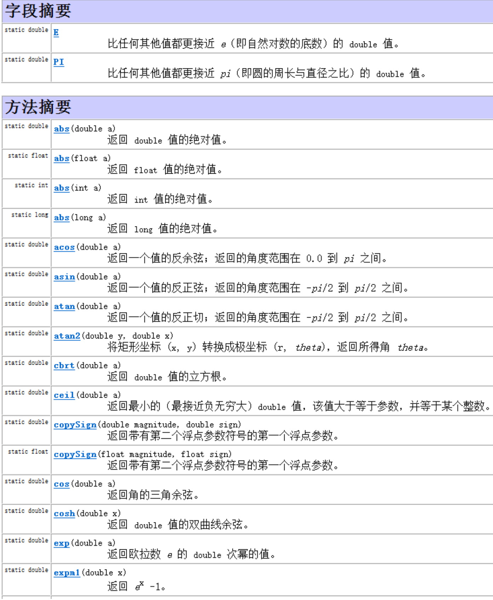

# Java笔记

## API

### 1、Math类



在API文档中没有体现可用的构造方法，因此我们就不能直接通过new关键字去创建Math类的对象。同时我们发现Math类中的方法都是静态的，因此在使用的时候我们可以直接通过类名去调用。在Math类中

####  常见方法

```java
public static int abs(int a)					// 返回参数的绝对值
public static double ceil(double a)				// 返回大于或等于参数的最小整数
public static double floor(double a)			// 返回小于或等于参数的最大整数
public static int round(float a)				// 按照四舍五入返回最接近参数的int类型的值
public static int max(int a,int b)				// 获取两个int值中的较大值
public static int min(int a,int b)				// 获取两个int值中的较小值
public static double pow (double a,double b)	// 计算a的b次幂的值
public static double random()					// 返回一个[0.0,1.0)的随机值
```

### 2、System类

System类所在包为java.lang包，因此在使用的时候不需要进行导包。并且System类被final修饰了，因此该类是不能被继承的。

System包含了系统操作的一些常用的方法。比如获取当前时间所对应的毫秒值，再比如终止当前JVM等等。

System类中的方法都是静态的，因此在使用的时候我们可以直接通过类名去调用。

`````java
public static long currentTimeMillis()			// 获取当前时间所对应的毫秒值（当前时间为0时区所对应的时间即就是英国格林尼治天文台旧址所在位置）
public static void exit(int status)				// 终止当前正在运行的Java虚拟机，0表示正常退出，非零表示异常退出
public static native void arraycopy(Object src,  int  srcPos, Object dest, int destPos, int length); // 进行数值元素copy 
//src：源数组，要复制的数组。
//srcPos：源数组中开始复制的位置。
//dest：目标数组，复制的目标。
//destPos：目标数组中开始粘贴的位置。
//length：要复制的元素数量。
`````

## 正则表达式

在Java中，我们经常需要验证一些字符串，例如：年龄必须是2位的数字、用户名必须是8位长度而且只能包含大小写字母、数字等。正则表达式就是用来验证各种字符串的规则。它内部描述了一些规则，我们可以验证用户输入的字符串是否匹配这个规则。


规则是从左到右一个一个比较的

#### 1、字符类(只匹配一个字符)

1. \[abc\]：代表a或者b，或者c字符中的一个。
2. \[^abc\]：代表除a,b,c以外的任何字符。
3. [a-z]：代表a-z的所有小写字符中的一个。
4. [A-Z]：代表A-Z的所有大写字符中的一个。
5. [0-9]：代表0-9之间的某一个数字字符。
6. [a-zA-Z0-9]：代表a-z或者A-Z或者0-9之间的任意一个字符。
7. [a-dm-p]：a 到 d 或 m 到 p之间的任意一个字符。 

### 2、预定义字符(只匹配一个字符)

1. "." ： 匹配任何字符。
2. "\d"：任何数字[0-9]的简写；
3. "\D"：任何非数字\[^0-9\]的简写；
4. "\s"： 空白字符：[ \t\n\x0B\f\r] 的简写
5. "\S"： 非空白字符：\[^\s\] 的简写
6. "\w"：单词字符：[a-zA-Z_0-9]的简写
7. "\W"：非单词字符：\[^\w\]

tips: \ 在java中表示转义的意思，就是改变后面那个字符原本的含义，可以用来打印分号，\\\前面的\是一个转义字符，改变了后面\原本的含义，把它变成了一个普通的\

### 3、数量词

1. X? : X出现0次或1次
2. X* : X出现0次到多次
3. X+ : X出现1次或多次
4. X{n} : X出现恰好n次
5. X{n,} : X出现至少n次
6. X{n,m}: X出现n到m次(n和m都是包含的)

以上内容不用背，可以通过查看Pattern类的API得知。

String中有一个方法matchs(String regex)，这个regex表示一个正则表达式，返回的是boolean类型，表示此字符是否匹配给定的正则表达式

