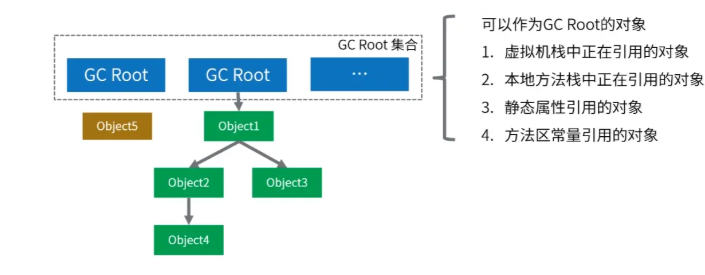
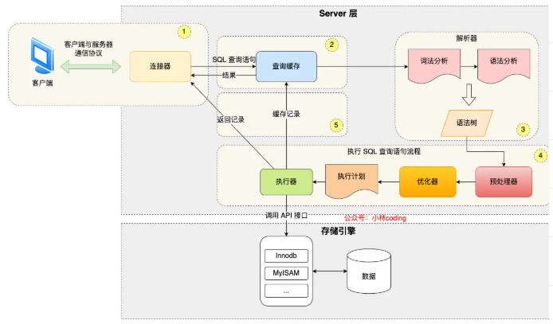
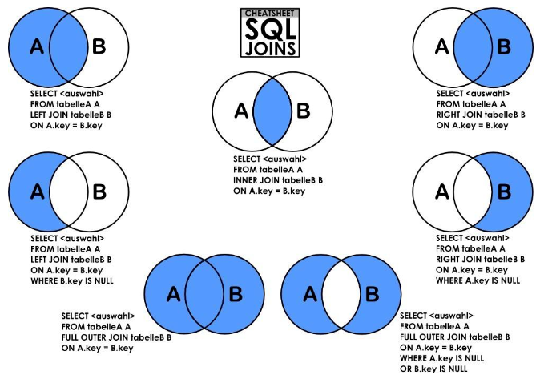
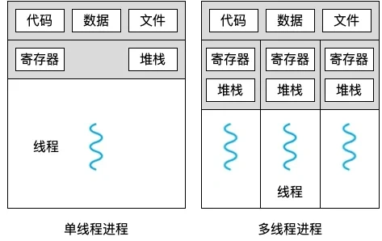
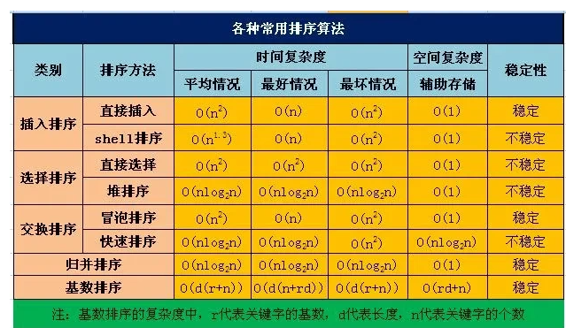

# 八股

## Java

### Hashmap的底层是用数组加链表实现的。

如果多个键映射到同一个槽位，它们会以链表的形式存储在同一个槽位上，因为链表的查询时间是O(n)，所以冲突很严重，一个索引上的链表非常长，效率就很低了。

所以在 JDK 1.8 版本的时候做了优化，当一个链表的长度超过8的时候就转换数据结构，不再使用链表存储，而是使用红黑树，查找时使用红黑树，时间复杂度O（log n），可以提高查询性能，但是在数量较少时，即数量小于6时，会将红黑树转换回链表。

### 哈希冲突如何解决？

Hashmap对于哈希冲突是用拉链法解决的，有新的键值对要插入到HashMap中时，会先计算键的哈希值，然后根据哈希值确定在数组中的位置。如果该位置已经有元素了，就会将新的元素插入到该位置的链表尾部（在 Java 8 及之后的版本中，当链表长度达到一定阈值时会转换为红黑树）。这样，同一个位置上的多个元素就通过链表（或红黑树）的方式连接起来，从而解决了哈希冲突。

当链表的长度大于等于 8 时，并且HashMap的容量大于等于 64，会将链表转换为红黑树。这是因为当链表长度较长时，查找、插入和删除操作的时间复杂度会退化为On，而红黑树可以将这些操作的时间复杂度保持在O(logn)，从而提高了性能。

### HashMap和HashTable的区别？

`Hashtable` 和 `HashMap` 都是 Java 中用于存储键值对的哈希表实现，但它们在多个方面存在区别：

* 线程安全性：
  * **`Hashtable`**：是线程安全的。它的大部分方法（如 `put`、`get`、`remove` 等）都使用了 `synchronized` 关键字进行同步，这意味着在同一时刻只能有一个线程对 `Hashtable` 进行写操作或读操作，从而保证了多线程环境下的数据一致性。
  * **`HashMap`**：是非线程安全的。在多线程环境下，如果多个线程同时对 `HashMap` 进行读写操作，可能会导致数据不一致或抛出 `ConcurrentModificationException` 异常。但在单线程环境下，由于不需要进行同步操作，其性能相对较高。
* 键值是否允许为null
  * **`Hashtable`**：不允许键或值为 `null`。如果尝试将 `null` 作为键或值插入 `Hashtable` 中，会抛出 `NullPointerException` 异常。
  * **`HashMap`**：允许键和值为 `null`，但 `null` 键只能有一个。
* 继承体系：
  * **`Hashtable`**：继承自 `Dictionary` 类，`Dictionary` 是一个抽象类，它是 Java 早期提供的用于存储键值对的抽象容器。
  * **`HashMap`**：继承自 `AbstractMap` 类，`AbstractMap` 是 `Map` 接口的一个抽象实现，提供了 `Map` 接口的一些基本实现，使得 `HashMap` 可以更方便地实现 `Map` 接口的功能。
* 初始容量和扩容机制：
  * **`Hashtable`**：默认初始容量为 11，扩容时会将容量变为原来的 2 倍 + 1，即 `newCapacity = oldCapacity * 2 + 1`。
  * **`HashMap`**：默认初始容量为 16，并且容量必须是 2 的幂次方。扩容时会将容量变为原来的 2 倍，即 `newCapacity = oldCapacity * 2`。
* 性能：
  * **`Hashtable`**：由于使用了 `synchronized` 进行同步，在多线程环境下可以保证线程安全，但同步操作会带来一定的性能开销，因此在单线程环境下性能相对较低。
  * **`HashMap`**：在单线程环境下，由于不需要进行同步操作，性能相对较高。但在多线程环境下，如果需要线程安全，需要使用额外的同步机制（如 `Collections.synchronizedMap()`）或使用 `ConcurrentHashMap`。
* 哈希算法
  * **`Hashtable`**：使用 `key` 的 `hashCode()` 直接进行取模运算 `(hash & 0x7FFFFFFF) % tab.length` 来确定元素在数组中的位置。
  * **`HashMap`**：在 JDK 1.8 中，为了减少哈希冲突，对 `key` 的 `hashCode()` 进行了扰动处理，通过 `(h = key.hashCode()) ^ (h >>> 16)` 得到一个更均匀分布的哈希值，然后再通过 `(n - 1) & hash` 计算数组索引，其中 `n` 是数组的长度。


### Final关键字在Java中有什么用？

**修饰类：**当final修饰一个类时，表示这个类不能被继承，是类继承体系中的最终形态。例如，Java 中的String类就是用final修饰的，这保证了String类的不可变性和安全性，防止其他类通过继承来改变String类的行为和特性。

**修饰方法：**用final修饰的方法不能在子类中被重写。比如，java.lang.Object类中的getClass方法就是final的，因为这个方法的行为是由 Java 虚拟机底层实现来保证的，不应该被子类修改。修饰变量：当final修饰基本数据类型的变量时，该变量一旦被赋值就不能再改变。例如，final int num = 10;，这里的num就是一个常量，不能再对其进行重新赋值操作，否则会导致编译错误。

**对于引用数据类型，**final修饰意味着这个引用变量不能再指向其他对象，但对象本身的内容是可以改变的。例如，final StringBuilder sb = new StringBuilder("Hello");，不能让sb再指向其他StringBuilder对象，但可以通过sb.append(" World");来修改字符串的内容。


### String、StringBuilder和StringBuffer的区别是什么

|     特性     |      String      | StringBuilder  |  StringBuffer  |
| :----------: | :--------------: | :------------: | :------------: |
|  **可变性**  |      不可变      |      可变      |      可变      |
| **线程安全** |  安全（不可变）  |     不安全     | 安全（同步锁） |
|   **性能**   |  低（频繁修改）  |  高（单线程）  |  中（多线程）  |
| **内存开销** | 高（生成新对象） | 低（原地修改） |  低（原地修改  |

**如何选择？**

- **优先用`String`**：字符串内容固定或极少修改时。
- **优先用`StringBuilder`**：单线程下频繁修改字符串。
- **用`StringBuffer`**：多线程环境下需要线程安全。

## JVM虚拟机

### JVM内存区

JVM的内存区可以分为**程序计数器、虚拟机栈、本地方法栈、堆和元空间**。其中方法区和堆是线程共享的，程序计数器、虚拟机栈和本地方法栈是线程私有的。

* **程序计数器**储存当前的指令地址。当前线程所执行的字节码的行号指示器。
* 虚拟机栈用于存储线程的信息，当线程执行一个方法时，会创建一个对于的栈帧，用于存储局部变量表、操作数栈等。然后栈帧会被放入虚拟机栈中。方法结束时对应的栈帧会被移除。
* 本地方法栈是为调用本地方法服务的，当需要与操作系统交互，调用系统功能时就会使用 到本地方法栈。
* 堆是JVM中最大的一块内存区域，被所有线程共享，主要用于存储new出来的对象以及相关的数据。
* 元空间，是对JVM规范中方法区的实现。

### 垃圾回收GC

#### 什么是Java里的垃圾回收？如何触发垃圾回收？

垃圾回收(Garbage Collection, GC)是自动管理内存的一种机制，它负责自动释放不再被程序引用的对象所占用的内存，这种机制减少了内存泄露和内存管理错误的可能性。垃圾回收可以通过多种方式出发：

* **内存不足时**：当JVM检测到堆内存不足，无法为新的对象分配内存时，会自动触发垃圾回收。

* **手动请求：**虽然垃圾回收时自动的，但开发者也可以通过调用

  ```java
  System.gc()
  ```

  或

  ```java
  Runtime.getRuntime().gc()
  ```

  建议JVM进行垃圾回收，不过这只是一个建议，并不能保证立即执行。

* **JVM参数：**启动Java应用时可以通过JVM参数来调整垃圾回收的行为，比如：-Xmx(最大堆大小)、-Xms(初始堆大小)等。

* **对象数量或者内存使用达到阈值：**垃圾收集器内部实现了一些策略，以监控对象的创建和内存使用，达到某个阈值时触发垃圾回收。

#### 判断垃圾的方法有哪些？

##### 引用计数法(Reference Counting)

* 原理：为每个对象分配一个引用计数器，每当有一个地方引用它时，计数器+1；当引用失效时，计数器-1。当计数器为0时，表示对象不再被任何变量引用，可以被回收。
* 缺点：不能解决循环引用的问题，即两个对象互相引用，但不再被其他任何对象引用，这时引用计数器不会为0，导致对象无法被回收

##### 可达性分析算法(Reachability Analysis)



**Java虚拟机主要采用此算法来判断对象是否为垃圾**

* 原理：从一组称为GC Roots（垃圾收集根）的对象出发，向下追溯它们引用的对象，以及这些对象引用的其他对象，以此类推(有点像DFS)。如果一个对象到GC Roots没有任何引用链相连(即从GC Roots到这个对象不可达，那么这个对象就被认为是不可达到，可以被回收)。GC Roots对象包括：虚拟机栈（栈帧中的本地变量表）中引用的对象、方法区中类静态属性引用的对象、本地方法栈中JNI（Java Native Interface）引用的对象、活跃线程的引用等。


#### 垃圾回收算法是什么，是为了解决什么问题？


## Spring

### Spring和Spring Boot框架的优势分别是什么？

Spring框架的优势：

* **依赖注入与控制反转**：通过**依赖注入（DI, Dependency Injection）**和**控制反转（IoC, Inversion of Control）**机制，Spring 允许将对象的创建和依赖关系管理从应用程序代码中分离出来，交给 Spring 容器处理。这使得代码更加模块化、可维护和可测试，降低了组件之间的耦合度，提高了代码的复用性。
* **面向切面编程**：Spring 支持面向切面编程（AOP），允许将横切关注点（如日志记录、事务管理、权限控制等）从业务逻辑中分离出来，以切面的形式进行统一处理。
* **丰富的框架集成**：Spring 提供了与各种其他框架（如 Hibernate、MyBatis、Struts 等）的良好集成支持。

SpringBoot框架的优势：

* **快速构建项目**：Spring Boot 提供了大量的自动配置功能，能够根据项目的依赖和配置自动配置 Spring 应用的各种组件，大大减少了项目的配置工作量，提高了开发效率。开发者只需关注业务逻辑的实现，而无需花费大量时间在繁琐的配置上。
* **内置服务器：**Spring Boot 内置了如 Tomcat、Jetty 等服务器，使得应用可以直接以可执行的 JAR 或 WAR 包的形式运行，无需像传统的 Java Web 应用那样部署到外部服务器上。这简化了应用的部署过程，方便了开发、测试和部署环节，提高了项目的可移植性和灵活性。
* **监控与管理**：Spring Boot Actuator 提供了对应用的监控和管理功能，能够方便地查看应用的运行状态、性能指标、健康状况等信息。还可以通过 HTTP 端点或 JMX 等方式对应用进行监控和管理，为运维和故障排查提供了有力的支持。


## MySQL

### MySQL的执行流程是怎样的？




### MySQL的存储引擎有哪些？

* **InnoDB**：MySQL的默认存储引擎，具有ACID事务支持、行级锁、外键约束等特性。它适用于高并发的读写操作，支持较好的数据完整性和并发控制。
* MyISAM：MyISAM是MySQL的另一种常见的存储引擎，具有较低的存储空间和内存消耗，适用于大量读操作的场景。然而，MyISAM不支持事务、行级锁和外键约束，因此在并发写入和数据完整性方面有一定的限制。
* Memory：Memory引擎将数据存储在内存中，适用于对性能要求较高的读操作，但是在服务器重启或崩溃时数据会丢失。它不支持事务、行级锁和外键约束。

### 数据库索引的原理是什么，为什么能加快查询速度？

MySQL InnoDB引擎是用了B+树作为了索引的数据结构。

B+Tree 是一种多叉树，叶子节点才存放数据，非叶子节点只存放索引，而且每个节点里的数据是按主键顺序存放的。


B+Tree 存储千万级的数据只需要 3-4 层高度就可以满足，这意味着从千万级的表查询目标数据最多需要 3-4 次磁盘 I/O，所以**B+Tree 相比于 B 树和二叉树来说，最大的优势在于查询效率很高，因为即使在数据量很大的情况，查询一个数据的磁盘 I/O 依然维持在 3-4次。**


### 左连接、右连接和内连接的区别是什么



**左连接（LEFT JOIN）**：以左表为基础，返回左表中的所有行，以及右表中与左表匹配的行。如果右表中没有与左表匹配的行，则右表中的列值显示为 NULL。

**右连接（RIGHT JOIN）**：与左连接相反，以右表为基础，返回右表中的所有行，以及左表中与右表匹配的行。如果左表中没有与右表匹配的行，则左表中的列值显示为 NULL。

**内连接（INNER JOIN）**：只返回两个表中连接条件匹配的行，即只返回同时存在于左表和右表中的数据，不包含任何一方表中无法匹配的行。


### 事务的特性是什么？如何实现的？

**ACID**

* **原子性(Atomicity)**：一个事务中的所有操作，要么全部完成，要么全部不完成，不会结束再中间某个环节，而且事务在执行过程中发生错误，会回滚到事务开始前的状态，就像这个事物从来没有执行过一样。 例如买一件商品的时候，购买成功的话则给商家付了钱，商品到手；而购买失败则商品还在商家手中，消费者的钱也没花出去。
* **一致性（Consistency）**：指事务操作前和操作后，数据满足完整性约束，数据库保持一致性状态。
* **隔离性（Isolation）**：数据库允许多个并发事务同时对其数据进行读写和修改的能力，隔离性可以防止多个事务并发执行时由于交叉执行而导致的数据不一致，多个事务同时使用相同的数据时，不会互相干扰，每个事务都有一个属于自己的完整数据空间，对其他并发事务是隔离的。
* **持久性（Durability）**：事务处理结束后，对数据的修改是永久的，即使系统故障也不会丢失。

MySQL InnoDB引擎通过什么技术来保证事务的这四个特性？

* 持久性：redo log（重做日志）
* 原子性：undo log（回滚日志）
* 隔离性：MVCC（多版本并发控制）或锁机制
* 一致性：持久性+原子性+隔离性


## 计算机网络

### TCP和UDP协议处于哪一层？

传输层。

### TCP协议是如何保证可靠传输的，有哪些机制？

TCP协议主要通过以下几点来保证传输可靠性：**连接管理、序列号、确认应答、超时重传、流量控制、拥塞控制。**

* **连接管理：**三次握手四次挥手。连接管理机制可以建立起可靠的连接，这是保证传输可靠性的前提。
* **序列号**：TCP将每个字节的数据都进行了编号，这就是序列号。序列号能够保证可靠性，既能防止数据丢失，又能避免数据修复。能够保证有序性，按照序列号的顺序进行数据包还原。能够提高效率，基于序列号可以实现多次发送，一次确认。
* **确认应答**：接受方接收数据之后，会传输ACK报文，报文中带有此次确认的序列号，用于告知发送方此次接收数据的情况。在指定时间后，若发送端仍未收到确认应答，就会**启动超时重传**。
* **超时重传**：
* **流量控制**：
* **拥塞控制**：


## 操作系统

### 线程和进程的区别



**进程是操作系统资源分配的基本单位，而线程是任务调度和执行的基本单位**

* 在开销方面：每个进程都有独立的代码和数据空间（程序上下文），程序之间的切换会有较大的开销；线程可以看作轻量级的进程，同一类线程共享代码和数据空间，每个线程都有自己独立的运行栈和程序计数器，线程之间切换的开销小。
* 稳定性：进程中某个线程如果崩溃了，可能会导致整个进程崩溃。而进程中的子进程崩溃，并不会影响其他进程。
* 内存分配：系统在运行的时候会为每个进程分配不同的内存空间；而对线程来说，除了cpu外，系统不会为线程分配内存。
* 包含关系：没有线程的进程可以看作是单线程的。


## 数据结构

### 排序算法



* 冒泡排序
* 插入排序
* 选择排序
* 快速排序
* 归并排序
* 堆排序

