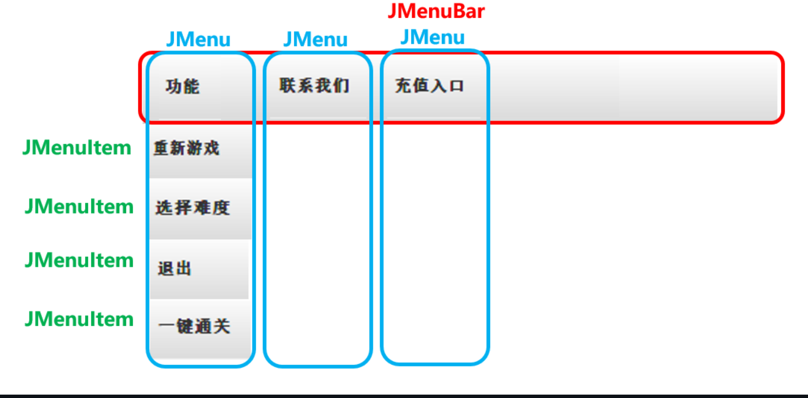
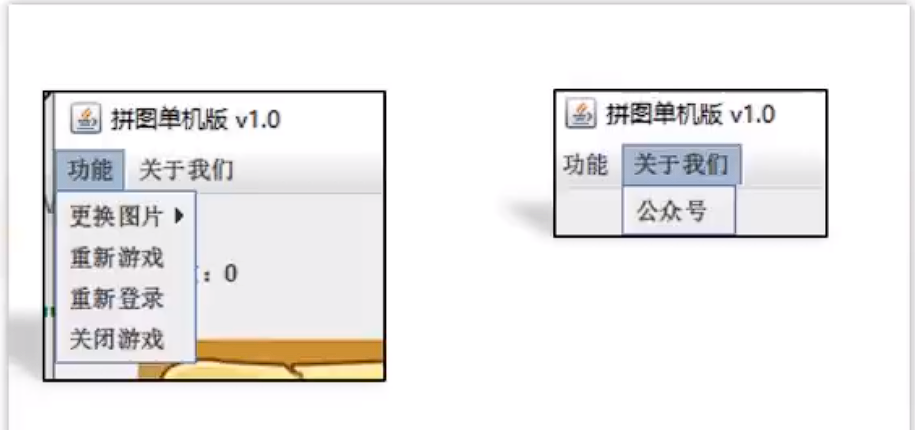
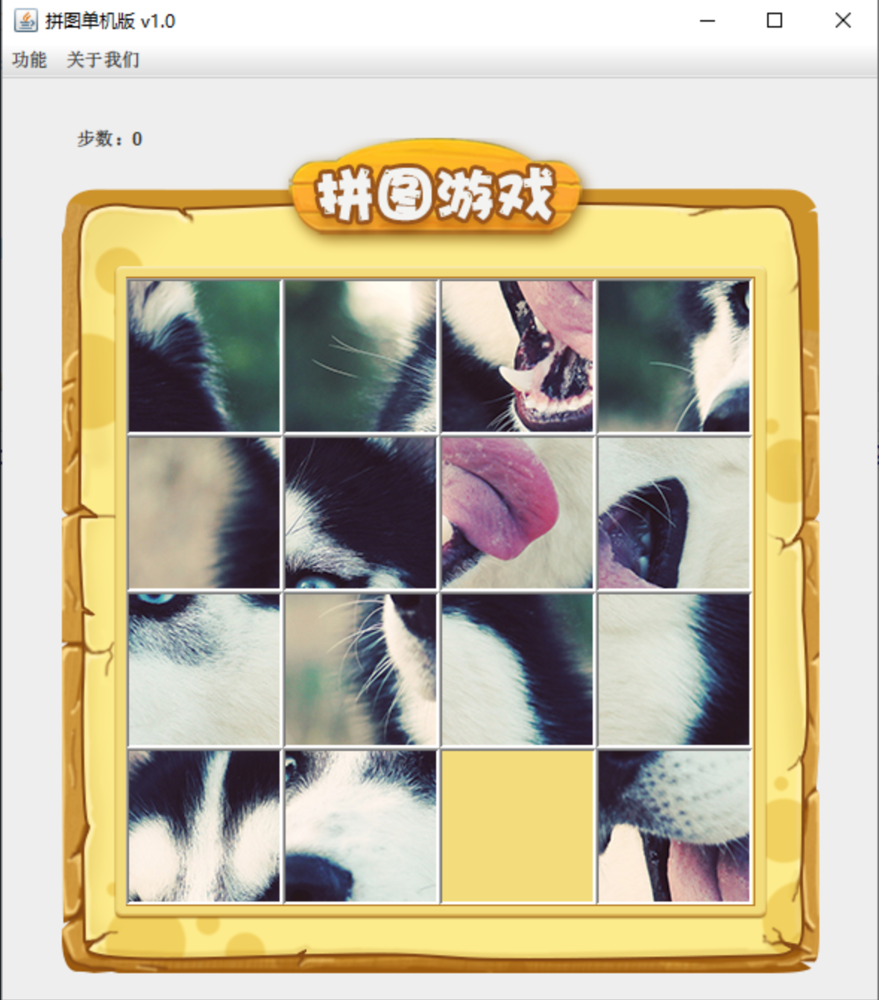
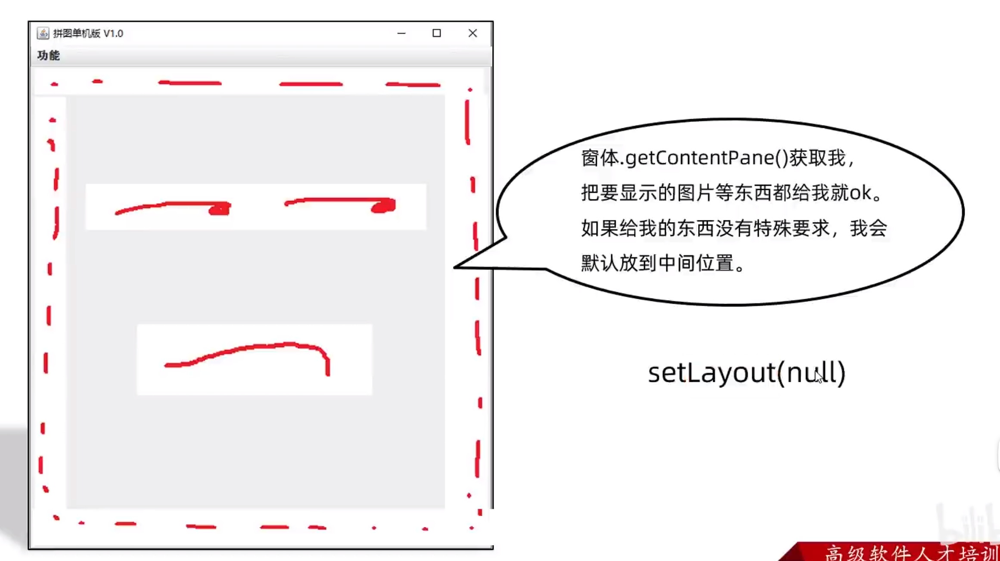
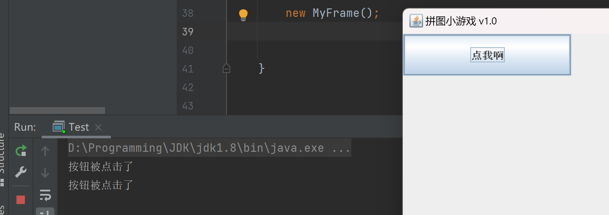

# 拼图小游戏

##  实现思路

我们在写游戏的时候，也是一部分一部分完成的。

先写游戏主界面，实现步骤如下：

1，完成最外层窗体的搭建。

2，再把菜单添加到窗体当中。

3，把小图片添加到窗体当中。

4，打乱数字图片的顺序。

5，让数字图片可以移动起来。

6，通关之后的胜利判断。

7，添加其他额外的功能。

## 界面搭建

1. 创建APP类，编写main方法，作为程序的主入口

2. 设计游戏界面，登录界面，注册界面

	```java
	//1.创建界面对象
	JFrame jFrame = new JFrame();
	
	//设置主界面的大小
	jFrame.setSize(514,595);
	
	//将主界面设置到屏幕的正中央
	jFrame.setLocationRelativeTo(null);
	
	//将主界面置顶
	jFrame.setAlwaysOnTop(true);
	
	//关闭主界面的时候让代码一起停止
	jFrame.setDefaultCloseOperation(3);
	
	//给主界面设置一个标题
	jFrame.setTitle("拼图游戏单机版 v1.0");
	
	//2.让主界面显示出来
	jFrame.setVisible(true);
	```

3. 利用继承简化代码

	```java
	//登录界面
	public class LoginJFrame extends JFrame {
	    //LoginJFrame 表示登录界面
	    //以后所有跟登录相关的代码，都写在这里
	
	
	    public LoginJFrame(){
	        //在创建登录界面的时候，同时给这个界面去设置一些信息
	        //比如，宽高，直接展示出来
	        this.setSize(488,430);
	        //设置界面的标题
	        this.setTitle("拼图 登录");
	        //设置界面置顶
	        this.setAlwaysOnTop(true);
	        //设置界面居中
	        this.setLocationRelativeTo(null);
	        //设置关闭模式
	        this.setDefaultCloseOperation(WindowConstants.EXIT_ON_CLOSE);
	        //让显示显示出来，建议写在最后
	        this.setVisible(true);
	    }
	}
	
	
	
	//注册界面
	public class RegisterJFrame extends JFrame {
	    //跟注册相关的代码，都写在这个界面中
	    public RegisterJFrame(){
	        this.setSize(488,500);
	        //设置界面的标题
	        this.setTitle("拼图 注册");
	        //设置界面置顶
	        this.setAlwaysOnTop(true);
	        //设置界面居中
	        this.setLocationRelativeTo(null);
	        //设置关闭模式
	        this.setDefaultCloseOperation(WindowConstants.EXIT_ON_CLOSE);
	        //让显示显示出来，建议写在最后
	        this.setVisible(true);
	
	
	        getContentPane();
	    }
	}
	
	//游戏主界面
	public class GameJFrame extends JFrame {
	
	    public GameJFrame() {
	        //设置界面的宽高
	        this.setSize(603, 680);
	        //设置界面的标题
	        this.setTitle("拼图单机版 v1.0");
	        //设置界面置顶
	        this.setAlwaysOnTop(true);
	        //设置界面居中
	        this.setLocationRelativeTo(null);
	        //设置关闭模式
	        this.setDefaultCloseOperation(WindowConstants.EXIT_ON_CLOSE);
	        //取消默认的居中放置，只有取消了才会按照XY轴的形式添加组件
	        this.setLayout(null);
	        //让界面显示出来，建议写在最后
	        this.setVisible(true);
	    }
	}
	```

	

## 菜单制作



在菜单中有：JMenuBar、JMenu、JMenuItem三个角色。

JMenuBar：如上图中红色边框

JMenu：如上图蓝色边框

JMenuItem：如上图绿色字体处

其中JMenuBar是整体，一个界面中一般只有一个JMenuBar。

而JMenu是菜单中的选项，可以有多个。

JMenuItem是选项下面的条目，也可以有多个。

### 代码步骤

1. 创建

2. 创建JMenuBar对象

3. 创建JMenu对象

4. 创建JMenuItem对象

5. 把JMenuItem添加到JMenu中

6. 把JMenu添加到JMenuBar中

7. 把整个JMenuBar设置到整个界面中

	

	```java
	JMenuBar jMenuBar = new JMenuBar();
	//创建功能选项，关于我们选项
	JMenu functionJMenu = new JMenu("功能");
	JMenu aboutJMenu = new JMenu("关于我们");
	//创建条目
	JMenuItem restartJMenuItem = new JMenuItem("重新游戏");
	JMenuItem reLoginJMenuItem = new JMenuItem("重新登录");
	JMenuItem closeJMenuItem = new JMenuItem("关闭游戏");
	JMenuItem gzhJMenuItem = new JMenuItem("公众号");
	//把条目添加到选项中
	functionJMenu.add(restartJMenuItem);
	functionJMenu.add(reLoginJMenuItem);
	functionJMenu.add(closeJMenuItem);
	aboutJMenu.add(gzhJMenuItem);
	//把选项添加到菜单中
	jMenuBar.add(functionJMenu);
	jMenuBar.add(aboutJMenu);
	//给整个界面设置菜单
	this.setJMenuBar(jMenuBar);
	```

## 添加图片



在上图中，其实是15张小图片。我们在添加图片的时候，要把添加图片的操作重复15次，才能把所有图片都添加到界面当中。

### 使用到的java类

1. ImageIcon：描述图片的类，可以关联计算中任意位置的图片。但是一般会把图片拷贝到当前项目中。

2. JLabel：用来管理图片，文字的类。可以用来设置位置，宽高。

### 步骤

1. 取消整个界面的默认居中布局
2. 创建ImageIcon对象，并制定图片位置。
3. 创建JLabel对象，并把ImageIcon对象放到小括号中。
4. 利用JLabel对象设置大小，宽高。
5. 将JLabel对象添加到整个界面当中。



要在initJFrame中取消默认的居中放置，只有取消了才会按照XY轴的形式添加组件

```java
this.setLayout(null);
```

代码：

``` java
place=1;//图片所在的位置
//创建JLable对象并制定图片位置，并把ImageIcon对象传递给JLable
JLabel jLabel1 = new JLabel(new ImageIcon("D:\\Programming\\IDEAprojects\\studyjava\\image\\animal\\animal1\\"+place+".jpg"));
//指定图片位置
jLabel1.setBounds(j*105,i*105,105,105);
//将JLable对象添加到整个界面中
```

## 打乱图片

打乱图片有两个主要步骤

1. 将创建的一维数组中的数据打乱(随机化)
2. 将打乱后的一维数组转换为二维数组，方便后续的操作

第一步的实现：

```java
int arr[] = {0, 1, 2, 3, 4, 5, 6, 7, 8, 9, 10, 11, 12, 13, 14, 15};
Random random = new Random();
for (int i = 0; i < arr.length; i++) {
    int ranInt=random.nextInt(arr.length);
    int temp=arr[i];
    arr[i]=arr[ranInt];
    arr[ranInt]=temp;
}
```

第二步的实现：

```java
//创建数据数组
int data[][]=new int[4][4];
for (int i = 0; i < 4; i++) {
    for (int j = 0; j < 4; j++) {
        data[i][j]=arr[i*4+j];
    }
}
```

## 事件

### 常见的三种事件监听

* 键盘监听 KeyListener

* 鼠标监听 MouseListener

* 动作监听 ActionListener


### 监听一个事件的步骤

1. 创建一个JButton，并进行初始化(setBounds)
2. 创建一个ActionListener，来写入这个事件发生时会发生的事情
3. 将ActionListener传入JButton(addActionListener).
4. 别忘了将JButton传入面板中

```java
public class MyFrame extends JFrame implements ActionListener{
    public MyFrame() throws HeadlessException {
        //设置界面的宽高
        this.setSize(603,680);
        //设置界面的标题
        this.setTitle("拼图小游戏 v1.0");
        //设置界面置顶
        this.setAlwaysOnTop(true);
        //设置界面居中
        this.setLocationRelativeTo(null);
        //设置关闭模式
        this.setDefaultCloseOperation(WindowConstants.EXIT_ON_CLOSE);
        //取消默认的居中放置，只有取消了才会按照XY轴的形式添加组件
        this.setLayout(null);

        JButton jButton = new JButton("点我啊");
        jButton.setBounds(0,0,200,50);
        jButton.addActionListener(this);

        this.getContentPane().add(jButton);

        this.setVisible(true);
    }

    @Override
    public void actionPerformed(ActionEvent e) {
        System.out.println("按钮被点击了");
    }
}
```

this表示这个文件本身这个类，因为本身这个类实现了ActionListener这个类

实现效果为：



### ActionListener

| Modifier and Type | Method and Description                                       |
| :---------------- | :----------------------------------------------------------- |
| `void`            | `actionPerformed(ActionEvent e)`Invoked when an action occurs. |

### MouseListener

| Modifier and Type | Method and Description                                       |
| :---------------- | :----------------------------------------------------------- |
| `void`            | `mouseClicked(MouseEvent e)`Invoked when the mouse button has been clicked (pressed and released) on a component. |
| `void`            | `mouseEntered(MouseEvent e)`Invoked when the mouse enters a component. |
| `void`            | `mouseExited(MouseEvent e)`Invoked when the mouse exits a component. |
| `void`            | `mousePressed(MouseEvent e)`Invoked when a mouse button has been pressed on a component. |
| `void`            | `mouseReleased(MouseEvent e)`Invoked when a mouse button has been released on a component. |

### KeyListener

| Modifier and Type | Method and Description                                       |
| :---------------- | :----------------------------------------------------------- |
| `void`            | `keyPressed(KeyEvent e)`Invoked when a key has been pressed. |
| `void`            | `keyReleased(KeyEvent e)`Invoked when a key has been released. |
| `void`            | `keyTyped(KeyEvent e)`Invoked when a key has been typed.     |

如果按住一个键不松，会重复调用keyPressed方法

KeyEvent类对象可以获取键盘上每一个按键的编号(getKeyCode())

## 美化界面

1. 将15张小图片移动到界面的中央偏下方 
2. 添加背景图片

3. 添加图片的边框 
4. 优化路径

### 1.1 小图片居中

原本的小图片，都在左上角的位置，不好看，我想让他们居中，这样就需要给每一张图片在x和y都进行一个偏移即可。

```java
private void initImage() {

        int place=0;
        for (int i = 0; i < 4; i++) {
            for (int j = 0; j < 4; j++) {
                place=data[i][j];
                //创建JLable对象并制定图片位置，并把ImageIcon对象传递给JLable
                JLabel jLabel1 = new JLabel(new ImageIcon("D:\\Programming\\IDEAprojects\\studyjava\\image\\animal\\animal1\\"+place+".jpg"));
                //指定图片位置
                jLabel1.setBounds(j*105+83,i*105+134,105,105);
                //将JLable对象添加到整个界面中
                this.getContentPane().add(jLabel1);
//                this.add(jLabel1);

            }
        }

    }
```

### 1.2 添加背景图片

```java
JLabel background = new JLabel(new ImageIcon("D:\\Programming\\IDEAprojects\\studyjava\\image\\background.png"));
background.setBounds(40,40,508,560);
this.getContentPane().add(background);
```

将背景图片在两层循环结束后再添加到panel中就能将图片显示在background之上了。

### 1.3 添加图片边框

```java
//给图片添加边框
//括号中也可以写0或者1
//要注意，这个凸凹跟大家自己理解的可能会有偏差
//0:表示让图片凸起来，图片凸起来，边框就会凹下去
//1：表示让图片凹下去，图片凹下去，边框就会凸起来
//但是0和1不好记，所以Java中就定义了常亮表示，方便记忆
//BevelBorder.LOWERED：表示1
//BevelBorder.RAISED：表示0
jLabel.setBorder(new BevelBorder(BevelBorder.LOWERED));
```

### 1.4 优化路径

之前我们写的路径是完整路径：

这样会有两个坏处：

一：路径太长，代码阅读不方便

二：项目拿到别人电脑上时，如果别人电脑上没有F盘和对应的文件夹，就找不到图片

####  1.4.1 计算机中的两种路径

* 绝对路径

	从判断开始的路径，此时路径是固定的。

```java
C:\\a.txt
```

* 相对路径

	没有从判断开始的路径

```java
aaa\\bbb\\a.txt
```

目前为止，在idea中，相对路径是相对当前项目而言的。

以下面的路径为例：

```java
aaa\\bbb\\a.txt
```

在寻找的时候，先找当前项目，在当前项目下找aaa，在aaa里面找bbb，在bbb里面找a.txt

利用这个原理，我们可以修改项目中路径的书写：

代码示例：

```java
//添加背景图片
JLabel background = new JLabel(new ImageIcon("puzzlegame\\image\\background.png"));
background.setBounds(40, 40, 508, 560);
//把背景图片添加到界面当中
this.getContentPane().add(background);
```

## 上下左右移动的逻辑

#### 业务分析：

上下左右的我们看上去就是移动空白的方块，实则逻辑跟我们看上去的相反：

* 上移：是把空白区域下方的图片上移。
* 下移：是把空白区域上方的图片下移。
* 左移：是把空白区域右方的图片左移。
* 右移：是把空白区域左方的图片右移。

但是在移动的时候也有一些小问题要注意：

* 如果空白区域已经在最上面了，此时x=0，那么就无法再下移了。
* 如果空白区域已经在最下面了，此时x=3，那么就无法再上移了。
* 如果空白区域已经在最左侧了，此时y=1，那么就无法再右移了。
* 如果空白区域已经在最右侧了，此时y=3，那么就无法再左移了。

#### 实现步骤：

1. 本类实现KeyListener接口，并重写所有抽象方法

	`````java
	public class GameJFrame extends JFrame implements KeyListener
	`````

	

2. 给整个界面添加键盘监听事件

	在initJframe()类中添加

	`````java
	//添加键盘时间监听器
	        this.addKeyListener(this);
	
	`````

	

3. 统计一下空白方块对应的数字0在二维数组中的位置

4. 在keyReleased方法当中实现移动的逻辑

```java
@Override
public void keyReleased(KeyEvent e) {
    int x=0,y=0;
    for (int i = 0; i < 4; i++) {
        for (int j = 0; j < 4; j++) {
            if (data[i][j]==0) {
                x=i;
                y=j;
            }
        }
    }
    int code=e.getKeyCode();
    if (code==37){
        if(y==0){
            System.out.println("不能向上移动啦");
        }else{
            System.out.println("向上移动");
            data[x][y]=data[x][y-1];
            data[x][y-1]=0;
            y--;
            initImage();
        }

    }
    if (code==38){


        if(x==0){
            System.out.println("不能向左移动啦");
        }else{
            System.out.println("向左移动");
            data[x][y]=data[x-1][y];
            data[x-1][y]=0;
            x--;
            initImage();
        }

    }
    if (code==39){

        if(y==3){
            System.out.println("不能向右移动啦");
        }else{
            System.out.println("向右移动");
            data[x][y]=data[x][y+1];
            data[x][y+1]=0;
            y++;
            initImage();
        }

    }
    if (code==40){

        if(x==3){
            System.out.println("不能向下移动啦");
        }else{
            System.out.println("向下移动");
            data[x][y]=data[x+1][y];
            data[x+1][y]=0;
            x++;
            initImage();
        }

    }
}
```
