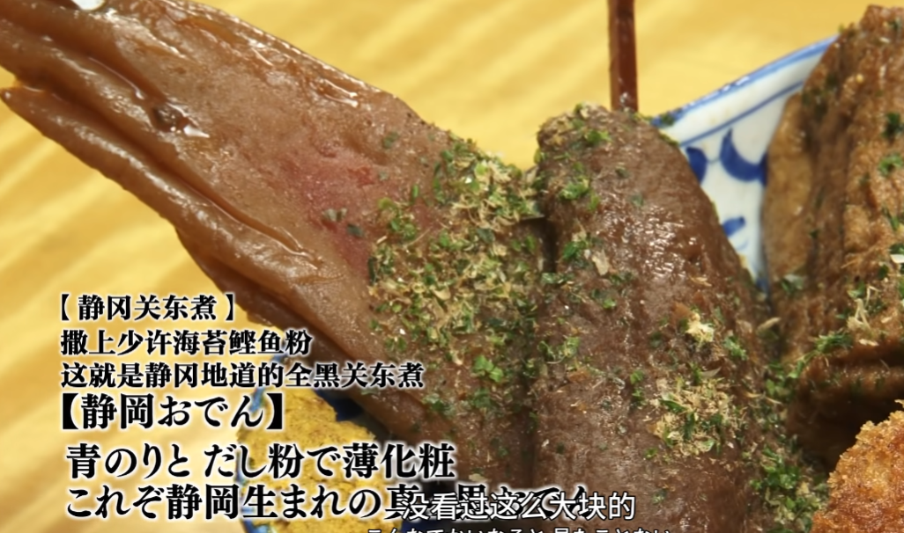

# 孤独的美食家

## S1

### E01

江东区门前仲街的烤鸡肉串和干烧饭

特色是烤鸡肉丸串配生青椒

以及用梅子做的干烧饭

和氏干烧饭：加入了小银鱼和话梅肉的炒饭，最后撒上紫苏叶

### E04

静冈关东煮

在关东煮上加海苔和鲣鱼粉可以增加风味

# Nick

https://www.bilibili.com/video/BV1DfQ3YXEJ1/?spm_id_from=444.41.list.card_archive.click&vd_source=3d871d08ddd72a4f5cc39b5c894405a6

炒蛋配布里欧修汉堡

炸鱼薯条配咖喱蛋黄酱

酸味+脂肪 完美组合